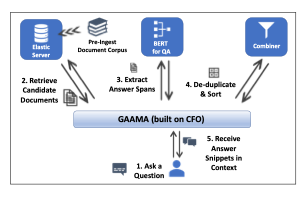

# El Problema: {#capproblema}

En el presente Capítulo se introduce la \@ref(desproblema) **Descripción del Problema** que se intenta solucionar con esta Investigación. En \@ref(delimitacion) se hace la **Delimitación del Problema** se hacen algunas consideraciones al respecto. En \@ref(justificacion) **Justificación e Importancia** se menciona la razón principal para haber llevado a cabo este trabajo. En \@ref(aportes) se listan los **Aportes** que se logró hacer en el transcurso de la investigación. En \@ref(descripcion) **Descripción de la Solución** se hace una aproximación a una descripción con algún nivel de detalle.

En \@ref(objegeneral) se menciona el **Objetivo Principal** que se trazó, mientras que en \@ref(objeespe) se enumeran los **Objetivos Específicos**.

## Descripción del Problema: {#desproblema}

La Universidad Central de Venezuela cuenta con un repositorio digital de documentos que se llama Saber UCV donde se alojan distintas investigaciones realizadas por la comunidad de la Universidad. Ingresando a la dirección web <http://saber.ucv.ve/> se permite "el acceso libre a la producción intelectual, materiales y recursos académicos elaborados en las áreas de docencia, investigación y difusión de la UCV." ¿Qué es Saber UCV?. (2023). Saber UCV.[http://saber.ucv.ve](http://saber.ucv.ve/){.uri}.

Los usuarios interesados en hacer búsquedas sobre la información académica alojada en el repositorio, pueden efectuarlas aplicando filtros sobre distintas categorías como:

-   Seleccionar "comunidades": artículos de investigación, tesis (doctorales, maestrías, otras y pregrado), guías de estudio, revistas entre otras categorías.

-   Seleccionar la fecha de inicio (referente al año en que se efectuó la publicación).

También pueden realizar la búsqueda en el texto que incluye el nombre del documento, el nombre del autor o el texto del resumen.

Dadas estas funcionalidades, en algunos casos el investigador que acuda a este repositorio puede necesitar filtrar información por algunos criterios adicionales, como lo es el área de académica donde fue realizada la investigación, en particular, si fue hecha en una escuela determinada, o en una facultad, o postgrado.

Aplicar el filtrado descrito en el párrafo anterior es donde se presenta una de las limitaciones principales al hacer búsquedas en Saber UCV, ya que el sistema no dispone de esos criterios para la recuperación de información.

De manera similar ocurre con el nombre del tutor de los trabajos de grado y tesis, al no encontrarse registro de esta información.

Motivado a que es viable realizar procesos para extraer y clasificar la información faltante, se realiza esta Investigación que mediante la implementación de un software denominado **Sistema Complementario Saber UCV (SCSU)**, extrae y clasifica los datos del área académica donde se realizaron las distintas investigaciones de tesis y trabajos de grado que están alojadas en la página precitada.

Adicionalmente, se detectó que es posible generar una propuesta alterna de implementación de criterios de relevancia para realizar la recuperación de información. Este problema será descrito con mayor detalle en \@ref(desarrollociclos3) correspondiente al tercer ciclo de desarrollo de la Solución.

## Delimitación del Problema: {#delimitacion}

El corpus con el que se trabajará sólo es el subconjunto de los trabajos de grado de pregrado y maestría junto con las tesis doctorales, no abarcando otro tipo de documentos que se encuentran registrados en el repositorio. No obstante en la implementación del ciclo \@ref(desarrollociclos4) se incluyen dos revistas: una científica (Gestión I+D) y la otra del área de filosofía (Episteme) de la Universidad Central de Venezuela. También se añade una publicación del repositorio digital de la Universidad de los Andes Saber U.L.A. para mostrar posibles ampliaciones en la ingesta de distintos tipos de publicaciones y fuentes dentro del SCSU.

Sin embargo, posibles incorporaciones de otras fuentes de datos implican procesos de revisión en las estructuras de los datos, ya que por los momentos el Sistema no está diseñado para incorporaciones de datos adicionales, sin la modificación de los códigos con los que se extraen los datos desde las páginas web donde se alojan los documentos.

## Justificación e Importancia: {#justificacion}

Con esta Investigación se implementa un método que permite subsanar la falta de clasificaciones por áreas académica que tiene el repositorio Saber UCV y mediante la aplicación web se amplian los criterios de búsqueda disponibles para investigadores que necesiten realizar consultas sobre los documentos disponibles en el repositorio.

## Aportes:

Algunos de los aportes que se generaron al realizar esta investigación son los siguientes:

-   Se mejora y flexibilizan los criterios de búsqueda en comparación a los que tiene el repositorio Saber UCV.

-   Se crean visualizaciones y representaciones de Mapas del Conocimiento.

-   Se implementa la búsqueda de texto completo con una función de relevancia distinta a la de Saber UCV.

-   Se implementa un "sistema de recomendación" de documentos que presenten similitudes con los textos recuperados.

-   Se obtienen mejores métricas de desempeño en la recuperación de información.

-   La experiencia del usuario se enriquece mediante gráficos que muestran la evolución de aparición de los términos buscados en el período establecido para la recuperació de información.

-   El Sistema puede fácilmente ponerse en producción y todos los componentes son de código abierto, libres de algún pago de licencia.

-   La implementación se hace mediante un orquestador de contenedores, teniendo asociados los archivos "docker compose" y "dockerfiles", que facilitan que pueda estar en producción el Sistema con un mínimo de configuraciones y se garantiza la reproducibilidad de los códigos que conforman la Solución.

-   El tipo de componentes hace que el Sistema sea escalable y adaptable a la demanda de accesos.

-   El Sistema está diseñado para poder actualizarse con la periodicidad que se defina.

-   El Sistema puede servir de prototipo para integrar publicaciones de otros repositorios de documentos que pertenecen a instituciones nacionales de investigación.

-   Se realiza la implementación de "búsquedas semánticas".

## Descripción de la Solución: {#descripcion}

La Solución que se propone es un Sistema de Recuperación de Información implementado para que mediante técnicas de extracción de datos de archivos html´s se puedan obtener datos estructurados de los trabajos mencionados en \@ref(delimitacion) que están disponibles en Saber UCV. Los datos que se extraen de cada documento son el título de la investigación, el nombre del investigador, las palabras claves, la fecha de publicación y el resumen.

Posteriormente se descarga el documento en formato word o pdf, anexo a la investigación, que es donde se encuentran, generalmente en las primeras páginas, los datos de la facultad, escuela y/o postgrado donde se generó la investigación así como el nombre del tutor.

Con todos los datos recopilados se conforma un corpus, al cual se le aplican distintas técnicas de procesamiento del lenguaje natural y de minería de texto, que permiten obtener un corpus anotado y un índice invertido sobre los textos, que posteriormente alimentan a la base de datos.

Una vez que se tienen estructurados los datos, se implementa una aplicación web que se soporta en un sistema distribuido conformado por contenedores que son gestionados por un orquestador con la arquitectura "modelo-vista-controlador".

La aplicación web está diseñada para permitir por parte del usuario la exploración exhaustiva del corpus anotado realizando consultas de texto, aplicando distintos filtros como la selección del área académica donde se generó la investigación, bien sea en la escuela, postgrado o facultad, así como la selección de un rango de fechas y las palabras a buscar.

Posterior a realizar la búsqueda el Sistema recuperará los documentos que cumplan con las condiciones establecidas y a los resultados les será aplicada una función de relevancia para mostrar de primero aquellos que puedan resultar de mayor interés para el usuario.

Adicionalmente para cada texto que se muestre en los resultados, se incluirán recomendaciones de otros documentos que sean similares. Igualmente se presentará un selector, que al estar activado, hará que se generé una representación de "mapas del conocimiento", según una adaptación *ad-hoc* hecha para la implementación del SCSU basada en el trabajo de [@dueñas2011], donde mediante una representación en grafos presentados en formato interactivo, se podrán aplicar filtros sobre palabras coocurrentes en los resultados de la búsqueda.

La Solución contempla procesos de actualización de los datos ante la incorporación de nuevas investigaciones en el repositorio Saber UCV.

En la figura \@ref(fig:arquitecturasri) se muestra un diagrama con la arquitectura del SCSU. (falta adaptarlo-pequeños cambios).

```{r, arquitecturasri, echo=FALSE, out.width='60%',fig.cap='Arquitectura del Sistema-Este diagrama se va a traducir y adaptar al SCSU. Se coloca ya que es muy similar a la Solución Implementada',fig.align='center'}

```

### Objetivo General: {#objegeneral}

Implementar un Sistema que pueda realizar procesos de recuperación de información (*information retrieval*), extracción y clasificación de los textos académicos alojados en el Repositorio SABER.UCV empleando técnicas de procesamiento de lenguaje natural, de minería de texto y usando modelos de lenguaje preentrenados de inteligencia artificial.

### Objetivos Específicos: {#objeespe}

1.  Conformar un corpus con los resúmenes, títulos, palabras claves y nombres de autor con todos los documentos de tesis doctorales y trabajos de grado de pregrado y maestría alojados en SABER.UCV.

2.  Clasificar los trabajos de grado alojados en SABER.UCV por área académica donde se haya realizado la investigación y extraer el nombre completo del tutor. (nota para el Prof. Mirabal: en este punto se puede separar, o colocar un nombre genérico para el objetivo como: creación de metadata a partir del texto contenido en los documentos de cada trabajo de grado).

3.  Crear una aplicación web que permita realizar las "búsquedas de texto completo" sobre el corpus conformado.

4.  Generar recomendaciones de investigaciones que presenten similitud con los documentos recuperados por el Sistema.
