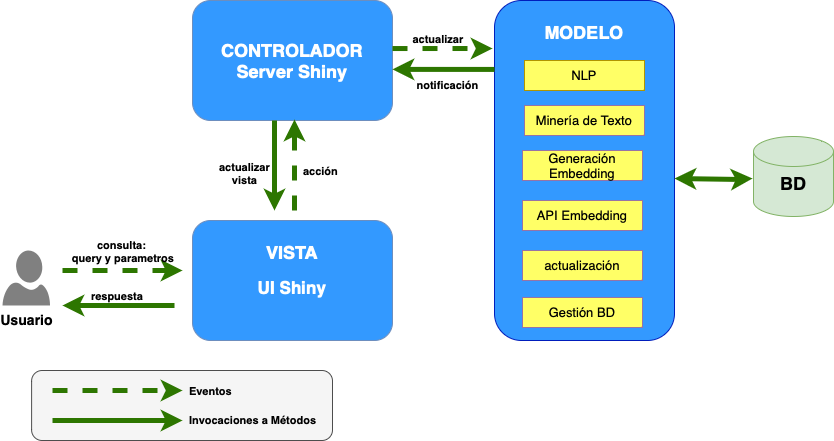

# El Problema: {#capproblema}

En el presente Capítulo en \@ref(desproblema) se hace la **Descripción del Problema**. En \@ref(delimitacion) se hace la **Delimitación del Problema**. En \@ref(justificacion) **Justificación e Importancia** se mencionan la razones principales que motivan haber llevado a cabo esta investigación. En \@ref(descripcion) **Descripción de la Solución** se hace una aproximación a la propuesta general.

En \@ref(objegeneral) se menciona el **Objetivo Principal** que se trazó, mientras que en \@ref(objeespe) se enumeran los **Objetivos Específicos** y en \@ref(aporte) se listan los **Aportes** efectuados.

## Descripción del Problema: {#desproblema}

La Universidad Central de Venezuela cuenta con un repositorio digital de documentos que se llama Saber UCV donde se alojan distintas investigaciones realizadas por la comunidad de la Universidad. Ingresando a la dirección web <http://saber.ucv.ve/> se permite "el acceso libre a la producción intelectual, materiales y recursos académicos elaborados en las áreas de docencia, investigación y difusión de la UCV". ¿Qué es Saber UCV?. (2023). Saber UCV. [http://saber.ucv.ve](http://saber.ucv.ve/){.uri}.

Los usuarios interesados en hacer búsquedas sobre la información académica alojada en el repositorio, pueden efectuarlas introduciendo un texto y aplicando filtros sobre distintas categorías como:

-   Seleccionar "comunidades": artículos de investigación, trabajos doctorales, maestrías, especialización y pregrado, guías de estudio y revistas, entre otras categorías.

-   Seleccionar la "fecha de inicio", referente al año en que se efectuó la publicación.

También pueden realizar búsqueda en el texto en áreas como: el nombre del documento, el nombre del autor o en el resumen.

Además de estas funcionalidades, el investigador pudiera necesitar filtrar información por criterios adicionales, como lo es: el área académica donde fue realizada la investigación, en particular, si fue hecha en una escuela, en una facultad, o un postgrado. En este caso, se presenta una limitación al hacer búsquedas en Saber UCV, ya que el sistema no dispone de esos criterios para la recuperación de información.

De manera similar ocurre con el nombre del tutor de los trabajos de grado, de pregrado y tesis, al no encontrarse datos registrados para esta información.

Motivado a que es viable realizar procesos para extraer y clasificar la información faltante, se realiza esta investigación que mediante la implementación de un software denominado **Sistema Complementario Saber UCV (SCSU)**, extrae y clasifica los datos del área académica donde se realizaron las distintas investigaciones que están alojadas en Saber UCV.

## Delimitación del Problema: {#delimitacion}

El corpus con el que se trabajará es el subconjunto de los trabajos de pregrado, trabajos de grado de maestría y tesis doctorales, así como otros tipos de documentos que se encuentran registrados en el repositorio que en Saber UCV están clasificados como "Otros" y alojan: trabajos de especialización, trabajos de ascenso y demás tipos de documentos, pero que no son diferenciados.

Adicionalmente, en la implementación del ciclo de desarrollo \@ref(desarrollociclos4) se incluyen dos revistas dos revistas: una científica (Gestión I+D) y la otra del área de filosofía (Episteme) de la Universidad Central de Venezuela. También se añade una publicación del repositorio digital de la Universidad de los Andes Saber U.L.A., para mostrar posibles ampliaciones en la ingesta de distintas publicaciones y fuentes de documentos dentro del SCSU.

Sin embargo, posibles incorporaciones de otras fuentes de datos implican procesos de revisión en las estructuras de los datos, ya que por los momentos SCSU no está diseñado para incorporaciones de datos adicionales sin la modificación de los códigos con los que se extraen los datos desde las páginas web donde se alojan los documentos.

```{r totales, echo=FALSE}
totales_tegs1 <- readRDS('data/totales_tegs.rds') |>
  select(-fecha)

docs_unicos <- sum(totales_tegs1$Únicos)

df_cdad_postgrados_total <- readRDS('data/df_cdad_postgrados.rds')%>%
  slice(1)

df_cdad_postgrados_total <- rowSums(df_cdad_postgrados_total) + 50


df_draw_seleccion <- readRDS('data/df_draw_seleccion.rds')

sin_lectura <- as.numeric(table(nchar(df_draw_seleccion$texto_intro)==0)[2])+
  as.numeric(table(is.na(df_draw_seleccion$texto_intro))[2])

df_clasificados <- df_draw_seleccion%>%
  filter(facultad != 'sin clasificación')

clasificados= nrow(df_clasificados)

totales_clasificacion <- df_draw_seleccion%>%
  group_by(facultad)%>%
  count(facultad)%>%
  mutate(facultad= str_to_title(facultad) ) %>%
  rename(Total=n,Facultad= facultad)

totales_porarea <- table(df_draw_seleccion$nombre)%>%
  as.data.frame()

  
tutores <- as.numeric(table(df_draw_seleccion$texto_tutor=="sin información")[1])

tutores_distintos <-length( unique(df_draw_seleccion$texto_tutor))

```

## Descripción de la Solución: {#descripcion}

La Solución que se propone es un un Sistema de Recuperación de Información con diversos componentes. Inicialmente de los trabajos mencionados en \@ref(delimitacion), mediante técnicas de extracción de nodos de archivos HTML´s, se obtienen de Saber UCV los siguientes datos de cada investigación: el título, el nombre del autor, las palabras claves, la fecha de publicación, el resumen y el enlace de descarga del documento que soporta el trabajo de grado.

Posteriormente el Sistema descarga el documento anexo a cada investigación, da lectura y clasifica la información del nombre de la facultad, la escuela o postgrado donde fue realizado el trabajo así como el nombre del tutor.

Todos los datos obtenidos son sometidos a técnicas del estado del arte en el Procesamiento del Lenguaje Natural y la Minería de Texto para conformar un corpus anotado, un índice invertido y se generan los vectores de *embeddings* de texto. Posteriormente las tablas obtenidas se almacenan en una base de datos indexada.

El Sistema cuenta con una aplicación web que permite a los usuarios desde un navegador, explorar extensivamente el corpus anotado, realizando consultas de texto y aplicando varios filtros como la selección de la jerarquía, el área académica y el rango de fechas. La relevancia de los resultados recuperados se determina mediante una función de ponderación y los documentos se presentan de manera priorizada para mejorar la experiencia del usuario.

Adicionalmente, el Sistema ofrece recomendaciones de documentos que presentan similitud con aquellos que fueron recuperados en el proceso anterior. También representa los "Mapas de Conocimiento", según una adaptación *ad-hoc* hecha para la implementación del SCSU basada en el trabajo de [@dueñas2011] donde mediante una representación en grafos en formato interactivo, se podrán aplicar filtros sobre palabras coocurrentes en los resultados de la búsqueda.

La solución implementada cuenta con procesos automatizados de actualización para incorporar las nuevas investigaciones que sean añadidas al repositorio Saber UCV y se soporta en un sistema distribuido conformado por contenedores que son gestionados por un orquestador con la arquitectura "modelo-vista-controlador".

En la figura \@ref(fig:arquitecturasri) se muestra un diagrama con la arquitectura MVC propuesta para el SCSU.

```{r, arquitecturasri, echo=FALSE, out.width='90%',fig.cap='Arquitectura del Sistema',fig.align='center'}

```

## Justificación e Importancia: {#justificacion}

Con esta Investigación se implementa un método que permite subsanar la falta de clasificaciones por área académica que tiene el repositorio Saber UCV y que mediante la aplicación web se amplían los criterios de búsqueda disponibles para investigadores que necesiten realizar consultas sobre los documentos disponibles en el repositorio.

### Objetivo General: {#objegeneral}

Implementar un Sistema que realice procesos de recuperación de información (*information retrieval*), extracción y clasificación sobre el cien por ciento de los textos académicos alojados en el Repositorio Saber UCV, empleando técnicas de procesamiento de lenguaje natural, de minería de texto y modelos de lenguaje preentrenados de inteligencia artificial.

### Objetivos Específicos: {#objeespe}

1.  Conformar un corpus que contenga el cien por ciento de los resúmenes, títulos, palabras claves y nombres de autor con todos los documentos de tesis doctorales y trabajos de grado de pregrado, maestría y otros documentos alojados en SABER.UCV.

2.  Clasificar al menos el noventa por ciento de los trabajos de grado alojados en Saber UCV por área académica donde se haya realizado la investigación y extraer en el 80 por ciento de los documentos el nombre completo del tutor.

3.  Crear una aplicación web que permita realizar las "búsquedas de texto completo" o "búsqueda semántica" sobre el corpus conformado donde se establezcan criterios de relevancia para presentar los resultados de la búsqueda y se representen los "Mapas de Conocimiento".

4.  Generar cinco recomendaciones de investigaciones que presenten similitud con cada documento recuperado por el Sistema.

## Aportes: {#aporte}

Algunos de los aportes que se generaron al realizar esta investigación son los siguientes:

-   Mejora y flexibiliza los criterios de búsqueda en comparación a los que tiene el repositorio Saber UCV al clasificar por área académica un total de `r prettyNum(clasificados,big.mark=".")` investigaciones de `r prettyNum(nrow(df_draw_seleccion),big.mark=".")` potenciales documentos a categorizar.

-   Se crea un listado con `r df_cdad_postgrados_total` categorías de carreras de pregrado, especializaciones, maestrías y doctorados que se imparten en la Universidad.

-   Se obtiene un listado de potenciales tutores de las investigaciones realizadas con `r prettyNum(tutores,big.mark=".")` nombres y una cantidad de `r prettyNum(tutores_distintos,big.mark="." )` nombres únicos.

-   Visualizaciones y representaciones de "Mapas de Conocimiento".

-   Implementación de la búsqueda de texto completo con una función de relevancia distinta a la de Saber UCV permitiendo obtener mejores métricas de desempeño en la tarea de "recuperación de información"

-   Implementación de un "sistema de recomendación" de documentos que presenten similitudes con los textos recuperados.

-   Enriquecimiento de la experiencia del usuario mediante gráficos que muestran la evolución de aparición de los términos solicitados en el período establecido para la búsqueda de la información.

-   Diseño del sistema para estar en producción donde todos los componentes son de código abierto, libres de algún pago de licencia.

-   Implementación fácil del Sistema en un servidor ya que está diseñado de manera que con los archivos "docker compose" y "dockerfiles", se puedan desplegar la aplicación, alcanzando elevados niveles de reproducibilidad en todos los procesos que conforman la solución.

-   Sistema escalable y adaptable a la demanda de accesos de acuerdo al tipo de componentes.

-   Sistema diseñado para poder actualizarse cada vez que sea necesario o con la periodicidad que se defina.

-   Sistema prototipo para integrar publicaciones de otros repositorios de documentos que pertenecen a instituciones nacionales de investigación.

-   Aproximación a la implementación de "búsquedas semánticas".
