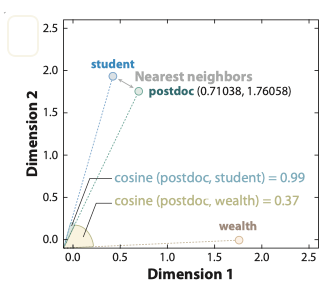
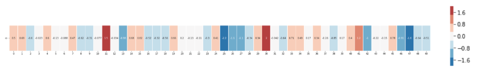
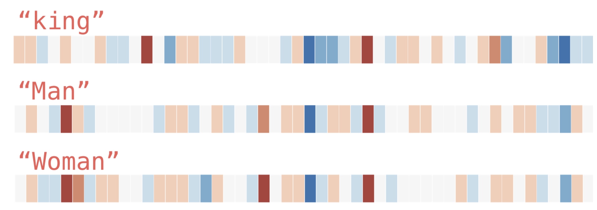
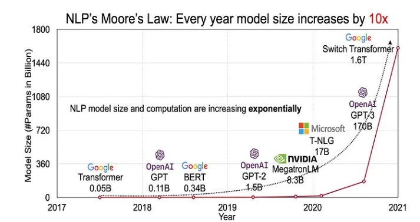

# Marco Teórico-Referencial: {#teorico}

En este capítulo se exponen los fundamentos teóricos en que se sustentan los procesos y métodos aplicados en la investigación **Recuperación, Extracción y Clasificación de Información de SABER UCV**.

En \@ref(alghist) se hace una **Reseña histórica** sobre los procesos de búsqueda, en \@ref(infret) se examina qué es la **Recuperación de Información** (RI), en \@ref(SRI) se indica qué son los **Sistemas de Recuperación de Información (SRI**) y en \@ref(ejemplos-de-irs) se muestran un par de ejemplos de SRI. Adicionalmente en \@ref(MRI) **Modelos de Recuperación de Información** se exploran modelos como el \@ref(MRIbol) **Boleano** y el \@ref(invind) de **Índices Invertidos**. En la sección \@ref(relevancia) se introduce el concepto de **Relevancia** que es clave para comprender cuál es uno de los principales objetivos que tiene cualquier SRI. En \@ref(ranking) **Re Ordenamiento** se exponen dos algoritmos usados para jerarquizar los documentos que sean más relevantes en un proceso de RI y en \@ref(evaluacion) **Métodos de Evaluación** se muestran algunas técnicas usadas para medir la precisión que se obtiene en los procesos de recuperación de información.

Para indicar los métodos con los que es tratado el Corpus de esta Investigación en \@ref(PT) **Procesamiento de Texto** se muestran las técnicas del \@ref(nlproc) **Procesamiento de Lenguaje Natura**l y de \@ref(textmin) **Minería de Texto**. En \@ref(similitud) **Similitud de Documentos** se indica cómo se puede comparar la similitud de los textos y su aplicación.

Adicionalmente, al formar parte de este Investigación, el desarrollo e implementación del software denominado **Sistema Complementario Saber UCV (SCSU)**, se exponen definiciones asociadas a los \@ref(SD) **Sistemas Distribuidos**, sentando las bases para el desarrollo e implementación del **SCSU**.

Se finaliza este Capítulo haciendo una inspección en \@ref(sota) a lo que constituye el **Estado del Arte** en la materia, haciendo énfasis en la representación de textos mediante \@ref(embed) **Embeddings**, en \@ref(trans) se introduce la **Arquitectura de** **Redes Neuronales Transformers** con que se logran generar los embeddings de mayor calidad para el IR y brevemente se muestra en \@ref(LLM) los **Largos Modelos de Lenguaje (LLM´s)**, mientras en \@ref(int) **Integración** se comentan los distintos avances y tendencias que se presentan en los Sistemas de Recuperación de Información.

## Reseña histórica: {#alghist}

El profesor Donald Knuth señala, dentro del campo de las ciencias de la computación, que la **búsqueda** *es el proceso de recolectar información que se encuentra en la memoria del computador de la forma más rápida posible, esto cuando tenemos una cantidad N de registros y nuestro problema es encontrar el registro apropiado de acuerdo a un criterio de búsqueda* [@knuth1997, p.392] .Iniciamos con esta cita porque la recuperación de información gira en torno a un problema central de las ciencias de la computación que es la **búsqueda**.

En la década de 1940 cuando aparecieron las computadoras, las búsquedas no representaban mayor problema debido a que estas máquinas disponían de poca memoria *RAM* pudiendo almacenar sólo moderadas cantidades de datos.

No obstante con el desarrollo e incremento del almacenamiento en memoria *RAM* o en dispositivos de almacenamiento permanentemente, ya en la década de 1950 empezaron a aparecer los problemas de **búsqueda** y los primeras investigaciones para afrontarla.

En la década de 1960 se adoptan estrategias basadas en arboles. Los primeros algoritmos que sirvieron para localizar la aparición de una frase dentro de un texto, o expresado de forma más abstracta, como la detección de una subcadena *P* dentro de otra cadena *T*, fueron los algoritmos de "*Pattern-Matching*" [@goodrich2013].

Así nos encontramos en la literatura con el algoritmo "Fuerza Bruta" donde dado un texto T y una subcadena P, se va recorriendo cada elemento de la cadena T para detectar la aparición de la subcadena P. Si bien este algoritmo no presentaba el mejor desempeño, creó una forma válida de enfrentar el problema de la búsqueda de subcadenas de texto.

El algoritmo "*Knuth-Morris-Pratt"* que se introdujo en 1976 tenía como novedad que se agregó una función que iba almacenando"previas coincidencias parciales" en lo que eran fallos previos y así al realizar un desplazamiento tomaba en cuenta cuántos caracteres se podían reusar. De esta forma se logró considerablemente mejorar el rendimiento en los tiempos de ejecución de \\( O\^{(a+b)} \\) que son asintóticamente óptimos.

Posteriormente en 1977 el problema se enfrenta con un nuevo algoritmo que es el de *Boyer-Moore* en el cual se implementan dos heurísticas (*looking-glass y* *character-Jump)* que permiten ir realizando algunos saltos en la búsqueda, ante la no coincidencia de la subcadena con la cadena y adicionalmente, el orden en el que se va realizando la comparación se invierte. Estas modificaciones permitieron obtener un mejor desempeño.

Sobre una modificación al algoritmo *Boyer-Moore* se sustenta la utilidad *grep* de la línea de comandos UNIX que también da soporte a diversos lenguajes que la usan para ejecutar búsquedas de texto, con un proceso que comúnmente es conocido como *grepping*. Esta utilidad fue ampliamente usada para resolver parcialmente lo que se expondrá en \@ref(desarrollociclos1).

Otra de las estrategias que surgió para enfrentar las búsquedas de texto, fue el uso de la programación lineal, donde bajo la premisa "*divida et impera",* los problemas que requieren tiempo exponencial para ser resueltos son descompuestos en polinomios y por lo tanto se disminuye la complejidad en tiempo para encontrar la solución.

Entre este tipo de algoritmos se puede mencionar los de *alineación de cadenas del ADN* de forma parcial o total dentro de una cadena mayor, siendo una versión de estos el algoritmo ***Smith-Waterman*** [@smith1981]. Posteriormente se identificó que este tipo de solución era extrapolable a las subcadenas de texto. Un algoritmo que se usó para resolver el problema de hacer coincidir una etiqueta de clasificación con los textos del *Corpus* en \@ref(desarrollociclos1) fue el algoritmo precitado.

Un gran paso para aproximarnos a la aparición de los Sistemas de Recuperación de Información \@ref(SRI) lo representó el enfoque que presentan los algoritmos *Tries*. Este nombre proviene del proceso de *Information Retrieval* y principalmente se basa en hacer una serie de preprocesamientos a los textos para que al momento de ejecutar la búsqueda de texto, es decir, de la subcadena dentro de la cadena, ya tengamos una parte del trabajo realizado previamente y no tener que ejecutarlo todo *"on the fly"*, es decir, sobre la marcha.

Un *Trie* [@fredkin1960] es una estructura de datos que se crea para almacenar textos para así poder ejecutar más rápido la coincidencia en la búsqueda. En la propuesta del **SCSU** todos los textos van siendo preprocesados con distintas técnicas a medida que son insertados en la base de datos.

## Recuperación de Información: {#infret}

El eje central sobre el cual gira el proceso de recuperación de información (RI) es satisfacer las necesidades de información relevante que sean expresadas por un usuario mediante una consulta de texto, lo que también se denomina el ***query***. El investigador Charu Aggarwal en su libro sobre Minería de Texto [@miningt2012] menciona que el objetivo del proceso de RI es conectar la información correcta, con los usuarios correctos en el momento correcto, mientras que otro de los autores con mayor dominio sobre el tema, Christopher Manning en su libro *Information Retrieval* indica que "es el proceso de encontrar materiales (generalmente documentos) de una naturaleza no estructurada (generalmente texto) que satisface una necesidad de información dentro de grandes colecciones (normalmente almacenada en computadores)" [@manning2008].

A los efectos de delimitar el espacio de búsqueda sobre el que se realiza la acción de la consulta, se define al **Corpus** como el conjunto cerrado de documentos codificados electrónicamente que se encuentra integrado en un sistema de almacenamiento [@martiaurora] o entendido desde otra perspectiva, es el conjunto de datos sobre el cuál se hará la búsqueda generando el proceso de recuperación de información.

Satisfacer una necesidad de recuperación de información no sólo se circunscribe a un problema búsqueda de un texto dentro de un *corpus*. En la mayoría de los casos se deberá cumplir con ciertos criterios, o restricciones, como por ejemplo que el *query* esté dentro de un período de fechas, o que se encuentre limitado a ciertas restricciones, siendo esto a lo que se le denomina "búsqueda múlti atributo".

La información que se recolecte en una búsqueda y el orden en que sea presentado el resultado al usuario, dependerá de varios factores como: la aparición, parcial o total, de las palabras del query en el documento; se puede dar un mayor peso a la aparición de la frase del *query* dentro del título o palabras claves; la proximidad (la cercanía entre dos palabras) dentro del documento con las que se introducen en el *query*; o por la frecuencia de aparición de una palabra, o varias, dentro del documento. En \@ref(relevancia) **Relevancia** se darán más detalles sobre este particular.

Igual puede aportar un peso mayor a la recuperación de un documento, las referencias (citas) que contengan otros documentos a ese determinado escrito, similar a la propuesta del algoritmo ***PageRank*** [@brin1998], siendo el fin último, la extracción de los documentos que resulten de mayor relevancia para el usuario. Esta aproximación también puede usarse para la detección de comunidades dentro del *Corpus* [@heydari2020analysis].

Incluso es válido incorporar documentos, en los resultados que arroje la búsqueda, que propiamente no coincidan exactamente con los términos buscados sino que contengan palabras que sean sinónimos o que presenten alguna similitud con el texto del *query*. Lo que acabamos de mencionar incorporará formalmente dentro del proceso de extracción de información algo de imprecisión con la intención última de enriquecer el proceso de ***Information Retrieval*** [@kraft2017]. En \@ref(similitud) **Similitud de Documentos** y en \@ref(embed) **Embeddings,** se mencionan y especifican algunas de las técnicas con las cuales se incorporan este lote de documentos en los resultados de una búsqueda.

Evaluando el proceso con cierto nivel de abstracción se tiene que el proceso de recuperación de información está compuesto principalmente:

-   por un *query*

-   por un corpus y

-   por una función de *ranking* \@ref(ranking) para ordenar los documentos recuperados de mayor importancia a menor.

El desarrollo de los algoritmos expuestos en \@ref(alghist), sumado a la necesidad de resolver los problemas asociados a la búsqueda de un texto dentro de un *corpus* con múltiples atributos, en tiempos aceptables y el crecimiento exponencial de datos disponibles en formato digital [@worldde2016], potenciada por el uso generalizado de los computadores desde la década de 1980, abonó las condiciones para la creación de los **Sistemas de Recuperación de Información**.

### Sistemas de Recuperación de Información (SRI) : {#SRI}

Los Sistemas de Recuperación de Información (*Information Retrieval Systems-IRS*) son los dispositivos (software y/o hardware) que median entre un potencial usuario que requiere información y la colección de documentos que puede contener la información solicitada [@kraft2017] 1. El SRI se encargará de la representación, el almacenamiento y el acceso a los datos que estén estructurados y se tendrá presente que las búsquedas que sobre él recaigan tendrán distintos costos, siendo uno de estos el tiempo que tarde en efectuarse.

Es de nuestro conocimiento que generalmente los datos estructurados son gestionados mediante un sistema de base de datos, pero en el caso de los textos, estos se gestionan por medio de un motor de búsqueda, motivado a que los textos en un estado crudo carecen de estructura [@miningt2012] . Son los motores de búsqueda (*search engines*) los que permiten que un usuario pueda encontrar fácilmente la información que resulte de utilidad mediante un *query*.

El **SCSU** está diseñado como un SRI donde se pueden ejecutar querys, que son procesados y los resultados que se obtienen, son sometidos a una función de *ranking* que será expuesta en una fase posterior del desarrollo de esta investigación.

### Ejemplos de IRS:

Profundizando en el tema de esta Investigación se mencionan un par de páginas de internet que funcionan coomo IRS sobre corpus de investigaciones científicas.

1.  Arvix alojado en <https://arxiv.org/>, que es un repositorio de trabajos de investigación. Al momento del usuario hacer un requerimiento de información, adicional al texto de la búsqueda, se pueden indicar distintos filtros a aplicar como puede ser el área del conocimiento (física, matemática, computación, etc.), si se quiere buscar sólo dentro del título de una investigación, o el nombre autor, en el *abstract, o* en las referencias.

2.  Portal de la *Asociation Computery Machine* (ACM) alojado en <https://dl.acm.org> incorpora un motor de búsqueda con particulares características ya que los resultados son acompañado por distintas representaciones gráficas que le dan un valor agregado. En la figura \@ref(fig:busquedasacm) se ve una de estas representaciones que incluye la frecuencia de aparición del *query* en el tiempo.

```{r, busquedasacm, echo=FALSE, out.width='30%',fig.cap='Gráfico que acompaña resultados de búsqueda de un término en la biblioteca digital de la Association for Computing Machinery (https://dl.acm.org/)',fig.align='center'}
knitr::include_graphics("images/03-marco-teorico/busquedaacm.png")
```

### Modelos de Recuperación de Información: {#MRI}

#### Recuperación boleana: {#MRIbol}

Ante una búsqueda de información se recorre linealmente todo el documento para retornar un valor boleano indicando la presencia o no del término buscado. Es uno de los primeros modelos que se uso y está asociado a técnicas de *grepping* [@manning2008]. El desarrollo de este modelo apareció entre 1960 y 1970.

El usuario final obtendrá como respuesta a su *query* sólo aquellos textos que contengan el término. Es un modelo muy cercano a los típicos *querys* de bases de datos con el uso de operadores "AND", "OR" y "NOT". En el procesamiento de los textos se genera una matriz de incidencia binaria término-documento, donde cada término que conforma el vocabulario, ocupa una fila *i* de la matriz mientras que cada columna *j* se asocia a un documento. La presencia de el término *i* en el documento *j* se denotará con un valor verdadero o un "1".

La recuperación boleana si bien representa una buena aproximación a la generación de *querys* más rápidos, presenta una gran desventaja y es que al crecer la cantidad de documentos y el vocabulario (palabras únicas contenidas dentro del Corpus), se obtiene una matriz dispersa de una alta dimensionalidad que hace poco efectiva su implementación.

Los documentos y los *querys* son vistos como conjuntos de términos indexados, que luego fueron llamados "bolsa de términos" *(bag of terms)*. Las deficiencias de este modelo recaen en que los resultados, no tienen ningún ranking. Si por ejemplo el término sobre el cual se realiza el *query* aparece 100 veces en un documento y en otro aparece sólo una vez, en la presentación de los resultados ambos documentos aparecerán al mismo nivel, no pudiendo mostrar preferencia del uno sobre el otro.

Otra de las desventajas es que no se registra el contexto semántico de las palabras e incluso se pierde el orden en que aparecen las palabras en cada texto.

Este modelo se presume que es el cual se basa la implementación de Saber UCV y por eso es que en general, se termina presentando el problema de que al usar el operador OR en las búsquedas exactas, se obtiene un gran ***recall*** [^03-marco-teorico-1] en los resultados.

[^03-marco-teorico-1]: Precision: la fracción, o porcentaje, de los documentos recuperados que son relevantes en la búsqueda efectuada. Recall, también denominado es español como "exhaustividad" mide la fracción de documentos relevantes que fueron recuperados con respecto a la totalidad de los documentos relevantes presentes en la base de datos.

Con la propuesta del \@ref(desarrollociclos3) Prototipo de Buscador del **SCSU** se obtiene una versión de recuperación de información que aplica métodos de mayor eficiencia y genera una mayor *"precision"* con un menor "*recall"* , mejorando la relevancia de los resultados. En \@ref(evaluacion) **Evaluación** se indicarán qué son estas métricas y algunos métodos para medirlas.

#### Índices Invertidos: {#invind}

Se denominan índices invertidos porque en vez de guardar los documentos con las palabras que en ellos aparecen, en estos se procede a guardar cada palabra y se indica los documentos en los cuales se encuentra y adicionalmente se puede registrar la posición en que aparece cada palabra con distintas granularidades, pudiendo ser estas: dentro del documento, del capítulo, del párrafo o de la oración. También pueden contener la frecuencia con que se presenta determinada cada palabra. Toda esta información nos permite mejorar los tiempos de búsqueda pero con ciertos costos.

El primero es el espacio en disco que implica guardar estos datos adicionales, que puede oscilar del 5% al 100% del valor inicial de almacenamiento, mientras que el segundo costo lo representa el esfuerzo computacional de actualizarlos una vez que se incorporan nuevos documentos [@Mahapatra2011].

Existen diversos tipos de **Índices Invertidos** y constantemente se están realizando investigaciones que permitan mejorar su desempeño motivado en que sobre ellos recae gran parte de la efectividad que podamos obtener ejecutando los *querys*. Algunos ejemplos de estos índices son el *Generalized Inverted Index* (GIN), también está el RUM [^03-marco-teorico-2] o el VODKA [^03-marco-teorico-3]que es otra implementación con menos literatura sobre posibles usos pero con métodos disponibles para su uso en manejadores de base de datos como PostgreSQL que es el que soporta al **SCSU**.

[^03-marco-teorico-2]: En el vínculo <https://github.com/postgrespro/rum> se tiene acceso a la explicación e implementación de este índice para PostgreSQL.

[^03-marco-teorico-3]: este índice fue presentado en la Postgres Conference en el año 2014 <https://www.pgcon.org/2014/schedule/attachments/318_pgcon-2014-vodka.pdf>

El espacio que ocupa la implementación de estos índices se puede ver reducido, por un lado mediante el preprocesamiento que hagamos a las palabras buscando su raíz con el *stemming* \@ref(steaming) o removiendo las *stop words* (las palabras que no generan mayor valor semántico como: la, el, tu, son, etc.).

Por otra parte el peso total se puede incrementar a medida que decidamos tener una granularidad más fina en el registro de las palabras y su ubicación dentro de los documentos. En el transcurso del desarrollo de nuestra investigación se indicará en cuánto se incremento el espacio de almacenamiento en disco con la aplicación de este índice y la granularidad que se adoptó.

Continuando con los índices inversos, existen estrategias que significan la adopción de generar dos índices inversos para un sistema, conteniendo uno de estos la lista de documentos y la frecuencia de la palabra, mientras que el otro registra la lista con las posiciones de la palabra.

El uso de los índices invertidos permite la denominada "búsqueda de texto completa" (*full text search*) que es uno de los pilares que sustenta a los motores de búsqueda y se entiende por este tipo de búsqueda aquella que permite encontrar documentos que contienen las palabras clave o frases determinadas en el texto del *query*. Adicionalmente se puede introducir el criterio de búsqueda de texto aproximado *(approximate text searching)*, donde se flexibiliza la coincidencia entre el texto requerido y el resultado.

En la Solución que se propone, la optimización en la generación de este índice quedará bajo la administración del propio manejador de base de datos que es *postgreSQL*.

Cuando la base de datos que registra el índice invertido crece y no es viable almacenarla en un único computador, es necesario acudir al uso de técnicas que permitan distribuir la base de datos con el uso de tecnologías como *Spark, Hadoop, Apache Storm* entre otras. En el trabajo de [@Mahapatra2011] se encuentran detalles adicionales sobre este tipo de índices.

En \@ref(sota) se muestra el **Estado del Arte** en los Sistemas de Recuperación de Información al incorporar representaciones de **Embeddings** [@reimers2019] para los textos y su uso como un Modelo de Recuperación de Información.

### Relevancia: {#relevancia}

Refiere la medida en que un documento o recurso recuperado satisface las necesidades de información del usuario. En otras palabras, un documento es relevante si contiene información que es útil y está relacionada con el *query* realizado por el usuario [@büttcher2010a]. La relevancia no es una propiedad intrínseca del documento, sino que depende del contexto y de las necesidades de información del usuario en un momento específico.

### Re Ordenamiento (re-ranking): {#ranking}

Es una técnica utilizada para mejorar la precisión y lograr extraer los documentos que tengan mayor relevancia \@ref(relevancia) en los resultados de una búsqueda. Cuando los usuarios realizan el *query* a menudo se encuentran con una gran cantidad de documentos que coinciden con sus consultas. Sin embargo, no todos estos documentos son igualmente relevantes para el usuario. Por lo tanto, el re-ranking implica reorganizar los resultados de búsqueda originales para que los documentos más relevantes aparezcan en las primeras posiciones, mejorando así la experiencia del usuario.

#### Learning to Rank (LTR):

Los algoritmos de aprendizaje para la clasificación (LTR, por sus siglas en inglés) son comúnmente utilizados para el re-ranking. En ellos se utilizan técnicas de aprendizaje automático para modelar la relevancia de los documentos basándose en características específicas [@büttcher2010]. Los atributos pueden incluir la frecuencia de palabras clave, la proximidad de términos en el documento y otros factores que indican la relevancia. Los modelos LTR pueden ser entrenados con conjuntos de datos que contienen consultas y documentos etiquetados con su relevancia, y luego aplicados para re-ordenar los resultados de búsqueda en función de las características aprendidas.

#### BM25:

Es un algoritmo que apareció a mediados de la década de 1990 el cual contiene una función de puntuación basada en un modelo probabilístico que es utilizada para calcular la relevancia de un documento con respecto a una consulta [@robertson2009] y ha demostrado ser efectivo en la práctica para clasificar documentos según su relevancia con las consultas de los usuarios, llegando en su momento a compararse a que obtenía un rendimiento similar al humano, al hacer los procesos de ranking sobre las colecciones [@trotman2014] de documentos TREC [@trec:ex2005]. Se basa en la frecuencia de los términos de búsqueda y la longitud del documento. A diferencia de los modelos clásicos como TF-IDF, BM25 ajusta la importancia de la frecuencia del término y la longitud del documento mediante una fórmula matemática compleja [@zhai2016], lo que lo hace más eficaz para lidiar con variaciones en la longitud del documento y mejorar la precisión en los resultados de búsqueda.

### Medidas y Métodos de Evaluación: {#evaluacion}

Las siguientes métricas son usadas en el campo de la recuperación de información:

1.  ***Precision*** **(Precisión) :** Es la proporción de documentos relevantes recuperados por el sistema con respecto a todos los documentos recuperados. Cuanto mayor es la precisión, menos documentos irrelevantes se recuperan.

2.  ***Recall*** **(Recuperación):** Es la proporción de documentos relevantes recuperados por el sistema con respecto a todos los documentos relevantes presentes en la base de datos. Un alto "recall" indica que el sistema encuentra la mayoría de los documentos relevantes.

3.  ***F1 Score*****:** Es la media armónica de precisión y recall. Proporciona un equilibrio entre precisión y recall. Un F1 Score alto indica un buen equilibrio entre la precisión y la capacidad para encontrar todos los documentos relevantes.

Una vez enunciado el concepto de estas tres medidas es necesario determinar el proceso con que se puede determinar la "relevancia" de los documentos recuperados. Para explicar esto se expone el origen de este método.

Posterior a la segunda guerra mundial se incrementó considerablemente la publicación de investigaciones en el ámbito científico y se hizo necesario contar con sistemas analógicos que fuesen eficientes para la indexación de los documentos. En el estudio denominado "Cranfield Tests"[@harman2011], que fue conducido por Cyril Cleverdon, a partir de 1958 se empezaron a definir los estándares para evaluar la efectividad de los índices disponibles para aquel momento.

Desde ese entonces quedó definido el concepto de "relevancia" ante los resultados obtenidos en un proceso de búsqueda documental, siendo bastante similar al que actualmente se denomina "precisión" .

Una de las estrategias que se llevó a cabo en el proyecto fue usar el *"known-item searching"* (búsqueda del elemento conocido), que consistía en encontrar un documento que garantizara ser relevante ante una determinada pregunta. Para obtener la dupla "pregunta-nombre documento" más relevante, acudieron a los autores de 1500 documentos y les pidieron que formulasen una pregunta que satisfactoriamente iba a ser respondida en el documento de su autoría [@harman2011].

Hoy en día se han construido distintos conjuntos de datos constituidos por la dupla "pregunta - identificación de documento con respuesta correcta", para evaluar mediante las métricas "precisión" y "recall", la efectividad que tiene un sistema de recuperación de información. Este tipo de conjuntos de datos se denominan las "Standard Test Collections", que es un conjunto de juicios de relevancia por parte de expertos, dados como una expression binaria: "relevante" o "no relevante" para la dupla "query- documento".

Con esto se puede conformar una aproximación a una "gold standard" o "ground truth judgment of relevance" (juicio de pertinencia basado en la verdad).

Desde inicios de la década de los 90, con las reuniones periódicas de la denominada "Text REtrieval Evaluation Conference-TREC" se crean distintos conjuntos de datos con diversos documentos agrupados por temas, donde expertos anotan juicios de relevancia para indicar cuáles son los documentos más relevantes para cada uno de los temas.

Así se introdujo una de las metodologías que es usada para evaluar la "relevancia" obtenida, al comparar la que ejecuta el sistema de recuperación de información con la que fue realizada por expertos.

El problema que presenta este enfoque es que ante métodos de recuperación de documentos más avanzados, como la búsqueda semántica, que será presentada más adelante, y ante el incremento de documentos digitales y también de temas de investigación más específicos, este tipo de mediciones se queda un tanto rezagada y no muestra la real efectividad de los sistemas.

También hay que indicar es que las medidas "*precisión*"y "*recall"* pueden no necesariamente reflejar la satisfacción del usuario, ya que esta en muchos casos se ve afectada es por el grado de satisfacción con la interface de usuario que presente el Sistema de Recuperación de Información [@manning2008].

## Procesamientos a los textos: {#PT}

En esta sección mostramos métodos de manipulación y tratamiento de los textos. Lo primero que se indica es que hasta el año 2016 eran escasas las herramientas computacionales para el procesamiento de los textos \@ref(nlproc) en el idioma español. Sabiendo que son justamente los textos, el insumo que recibe el Sistema propuesto en este Investigación, la calidad en los procesamientos que sobre ellos se hagan, marcarán en gran medida la propia calidad del Sistema que se obtenga.

*Frameworks* para tareas de procesamientos de texto se basan en los proyectos de *"Universal Dependencies"* [@demarneffe2021], como es el caso del "coreNLP" de la Universidad de Stanford [@manning-etal-2014-stanford] que fue uno de los primeros sistemas en incluir procesamientos para el idioma español, sin disponer todas las utilidades que sí era viable realizar con textos en el idioma inglés, como la identificación de parte del discurso *(Part of Speech Tagging)* \@ref(pos)*,* ni el análisis morfológico (*Morphological Analysis)* [@straka2017] o el reconocimiento de entidades nombradas (*Named Entity Recognigtion)*, sino algunas pocas como el tokenizador \@ref(token) y el separador de oraciones (*Sentences Splitting*).

Casos similares se presentaban con otras herramientas, siendo un caso aparte el esfuerzo del "CLiC- Centre de Llenguatge i Computación" quienes hicieron la anotación del Corpus AnCora [^03-marco-teorico-4] . También la Universidad Politécnica de Cataluña creó la herramienta FreeLing [^03-marco-teorico-5] que implementó para el español, y catalán, algunas de las funcionalidades con que sí disponía para el idioma inglés el "coreNLP". No obstante, su integración en cadenas de trabajo y la actualización de sus modelos de entrenamiento, presentaron rezagos en comparación a otros modelos que actualmente se están usando, basados en el uso del aprendizaje mediante redes neuronales [@chen2014fast] y que serán indicados con mayor detalle en la sección **Estado del Arte** \@ref(sota) .

[^03-marco-teorico-4]: **AnCora** es un corpus del **catalán (AnCora-CA)** y del **español (AnCora-ES)** con diferentes niveles de anotación como lema y categoría morfológica, constituyentes y funciones sintácticas, estructura argumental y papeles temáticos, clase semántica verbal, tipo denotativo de los nombres deverbales, sentidos de WordNet nominales, entidades nombradas (NER), relaciones de correferencia (<http://clic.ub.edu/corpus/es/ancora>)

[^03-marco-teorico-5]: <https://nlp.lsi.upc.edu/freeling/node/1>

### Procesamiento del Lenguaje Natural (Natural Language Processing- NLP): {#nlproc}

El Procesamiento del Lenguaje Natural (PNL), son el conjunto de técnicas computacionales desarrolladas para permitir al computador representar e interactuar de una forma más efectiva con el "significado" de los textos . Al aplicar la *tokenización* \@ref(token) , el Etiquetado de Partes del Discurso \@ref(pos), el *stemming* \@ref(steaming), la *lematización* \@ref(lemma) , entre otros métodos, se desea obtener un Corpus Anotado [@desagulier2017]. Los métodos que se detallan a continuación fueron aplicados sobre el Corpus del **SCSU**.

#### Tokenizador: {#token}

Básicamente es separar el documento en palabras, o unidades semánticas que tengan algún signficado a las cuales se le llaman *tokens* [@straka2017]. Para el idioma español no representa un mayor reto, ya que se puede usar el espacio como delimitador de palabras, no así en otros idiomas como el chino donde el problema se aborda de manera distinta.

Al obtener las palabras como entidades separadas de un texto nos permite, por ejemplo, calcular la frecuencia de uso de las mismas.

Es común que las librerías de procesamiento de lenguaje natural contengan tokenizadores que presentan un 100% como métrica de precisión en el idioma español.

Hay que destacar que los tokenizadores para generar "embeddings", ver \@ref(embed), se comportan en algunos casos de forma distinta al hacer la separación de las unidades que conforman el texto.

#### Etiquetado de Partes del Discurso *(Part of speech tagging-POS)*: {#pos}

Consiste en asignar un rol sintáctico a cada palabra dentro de una frase [@eisenstein2019] siendo necesario para ello evaluar cómo cada palabra se relaciona con las otras que están contenidas en una oración y así se revela la estructura sintáctica.

Los roles sintácticos principales de interés en la elaboración de esta Investigación son los sustantivos, adjetivos y verbos.

-   Los sustantivos tienden a describir entidades y conceptos.

-   Los verbos generalmente señalan eventos y acciones.

-   Los adjetivos describen propiedades de las entidades

Igualmente dentro del POS se identifican otros roles sintácticos como los adverbios, nombres propios, interjecciones entre otros.

El POS es un procesamiento que sirve de insumo para determinar la coocurrencia de palabras, que es una de las formas en que se representan los resultados de los *querys* en el **SCSU**.

En el estado del arte este etiquetado alcanza un 98% de precisión.

#### Stemming: {#steaming}

Stemming es un algoritmo que persigue encontrar la raíz de una palabra, teniendo como el de mayor uso el Algoritmo de Porter [@willett2006]. Al ser usado se puede reducir considerablemente el número de palabras que conforman el vocabulario del *corpus* y así se mejoran los tiempos en que se ejecuta la búsqueda de un texto, ya que se disminuye el espacio de búsqueda. La aplicación de este tipo de algoritmos no toma en consideración el contexto en el que aparece la palabra a la que se le extrae la raíz. Como ejemplo se muestra que "yo canto, tú cantas, ella canta, nosotros cantamos, ellos cantan" donde todas las palabras tendrán como raíz "cant**"**.

Es necesario considerar que al crear el **índice invertido** \@ref(invind) son las raíces las que se guardarán y no propiamente la palabra que aparece en el texto.

#### Lematización: {#lemma}

Es el proceso en que se consigue el *lema* de una palabra, entendiendo que el *lema* es la forma que por convenio se acepta como representante de todas las formas flexionadas de una misma palabra [@demarneffe2021]. Los lemas, o lexemas, constituyen la parte principal de la palabra, la que transmite el significado. Los morfemas son el elemento variable de la palabra y son los que se busca desechar en el proceso de lematización.

Al buscar el *lema* se tiene presente la función sintáctica que tiene la palabra, es decir que se evalúa el contexto en el que ocurre. Una de las ventajas de aplicar esta técnica es que se reduce el vocabulario del Corpus y eso conlleva a que también se reduzca el espacio de búsqueda.

Un ejemplo de lematización se puede representar con estas tres palabras: "bailaré, bailamos, bailando" que tienen el mismo *lema* que es "bailar".

En el estado del arte este etiquetado alcanza un 96% de precisión en varios de los modelos de aprendizaje automático preentrenados, no obstante no se disponen datos puntuales de esta métrica para el idioma español.

### Minería de Texto: {#textmin}

La extracción de ideas útiles derivadas de textos mediante la aplicación de algoritmos estadísticos y computacionales, se conoce con el nombre de minería de texto, analítica de texto o aprendizaje automático para textos (*text mining, text analytics, machine learning from text*). Se quiere con ella representar el conocimiento en una forma más abstracta y así poder detectar relaciones en los textos [@aggarwal2018a].

La minería de texto surge para dar respuesta a la necesidad de tener métodos y algoritmos que permitan procesar estos datos no estructurados [@miningt2012] y ha ganado atención en recientes años motivado a las grandes cantidades de textos digitales que están disponibles. Los procesamientos inherentes al NLP mencionados anteriormente son insumo para la minería de texto.

Algunos de los métodos que pertenecen a la Minería de Texto son:

#### Term-Document Matrix: {#tdm}

Una vez que se tiene conformado un Corpus, se procede a conformar una matriz dispersa de una alta dimensionalidad que se denominará *"Sparce Term-Document Matrix)"* de tamaño *n X d,* donde *n* es el número total de documentos y *d* es la cantidad de términos o vocabulario (palabras distintas) presentes entre todos los documentos. Formalmente se sabe que la entrada *(i,j)* de nuestra matriz es la frecuencia (cantidad de veces que aparece) de la palabra *j* en el documento *i* . Este procedimiento es similar al que fue revisado en \@ref(MRIbol).

Uno de los problemas que presenta la matriz obtenida es la alta dimensionalidad y lo dispersa que es, llegando a estar conformada en un 98% por ceros, que indican la ausencia de la aparición de una palabra en un determinado documento.

Para mejorar un tanto este tipo de representación del Corpus, se aplican otras técnicas, que en principio puedan colaborar a reducir la dimensionalidad, por medio de simplificar los atributos, es decir, disminuyendo el vocabulario aplicando el stemming \@ref(steaming).

#### Coocurrencia de Palabras: {#coocurrencia}

En esta investigación se usará un método denominado "Coocurrencia de Palabras" para la detección de patrones en los textos y se hará la representación de aparición de las coocurrencias mediante grafos.

El método se explica en que se evaluan las palabras que coocurren, es decir, aquellas que forman parte del conjunto de palabras obtenidas de la intersección de los documentos que conforman el *corpus,* o del subconjunto de documentos recuperados mediante un determinado *query*.

También se puede establecer el nivel al que se quiere determinar la coocurrencia, por ejemplo, las palabras que coocurren una seguida de otra en los textos, o las que coocurren dentro de la misma oración, o dentro de un párrafo o dentro de todo el texto de cada documento.

Para la representación visual se usan los grafos, donde cada palabra representa un nodo y la coocurrencia de una palabra con otra implica que se extienda un arco entre ellas. Las palabras dispuestas para representarse en el grafo serán exclusivamente las que tengan la función dentro del discurso (POS) \@ref(pos) de adjetivos y sustantivos, es decir que cada coocurrencia será un sustantivo con el adjetivo que la acompaña, donde es posible tener una relación de un sustantivo con {0,1,...,n} adjetivos.

La selección de las funciones gramaticales propuestas se hace para disminuir el espacio de representación y se considera que los sustantivos, al contar con el adjetivo que las acompaña, logran hacer una representación que muestra proximidad semántica y se representan los temas (*tópicos*) más relevantes [@segev2021].

En la figura \@ref(fig:coocejem) se visualiza lo expuesto de una manera gráfica al ver la representación en un grafo de la coocurrencia de palabras sobre los textos de los resúmenes de las Tesis y TEG de la Escuela de Física de la U.C.V.

```{r, coocejem, echo=FALSE, out.width='90%',fig.cap='Coocurrencia de Palabras', fig.align='center'}

knitr::include_graphics(rep("images/03-marco-teorico/cooc.png"))


```

##### Mapas de Conocimiento: {#mapacon}

La representación gráfica y el método de extracción de sustantivos y adjetivos, resulta similar a la propuesta metodológica realizada por [@dueñas2011] para crear "Mapas de Conocimiento" con "las palabras claves obtenidas a través de búsquedas recurrentes y relacionadas". En esta Investigación se simplificará la obtención y representación de estos Mapas, asumiendo que las palabras claves son los sustantivos adjetivizados, equivalente a visualizar las personas, cosas o ideas que se mencionan y que son modificados por los adjetivos, al cambiar sus propiedades o atributos; seleccionando aquellas palabras que muestran una mayor aparición en el *query* realizado y que se interconectan mediante arcos.

### Similitud de documentos: {#similitud}

Para poder realizar la recomendación de documentos, una de las técnicas que se usa es medir la similitud que presenta un documento con los otros contenidos en el corpus [@aggarwal2018a] . Un ejemplo de esta técnica es el uso de la similitud coseno que se explica con esta fórmula.

```{=tex}
\begin{equation}
\cos ({\bf t},{\bf e})= {{\bf t} {\bf e} \over \|{\bf t}\| \|{\bf e}\|} = \frac{ \sum_{i=1}^{n}{{\bf t}_i{\bf e}_i} }{ \sqrt{\sum_{i=1}^{n}{({\bf t}_i)^2}} \sqrt{\sum_{i=1}^{n}{({\bf e}_i)^2}} }
\end{equation}
```
<br>

En la fórmula *t* representa un documento y *e* representa otro documento. Ambos documentos se asumen que están en un espacio con *i* atributos, o dimensiones, y la intención es calcular un índice de similitud entre ambos documentos.

Este es uno de los métodos más usados para detectar similitudes en los textos, aunque existen otras fórmulas para el cálculo de la similitud como los es el índice de Jaccard.

Al hacer la comparación de un documento i del Corpus que contiene n documentos, en un proceso iterativo con otra cantidad de (*n-1)* documentos, se obtendrán (*n-*1) índices de similitud. Aquel que obtenga un mayor valor se puede inferir que presenta una mayor similitud con el documento *i.*

El otro elemento de gran importancia en el resultado que se obtenga de esta medición, es la representación computacional que se haga del documento. Son distintas las técnicas que existen estando entre ellas la representación mediante "bolsas de palabras" o *bag of words,* similar a lo que se explicó en \@ref(tdm) donde un documento i es el vector correspondiente a una fila de la matriz y la cantidad de dimensiones que presenta es equivalente al tamaño del vocabulario.

La aplicación de realizar este tipo de comparaciones mediante la estimación de la similitud, es que ante un proceso de *query* también pueden ser recuperados, o sugerir al investigador, en la entrega de los documentos recuperados, aquellos documentos que también presenten alguna similitud, a manera de que el propio sistema tenga la capacidad de realizar recomendaciones.

Recientemente se han creado formas más complejas para la representación de los documentos, como lo son los *word embeddings* que son obtenidos mediante el entrenamiento de redes neuronales de aprendizaje profundo, lo que será expuesto en \@ref(embed).

## Sistemas Distribuidos: {#SD}

Los distintos procesos y componentes de la Solución propuesta han sido diseñados e implementados como un sistema distribuido y por eso se hace la mención a este tema.

Una definición formal que se le puede dar a los sistemas distribuidos es "cuando los componentes de hardware y/o sofware se encuentran localizados en una red de computadores y estos coordinan sus acciones sólo mediante el pase de mensajes" [@distribu2012].

Algunas de las principales características que tienen los sistemas distribuidos es la tolerancia a fallos, compartir recursos, concurrencia, ser escalables [@czaja2018] entre otras. Mencionamos estas, en particular, al ser propiedades que están presentes en la propuesta acá descrita:

1.  Fiabilidad o la llamada tolerancia a fallos: en caso de fallar un componente del sistema los otros se deben mantener en funcionamiento.

2.  Compartir recursos: un conjunto de usuarios pueden compartir recursos como archivos o base de datos.

3.  Concurrencia: poder ejecutar varios trabajos en simultáneo.

4.  Escalable: al ser incrementada la escala del sistema se debe mantener en funcionamiento el sistema sin mayores contratiempos.

### Contenedores: {#contenedores}

Un contenedor es una abstracción de una aplicación que se crea en un ambiente virtual, en el cual se encuentran "empaquetados" todos los componentes (sistema operativo, librerías, dependencias, etc.), que una aplicación necesita para poder ejecutarse. En su diseño se tiene presente que sean ligeros y que con otros contenedores pueden compartir el *kernel*, usando un sistema de múltiples capas, que también pueden ser compartidas entre diversos contenedores, ahorrando espacio en disco del *host* donde se alojan los contenedores [@nüst2020].

El uso de los contenedores permite crear, distribuir y colocar en producción aplicaciones de software de una forma sencilla, segura y reproducible. También a cada contenedor se le puede realizar una asignación de recursos (memoria, cpu, almacenamiento) que garantice un óptimo funcionamiento de la aplicación que contienen.

Es importante señalar que el uso de esta tecnología añade un entorno de seguridad al estar cada contenedor en una ambiente isolado.

Para cada contenedor es necesario usar una imagen donde previamente se definen las dependencias (sistema operativo, librerías, lenguajes) necesarias para su funcionamiento.

### Orquestador:  {#orquestador}

Al tener diversos contenedores, donde cada uno aloja una aplicación distinta, puede resultar necesario que todos se integren en un sistema. Para que esta integración sea viable es necesario contar con un orquestador [@cook2017]. Su uso permitirá lograr altos grados de portabilidad y reproducibilidad, pudiendo colocarlos en la nube o en centros de datos, garantizando que se pueda hacer el *deploy* de forma sencilla y fiel a lo que se implementó en el ambiente de desarrollo.

En el caso de la Solución propuesta se adoptará el uso de *Docker Compose* como orquestador y en el Capítulo que contiene los Ciclos de Desarrollo \@ref(desarrollociclos4) serán expuestas las funcionalidades de cada contenedor y se apreciará la integración que proporciona contar con un orquestador.

## Estado del Arte: {#sota}

Si bien anteriormente las búsquedas de información dentro de un corpus se procesaban determinando la aparición de palabras dentro de un texto, este método ha ido evolucionando para llegar hoy en día a un elevado nivel de abstracción, donde a partir de la necesidad de obtener una información, es decir, de aquello que necesitamos buscar, que antes consistía en hacer *match* con un objeto de información, se ha pasado de los motores de búsqueda (*search engines* ) a los motores de respuestas ( *answering engines* ) [@balog2018], donde el sistema ante una determinada consulta del usuario, va a retornar una serie de resultados enriquecidos, mostrando la identificación de entidades, hechos y cualquier otro dato estructurado que esté de forma explícita, e incluso implícita, mencionado dentro de los textos que conforman el corpus.

Para hablar sobre el Estado del Arte tanto en los Sistemas de Recuperación de Información \@ref(infret) así como en el Procesamiento del Lenguaje Natural \@ref(nlproc) y en la medición de similitud entre documentos \@ref(similitud) es necesario referir la representación de los textos mediante *embeddings*.

### Embeddings {#embed}

Para comprender qué son los *embeddings* se debe partir de estudiar la Hipótesis  Distribucional, la cual se enmarca en al área de la lingüística y enuncia que la similaridad en significados, resulta en que también se presente una similaridad en la distribución lingüística. Dos palabras que sean próximas en significado, entendido como que sean intercambiables en un texto, es un fenómeno que también se detectará en la distribución que presentan dichas palabras dentro de un corpus. Más adelante se mostrará un ejemplo de esto.

De esta Hipótesis surge la propuesta de crear la "Distribución Semántica", donde se representa el significado de una palabra, mediante el proceso en que se toma como entrada grandes cantidades de texto y se construye un modelo de distribución, también llamado "espacio semántico", que logra extraer la representación semántica del vocabulario en un espacio *n*-dimensional, haciendo que una palabra se muestre como un vector en dicho espacio.

"Semántica" se entiende como el significado específico que puede tener una palabra en una oración. Al evaluar las siguientes dos frases:

1\. "El modelo de banco de tres asientos está en oferta"

2\. "Voy a depositar dinero al banco"

el significado de la palabra "banco" en los ejemplos tiene dos acepciones. Claramente el lingüista Firth J.R. enfrentó este problema en su famosa frase: "entenderás una palabra por aquellas que la acompañan", donde hace entrever que para comprender el significado de una palabra hay que revisar el contexto en el que ocurre.

Al recordar \@ref(tdm) el modelo Term Document Frecuency (TDF), para representar en un documento la aparición de una determinada palabra, se colocaba en la matríz el valor "1" en la posición *i,j* , o se colocaba un "0" en su ausencia, correspondiendo la *i* al índice del documento y la *j* al índice de la palabra dentro del vocabulario; no obstante, en este método de representación no se puede lograr inferir la semántica de la palabra, sino simplemente la aparición, o no, dentro del texto, independientemente de la acepción que tenga la palabra "banco", que siempre se representaría con un valor "1", tanto en un documento que contenga "El modelo de banco de tres asientos está en oferta", como en el otro "Voy a depositar dinero al banco".

\
Lo anterior constituye un problema clave para los procesos de Recuperación de Información ya que si estuviésemos usando el modelo \@ref(invind) de Índices Invertidos, que comparte algunos fundamentos del modelo \@ref(tdm) *Term Document Frecuency (TDF)*, retomando el ejemplo en que usamos la palabra "banco", al intentar encontrar aquellos documentos que mencionen a los "bancos" en su acepción de "Asiento, con respaldo o sin él...", también se recuperaría el documento que habla de la "empresa que se dedica a realizar transacciones financieras".

Este ejemplo, bastante trivial, plantea la necesidad de contar con modelos de representaciones con una estructura más compleja y que puedan facilitar mediante los métodos de *Information Retrieval*, la recuperación de los documentos que tengan la mayor relevancia \@ref(relevancia) ante un *query* y que también se correspondan con lo que ciertamente se está buscando, como pudiera ser "fabrica de bancos para parques" y mejor aún sería si ante una búsqueda con el texto "fabrica de sillas", también se recuperará el documento que indica "El modelo de banco de tres asientos está en oferta", ya que asiento y silla pueden ocurrir en contextos semánticos similares.

Son los "***embeddings***" la representación que hoy constituye el Estado del Arte en el los procesos de Recuperación de Información ya que hacen posible aplicar distintos métodos algebraicos y computacionales para inspeccionar el vocabulario de un determinado corpus y tener nociones más precisas sobre la cercanía de una palabra con otra y hacer mediciones \@ref(similitud) de similitud entre un documento, que se ha transformado en partes o en su totalidad en un *embedding*, con otro que tenga el mismo tipo de representación vectorial. 

En el siguiente ejemplo \@ref(tab:tblembedding) que se obtiene del trabajo *Distributional Semantics and Linguistic Theory* [@boleda2020], se muestra una versión simplificada de un espacio semántico de dos dimensiones donde están los vectores que se corresponden con tres palabras que son "*postdoc", "estudent"* y"*wealth"*:

```{r,tblembedding, echo=FALSE, out.width='40%'}
df_embed <- data.frame(Palabra= c("postdoc", "estudent","wealth") ,
                       `Dimensión 1`= c(0.71038,0.43679,1.77337),
                       `Dimensión 2`= c(1.76058,1.93841,0.00012 ))

knitr::kable(
  df_embed, 
  booktabs = TRUE,
  caption = 'Embedding bidimensional para representar palabras'
)
```

Al tener cada palabra un vector de dos componentes, se puede hacer una representación gráfica en un plano, ver figura \@ref(fig:embeddingimg), donde al aplicar la medición de similitud coseno, revisada en \@ref(similitud), se determina que las palabras *postdoc* y *student* se encuentran más próximas y tienen una mayor similitud, que por ejemplo, *postdoc* y *wealth*.

```{r,embeddingimg, echo=FALSE, out.width='55%',fig.cap='Representación de palabras en un plano', fig.align='center'}


king= c( 0.50451 , 0.68607 , -0.59517 , -0.022801, 0.60046 , -0.13498 , -0.08813 , 0.47377 , -0.61798 , -0.31012 , -0.076666, 1.493 , -0.034189, -0.98173 , 0.68229 , 0.81722 , -0.51874 , -0.31503 , -0.55809 , 0.66421 , 0.1961 , -0.13495 , -0.11476 , -0.30344 , 0.41177 , -2.223 , -1.0756 , -1.0783 , -0.34354 , 0.33505 , 1.9927 , -0.04234 , -0.64319 , 0.71125 , 0.49159 , 0.16754 , 0.34344 , -0.25663 , -0.8523 , 0.1661 , 0.40102 , 1.1685 , -1.0137 , -0.21585 , -0.15155 , 0.78321 , -0.91241 , -1.6106 , -0.64426 , -0.51042 )


```

Al generar la representación completa de un espacio semántico, haciendo la búsqueda de una palabra, podemos encontrar también aquellas que son cercanas y no limitar la búsqueda al *match* que los modelos anteriormente estudiados sí imponían. Más adelante también veremos que el modelo semántico puede ser expandido y representar mediante un *embedding* oraciones (*sentences*), siendo esto el sustento de que al hacer una pregunta, o *query*, a un sistema de Recuperación de Información, este sea capaz de encontrar la respuesta dentro del corpus, ya que la pregunta o *query* se transforma en un *embedding* y luego se determina en el espacio semántico cuál es la oración que más se aproxima, o guarda algún tipo de proximidad o relación de distancia vectorial con la pregunta formulada. 

Los *embeddings* son representaciones numéricas densas de las palabras contenidas en un vocabulario. A diferencia de los modelos de tipo "one hot encodding (OHE)" de representación binaria, donde en un vector se usa un "1" para representar la aparición de una palabra dentro de un vocabulario y "0" para representar su ausencia, teniendo que la dimensionalidad del vector será la cantidad de *n* palabras que tenga el vocabulario. Es común que un corpus se puedan disponer de unas 20 mil o más palabras distintas, es decir un vocabulario con *n* igual a 20 mil, así sea para representar una sola palabra se requerirá en el OHE de unos 20 mil componentes con 19.999 ceros y un solo "1", lo cual es una representación bastante dispersa que dificulta cálculos computacionales. Retornando al *embedding*, lo que ellos captan es una representación vectorial de las palabras pero con un número menor de componentes.

En algunas de la primeras representaciones realizadas, por ejemplo con el modelo "GloVe: Global Vectors for Word Representation" [@pennington2014], se tenían 100 componentes, cifra considerablemente menor a las 20 mil que del modelo de "one hot encodding", evitando así la alta esparcidad. Otro cambio sustancial que se introdujo con este tipo de representación es que los los componentes no son valores binarios de unos o ceros, sino se hace con números reales que pueden tener más de ocho decimales (floating point numbers). Bajo este modelo, la representación específica de la palabra "king" es el siguiente vector:

"`r king`"

el cual se puede representar graficamente como se observa el la figura \@ref(fig:embking) donde se mapean los números a una paleta de colores.

```{r,embking,echo=FALSE, out.width='95%',fig.cap='Representación de palabra "king" mediante el modelo GloVe', fig.align='center'}


```

Usando el mismo modelo GloVe, una representación gráfica de las palabras "King", "Man" y "Woman" en 50 dimensiones es la que se observa en la imagen \@ref(fig:GloVeEmbedd).

```{r,GloVeEmbedd,echo=FALSE, out.width='95%',fig.cap='Representación de palabras mediante el modelo GloVe', fig.align='center'}


```

El crédito a la visualización \@ref(fig:GloVeEmbedd) [@wordtovec] corresponde al divulgador Jay Alammar. (2019).  La representación muestra gráficamente que las palabras "man" y "woman" son más "parecidas" visualmente que "king" y "man" y esto es lo que se puede generalizar para entender como las distintas palabras que se representan en un espacio semántico pueden presentar proximidades, similitudes o diferencias entre si, obteniendo de esta forma un significado semántico según la posición relativa que cada una tenga con respecto a la otra en el espacio indicado.

No obstante, en los puntos expuestos aún no ha explicado cómo se generan los *embeddings*, lo cual es indispensable para entender sus capacidades. En el año 2003 mediante el entrenamiento de redes neuronales logran modelar la probabilidad de las secuencias de palabras demostrando la capacidad de las redes neuronales para capturar patrones complejos en datos textuales [@Bengio:2003:NPL:944919.944966] . Otro hito fue la investigación "Semantic Hashing" [@salakhutdinov2009] donde usaron redes neuronales para transformar datos de alta dimensionalidad en representaciones binarias de baja dimensionalidad. Esa investigación añadió como aporte que se empezarán a usar técnicas de aprendizaje no supervisado para entrenar las redes neuronales, deshaciéndose de los cuellos de botella que previamente introducían los procesos de etiquetado, necesarios en métodos supervisados.

Ante la ampliación de capacidades de computo en sistemas distribuidos compuestos por tarjetas gráficas (Graphics Processing Unit - GPU), empieza a incrementarse el uso de redes neuronales de aprendizaje profundo y es cuando se presenta la investigación "Word2Vec: Efficient Estimation of Word Representations in Vector Space" [@mikolov2013] que implementa la técnica *Skip-gram* y *Continuous Bag of Words (CBOW)* que permitieron a las redes neuronales el aprendizaje de representaciones semánticas de palabras a partir de grandes volúmenes de texto. Word2Vec no solo era eficiente computacionalmente, sino que también producía *embeddings* que capturaban relaciones semánticas y sintácticas, transformando cómo se abordaban las tareas de NLP y las aplicaciones de recuperación de información.

Una vez que se empezó a tener un método para capturar la semántica de las palabras debió seguir el paso de lograr representar el sentido semántico de frases (sentences) y expresiones más complejas. Esto se introdujo en la investigación "Distributed Representations of Words and Phrases and their Compositionality" (2013) [@mikolov2013a] donde se hicieron representaciones vectoriales distribuidas para frases, mejorando la capacidad de capturar significados contextuales y relaciones sintácticas en un nivel más alto, lo cual resultó crucial para mejorar los sistemas de recuperación de información y también para la traducción automática.

La investigación GloVe [@pennington2014] también implicó grandes avances ya que superó limitaciones que presentaban investigaciones anteriores, al permitir generar analogías del tipo: (vector de embedding para la palabra Rey) menos (vector de embedding para la palabra hombre) más (embedding para la palabra mujer) es igual, o muy aproximado en el espacio semántico, al (vector de embedding de la palabra reina) o simplificado como "rey-hombre+mujer=reina".

Igualmente con esta investigación se intensificó el uso de este modelo en tareas de clasificación de texto como las revisadas en \@ref(nlproc), ya que las redes neuronales empezaron a entrenarse con representaciones de vectores de gran densidad que contenían las palabras, el POS y el etiquetado de las dependencias conteniendo cada vector 200 componentes, alcanzando mejores indicadores de desempeño en el etiquetado [@chen2014]. Este trabajo fue el que dio soporte a la librería revisada anteriormente de nombre "coreNLP" de la Universidad de Stanford.

### Arquitectura de Redes Neuronales *Transformers*: {#trans}

En el año 2017 se publica "Attention Is All You Need" [@vaswani2017] el cual fue una investigación donde se introdujo una nueva arquitectura de redes neuronales que eliminó ciertas limitaciones que venían presentando los modelos de redes neuronales recurrentes y las convolucionales en poder trabajar con largas cadenas de texto. La solución introdujo los llamados "mecanismos de atención" [^03-marco-teorico-6] que abrieron el camino para la creación de nuevos modelos de lenguaje como BERT [@devlin2018] que capturaban la riqueza de significados y las relaciones complejas del lenguaje mejorando la comprensión de textos, traducción automática y la generación de texto.

[^03-marco-teorico-6]: Los mecanismos de atención permiten al modelo asignar ponderaciones dinámicas a diferentes partes de la entrada, lo que resulta en una comprensión más profunda y contextualizada del texto.

"RoBERTa: A Robustly Optimized BERT Pretraining Approach" [@liu2019] optimizó el entrenamiento preexistente de BERT al desvincular la tarea de pre-entrenamiento del tamaño de la cantidad de ejemplos de entrenamiento (*batch size*) y la duración del entrenamiento. Al escalar el tamaño del lote y la cantidad de datos, RoBERTa mejoró la comprensión del modelo sobre el lenguaje, logrando una capacidad de generalización excepcional. Estos métodos que venían innovando e incrementando las capacidades, por otra parte también hacían que el tamaño de los conjuntos de datos usados para el entrenamiento fuese creciendo exponencialmente, como se analizará en \@ref(LLM) la sección referida a los Largos Modelos del Lenguaje.

Otro modelo basado en la arquitectura de Transformers, que es necesario referir, ya que a un componente del SCSU le da soporte, es el que se publicó bajo el título "Sentence-BERT: Sentence Embeddings" [@reimers2019a] que a diferencia de los modelos anteriormente expuestos, que trabajaban con la codificación de palabras, en él se logra la codificación de oraciones usando una variante de BERT [@devlin2018]. Al entrenar el modelo para entender la similitud semántica entre pares de oraciones, Sentence-BERT aprende representaciones de oraciones que capturan mejor las relaciones semánticas.

Un punto que fue necesario resolver, era lograr contar con representaciones de embeddings para distintos idiomas, ya que inicialmente estaban entrenados con textos en idioma ingles y uno de las investigaciones que permitió avanzar hacia modelos multilingües fue "Making Monolingual Sentence Embeddings Multilingual" [@reimers2020], usando la técnica "Knowledge Distillation", en lugar de entrenar modelos para cada idioma, este método utiliza un único modelo de referencia monolingüe para guiar el entrenamiento de modelos en múltiples idiomas, basándose en la idea de que "una frase traducida debe situarse en el mismo lugar del espacio vectorial que la frase original".

Este recorrido por el desarrollo de los embeddings lleva finalmente al modelo "BETO: Spanish BERT" [@CaneteCFP2020], que bajo la arquitectura BERT fue entrenado por el Departamento de Ciencias de la Computación Universidad de Chile, disponible en el enlace <https://github.com/dccuchile/beto> . Este modelo para la fecha está considerado como el estado del arte para el idioma español, alcanzando una precisión del 98,97% en tareas como el POS \@ref(pos).

Las investigaciones citadas se hicieron de dominio público y en muchos casos también se colocó a disposición de la comunidad científica los propios modelos preentrenados, lo que hizo que fuesen reproducibles tantos los modelos, como la evaluación de ellos.

Para obtener información sobre los modelos de *embeddings* que presentan una elevada precision y son de alta demanda por la comunidad open source, siendo parte del estado del arte, se tienen herramientas como el "MTEB: Massive Text Embedding Benchmark" [@muennighoff2022] al que se puede acceder en el enlace <https://huggingface.co/spaces/mteb/leaderboard> donde muestra métricas de 140 modelos preentrenados en el área del lenguaje disponibles para el uso público.

### Largos Modelos de Lenguaje: {#LLM}

Con la aparición de la arquitectura Tranformers se abrió el camino para la aparición de los Largos Modelos de Lenguaje *(Large Language Modes -LLM´s)*. En principio pudiese parecer estar fuera del alcance de este Trabajo de Grado exponer estos Modelos, pero el Estado del Arte de los Sistemas de Recuperación de Información se intersecta con ellos y no resultan ajenos a trabajos futuros que puedan suceder a esta investigación.

Según lo revisado en la sección de *embeddings* \@ref(embed), la tendencia ha sido ir incrementando la cantidad de datos con que se entrenan estos modelos, igual que la cantidad de parámetros que conforman al propio modelo. En la figura \@ref(fig:llm) vemos las variaciones increméntales que se han dado desde la publicación del modelo basado en los Transformers en el 2017.

```{r,llm,echo=FALSE, out.width='85%',fig.cap='Evolución en la Cantidad de parámetros en los LLM', fig.align='center'}



```

El crédito a la visualización \@ref(fig:llm) corresponde a Harishdatala (2023). Unveiling the Power of Large Language Models (LLMs). [https://medium.com/\@harishdatalab/unveiling-the-power-of-large-language-models-llms-e235c4eba8a9](https://medium.com/@harishdatalab/unveiling-the-power-of-large-language-models-llms-e235c4eba8a9){.uri} (acceso 23 el octubre, 2023).

Sin entrar en mayores consideraciones sobre este crecimiento y los costos asociados, que imposibilitan a instituciones educativas, empresas de mediano tamaño, investigadores independientes, poder acceder a los sistemas de computadores necesarios para entrenar modelos de estas características, a finales del año 2022 a uno de los modelos llamado "Generative Pre-trained Transformer 3" de la empresa OpenAI, del cual no se dispone mayor documentación sobre su arquitectura ni precisión sobre el método de entrenamiento, le es realizado un proceso de "fine tunning", que es un ajuste a los parámetros mediante un reentrenamiento, y se creó lo que hoy se conoce comercialmente como ChatGPT 3.5, introduciendo mediante una interface de usuario, la capacidad de que un usuario pueda interactuar con el modelo simulando una conversación. Abstrayendo los procesos de entrenamiento, la magnitud de los parámetros y la innovación que representó crear el modelo de chat, lo que se tiene es un usuario interactuando con un modelo semántico de una magnitud gigante.

En general los Largos Modelos de Lenguaje son entrenados con enormes corpus de textos recopilados de foros de internet, de páginas web, de libros digitalizados y de un basto cúmulo de textos. Si hacemos otra abstracción de un nivel más alto, lo que se tiene es un usuario haciendo un *query* ante un enorme Corpus que excede y se organiza de una forma distinta a lo que habíamos revisado en los Sistemas de Recuperación de Información \@ref(SRI) clásicos donde se tenía una base de dato con documentos indexados. Ahora son distintos tanto el proceso de interacción usuario-computador y más importante aún es que también cambia la representación de la información, ya que cada vez que se coloca un *query*, este es transformado en un *embedding*, y mediante un proceso estocástico, el LLM va prediciendo la siguiente palabra, de una en una, y se van construyendo respuestas, que pueden llegar a ser fidedignas, o no tanto, dependiendo de la calidad del modelo y de las previsiones que se hayan tomado para mitigar sesgos o entradas de datos incorrectas en la fase de entrenamiento del modelo.

Como queda fuera del alcance de este trabajo explicar como funcionan los modelos del lenguaje, lo que sí se quiere indicar es que en el año 2023 algunas compañías e institutos de investigación privada, empezaron a liberar ciertos modelos, con distintos pesos y versiones, para la comunidad open source, como lo es el modelo Falcon [@penedo2023] o el modelo OpenLlama2 [@touvron2023] [^03-marco-teorico-7]. Con las facilidades para el desarrollo que aportan plataformas como [huggingface.com](huggingface.com) para la implementación de aplicaciones de inteligencia artificial, mediante el almacenamiento de modelos preentrenados, conjuntos de datos para entrenamiento o sobre entrenamiento, así como librerías con *pipelines* de fácil integración mediante API´s unificadas [@wolf2019], estos LLM´s dejaron de tener un uso limitado sólo para grandes empresas o consorcios tecnológicos y para la fecha es viable que corran en computadoras con capacidades limitadas mediante métodos como la aplicación del quantized que se presenta en la investigación [@dettmers2023] que permite que un LLM que por ejemplo necesite unos 16 gb de memoria ram en GPU para ser desplegado, pueda disminuir una cuarta parte hasta los 4 gb.

[^03-marco-teorico-7]: la compañía que entrenó el modelo y lo liberó que es Meta indicó que es OpenSource, pero revisiones técnicas hechas a la licencia cuestionan que se pueda considerar que realmente cumpla las especificaciones para que sea considerado plenamente "open source". En el enlace [Is Llama 2 open source?](https://opensourceconnections.com/blog/2023/07/19/is-llama-2-open-source-no-and-perhaps-we-need-a-new-definition-of-open/) se encuentra un análisis sobre el tema.

La diversidad de modelos preentrenados, con distintas versiones de fine tunning o cuantizaciones, se puede ver en el enlace [@openllm] <https://huggingface.co/spaces/HuggingFaceH4/open_llm_leaderboard> donde se encuentra un tablero que muestra los modelos que presentan mayor popularidad, descargas y métricas de evaluación de su comportamiento.

### Integración: {#int}

Las versiones Open Source de estos modelos es posible integrarla en procesos de Information Retrieval principalmente mediante tres técnicas.

1.  **Retrieval Augmented Generation RAG** [@lewis2020]: esta técnica permite que un LLM que fue entrenado con un determinado corpus, pueda activar la extracción de información desde fuentes externas, como páginas de internet, complementando la información que dispone el modelo. A nivel de interacción del usuario todo ocurre en el mismo entorno o API que dispone el modelo originalmente.

2.  **Fine Tunning** [@lv2023]: con un conjunto de datos etiquetado, de un volumen de datos mucho menor al que inicialmente fue entrenado un determinado LLM, se puede lograr que un modelo de lenguaje aprenda, sea sobreentrenado con métodos como el propuesto en "Universal Language Model Fine-tuning for Text Classification" [@howard2018], con información de un dominio específico, mejorando su desempeño en esa particular área.

3.  **Vector DataBase:** mediante una representación de datos en *embeddings* se crea una base de datos con los documentos que están contenidos en corpus. El manejador de base de datos ofrece un almacenamiento optimizado y capacidades de consulta para estructuras únicas de *embeddings* vectoriales, permitiendo búsquedas fáciles, alto rendimiento, escalabilidad y recuperación de datos al comparar valores y encontrar similitudes.

Principalmente estas tres técnicas, por separado, o en paralelo, pueden implementarse para crear sistemas de recuperación de información que se adapten y sean expertos en áreas de estudio de la Universidad Central de Venezuela, modificando la forma en que anteriormente un investigador hacía la búsqueda de información.

Finalmente se mencionan algunos puntos de lo que hoy constituye el estado del arte en temas que hemos ido revisando a lo largo de este capítulo:

1.  Con modelos como BERT se ha hecho implementaciones modificadas para hacer el re ordenamiento \@ref(ranking) de los resultados obtenidos en un proceso de búsqueda, bien sea mediante las técnicas tradicionales o mediante técnicas de búsqueda semántica[@nogueira2019] . Igualmente mediante redes neuronales se ha buscado simular el comportamiento humano para jerarquizar los resultados obtenidos en procesos de búsqueda [@pang2017].

2.  Se están proponiendo nuevos métodos para evaluar la eficacia en los sistemas de "preguntas-respuestas" basados en similaridad semántica dadas las limitaciones que presentan las métricas tradicionales que no reflejan el desempeño de estos nuevos modelos [@risch2021].

3.  Mediante técnicas de aprendizaje profundo se están creando conjuntos de datos sintéticos de dominio público que permitan evaluar el desempeño de los sistemas de recuperación de información, usando como entrada las publicaciones de Wikipedia y creando con los modelos los *querys*, que permitan medir el grado de precisión que alcanza un determinado sistema [@frej-etal-2020-wikir].

Así culmina el recorrido por lo que es el Marco Teórico-Referencial \@ref(teorico) que soporta la investigación "Recuperación, Extracción y Clasificación de Información de SABER UCV".
