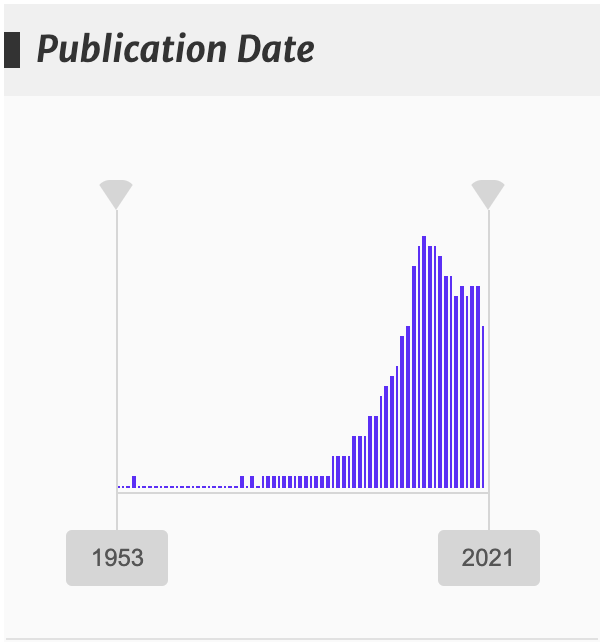

# Marco Teórico-Referencial {#teorico}

En este capítulo se exponen los fundamentos teóricos que sustentan los procesos y métodos aplicados en la investigación **Recuperación, Extracción y Clasificación de Información de SABER UCV**.

## Reseña histórica {#alghist}

El profesor Donald Knuth señala, dentro del campo de las ciencias de la computación, que la **búsqueda** "*es el proceso de recolectar información que se encuentra en la memoria del computador de la forma más rápida posible, esto cuando tenemos una cantidad N de registros y nuestro problema es encontrar el registro apropiado de acuerdo a un criterio de búsqueda"* [@knuth1997, p.392]. Este capítulo se inicia con esta cita ya que la recuperación de información gira en torno a un problema central de las ciencias de la computación que es la búsqueda.

En la década de 1940, cuando aparecieron las computadoras, las búsquedas no representaban mayor problema debido a que estas máquinas disponían de poca memoria *RAM* pudiendo almacenar solo moderadas cantidades de datos. No obstante, con el desarrollo e incremento del almacenamiento en memoria *RAM* o en dispositivos de almacenamiento permanentemente, ya en la década de 1950 empezaron a surgir los problemas de búsqueda y consecuentemente las primeras investigaciones para afrontarla.

Fue de esta manera que inicialmente se aplicaron estrategias de "búsqueda de fuerza bruta", donde dado un texto *T* y una subcadena *P,* se va recorriendo cada elemento de la cadena *T* para detectar la aparición de la subcadena *P*. Si bien esta estrategia no presentaba el mejor desempeño, sí constituía una forma válida de enfrentar el problema de la búsqueda de subcadenas de texto.

Siguientemente, en la década de 1960 se adoptan estrategias basadas en arboles para resolver los problemas de búsqueda. De los primeros algoritmos que sirvieron para localizar la aparición de una frase dentro de un texto se tienen los de "*Pattern-Matching*" [@goodrich2013].

Avanzando con el recorrido histórico, en 1976 se introdujo el algoritmo "Knuth-Morris-Pratt*"* que tenía como novedad el que se agregó una función que permitía ir almacenando en una tabla las "previas coincidencias parciales". Con mayor nivel de detalle, en esta tabla se registraban cuántos caracteres coincidentes se habían encontrado en una posición determinada cuando en la detección del patrón se generaban fallos. Con esto se logró que al momento de realizar un desplazamiento, se tomara en cuenta cuántos caracteres se podían reusar, logrando que se evitara retroceder más allá de lo necesario en el recorrido por la cadena de texto. Fue este enfoque el que permitió mejorar el rendimiento en lo relativo a los tiempos de ejecución comparado con las estrategias citadas previamente.

Seguidamente, en 1977 el problema de la búsqueda se enfrenta con un nuevo algoritmo que es el de "Boyer-Moore" en el cual se implementan dos heurísticas denominadas *looking-glass* y *character-jump,* las cuales permiten ir realizando algunos saltos en la búsqueda ante la no coincidencia de la subcadena con la cadena y adicionalmente el orden en el que se va realizando la comparación se invierte, trayendo como consecuencia que se obtuviese un mejor desempeño en el proceso de búsqueda.

Es importante mencionar que, sobre una modificación al algoritmo "Boyer-Moore" se sustenta la utilidad *grep* de la línea de comandos UNIX, la cual también da soporte a diversos lenguajes de programación para ejecutar búsquedas de texto, en un proceso que comúnmente es conocido como *grepping*. En particular, esta utilidad fue ampliamente usada para resolver distintos problemas de extracción de información en esta investigación.

Otra de las técnicas a considerar, ya que a ella se acudió para procesar las búsquedas de texto, fue el uso de la programación lineal, donde bajo la premisa "*divida et impera",* los problemas que requieren tiempo exponencial para ser resueltos son descompuestos en polinomios y por lo tanto se disminuye la complejidad en tiempo para encontrar la solución.

Dentro de los algoritmos que recurren a la programación lineal está el llamado "Smith-Waterman" [@smith1981], el cual se desarrolló para efectuar la alineación de cadenas del ADN de forma parcial o total dentro de una cadena mayor. Aunque su uso no estaba destinado a trabajar con caracteres, al poco tiempo de su aparición se identificó que el enfoque que adoptaba era extrapolable a la identificación de subcadenas de texto dentro de una cadena mayor, lo cual motivó a adoptar su uso en los procesos de búsqueda. Es importante señalar que este algoritmo se incorporó con éxito a los métodos implementados en esta investigación para resolver el problema de hacer coincidir las etiquetas de clasificaciones por área académica con el texto de las investigaciones y en el capítulo \@ref(desarrollo), "Desarrollo de la Solución", se indicará en detalle cómo fue usado.

Avanzando con el recorrido histórico, corresponde mencionar los algoritmos "*tries"* [@aho1975], en los que se representan los textos mediante estructuras jerárquicas de datos en un árbol compuesto por *tries,* donde se tienen nodos conectados representando cada uno un carácter y de esta manera la ruta desde la raíz hasta un nodo dado, forma una palabra o cadena. Esta estructura permite hacer búsquedas rápidas basadas en patrones y su eficiencia depende de la longitud de la palabra y no del tamaño total del conjunto de datos. Otro elemento a destacar de este algoritmo es que, los textos son sometidos a procesamientos que se hacen previamente a que ocurra el requerimiento de información, con lo cual al momento de hacer la búsqueda ya se dispone de una parte del trabajo realizado y de esta manera, al no tener que ejecutar todo el proceso sobre la marcha, se logran disminuir los tiempos de respuesta.

## Recuperación de Información {#infret}

Christopher Manning, uno de los investigadores con mayor dominio sobre el tema de recuperación de información (RI), la define como el proceso de encontrar materiales que satisfacen una necesidad de información cuando estos se encuentran dentro de grandes colecciones, y generalmente son textos almacenados de forma no estructurada en computadores [@manning2008]. Adicionalmente, el autor Charu Aggarwal menciona que el objetivo que tiene realizar la recuperación de información es conectar la información correcta, con los usuarios correctos en el momento correcto [@miningt2012].

En consecuencia, el eje central sobre el cual gira el proceso de recuperación de información es satisfacer las necesidades de información relevante que sean expresadas por un usuario mediante una consulta de texto a la cual se denomina ***query***.

En tal sentido, a los efectos de delimitar el espacio de búsqueda sobre el que se realiza la acción de la consulta, se tiene el **corpus**, al cual se define como el conjunto cerrado de documentos codificados electrónicamente que se encuentra integrado en un sistema de almacenamiento [@martiaurora] o entendido desde otra perspectiva, es el conjunto de datos en el cuál se hará la búsqueda, generando de esta manera el proceso de recuperación de información.

Ahondando un poco más en el tema se tiene que, satisfacer una necesidad de recuperación de información no solo se circunscribe a un problema de búsqueda de un texto dentro de un corpus. En la mayoría de los casos se deberá cumplir con ciertos criterios o restricciones, como por ejemplo, que la aparición del *query* en los documentos esté dentro de un período de fechas o que se encuentre limitado a otras restricciones, siendo esto a lo que se le denomina "búsqueda multi atributo".

Por otra parte, dentro de los fundamentos de la RI se tiene que el orden en que sean presentados los distintos documentos recuperados en un proceso de búsqueda, dependerá de la aparición, parcial o total y de la frecuencia, de las palabras del query dentro de un documento. Lo antes mencionado, junto con otros criterios determina la denominada "relevancia", concepto que será abordado con mayor detalle más adelante en \@ref(relevancia), "Relevancia".

Adicionalmente, en los procesos de recuperación de información es válido incorporar documentos que no coincidan exactamente con los términos buscados sino otros que contengan palabras que sean sinónimos o que presenten alguna similitud con el texto del *query*. Lo antes mencionado permite incorporar formalmente dentro del proceso de recuperación de información algo de imprecisión con la intención última de enriquecer el proceso [@kraft2017]. En \@ref(similitud), "Similitud de Documentos"**,** y en \@ref(embed), "*Embeddings"***,** se mencionan y especifican algunas de las técnicas con las cuales se incorporan este lote de documentos en los resultados de una búsqueda.

Recapitulando, se tiene que el proceso de recuperación de información está compuesto principalmente por los siguientes elementos:

-   Un ***query**:* el texto a buscar.

-   Un **corpus**: los documentos sobre los cuales se efectuará la búsqueda de información.

-   Una función de **relevancia**: la que permite ordenar los documentos recuperados de mayor a menor importancia para el usuario.

### Sistemas de Recuperación de Información (SRI) {#SRI}

Como se vio en la sección anterior, el desarrollo de algoritmos y métodos que permiten realizar procesos de búsqueda, teniendo en paralelo el crecimiento exponencial de datos disponibles en formato digital [@worldde2016], así como también la necesidad de resolver los problemas asociados a la búsqueda con múltiples atributos en tiempos que resulten aceptables, fue lo que abonó las condiciones para la creación de los sistemas de recuperación de información (SRI).

Estos sistemas son los dispositivos (*software* y/o *hardware*) que median entre un potencial usuario que requiere información y la colección de documentos que puede contener la información solicitada [@kraft2017] 1. El SRI se encargará de la representación, el almacenamiento y el acceso a los datos que están estructurados, teniendo presente que las búsquedas que sobre él recaigan conllevan distintos costos, siendo el principal el tiempo que tarde en efectuarse la misma.

Dentro de este contexto, es conocido que los datos estructurados son gestionados mediante un sistema gestor de base de datos, no obstante en el caso de los textos, se manejan por medio de un motor de búsqueda (*search engines*), motivado a que estos en un estado crudo carecen propiamente de estructura [@miningt2012]. Son estos motores los que permiten que un usuario pueda encontrar fácilmente la información que resulte de utilidad mediante un *query* usando las estructuras de datos, los algoritmos de búsqueda y la aplicación de funciones de relevancia que resulten óptimos para el proceso de recuperación de información.

### Ejemplos de SRI

A continuación se mencionan dos sitios de internet que funcionan como SRI sobre corpus de investigaciones científicas.

1.  Arxiv alojado en <https://arxiv.org/>: es un repositorio de trabajos de investigación. Al momento del usuario hacer un requerimiento de información, adicional al texto de la búsqueda, se pueden indicar distintos filtros a aplicar como puede ser el área del conocimiento (física, matemática, computación, etc.), si se quiere ejecutar la busqueda sólo, o de forma combinada dentro de: el título, el nombre autor, el resumen *o* en las referencias.

2.  Portal de la *Asociation Computery Machine* (ACM) alojado en <https://dl.acm.org>: incorpora un motor de búsqueda con particulares características ya que los resultados son acompañados por distintas representaciones gráficas que le dan un valor agregado. En la figura \@ref(fig:busquedasacm) se ve una de estas representaciones que incluye la frecuencia de aparición de los términos del *query* dentro del corpus en el tiempo.

```{r, busquedasacm, echo=FALSE, out.width='30%',fig.cap='Gráfico que acompaña resultados de búsqueda de un término en la biblioteca digital de la Association for Computing Machinery (https://dl.acm.org/)',fig.align='center'}

```

### Modelos de Recuperación de Información {#MRI}

#### Recuperación boleana {#MRIbol}

En este modelo ante una búsqueda de información se recorre linealmente todo el documento para retornar un valor boleano indicando la presencia o no del término buscado. Es uno de los primeros modelos que se usó y está asociado a técnicas de *grepping* [@manning2008]. El desarrollo de este modelo apareció entre 1960 y 1970.

El ojetivo planteado por este modelo es que el usuario final obtenga como respuesta a un *query* solo aquellos textos que contengan el término. Es un modelo muy cercano a los típicos *querys* de bases de datos con el uso de operadores lógicos "*AND*", "*OR*" y "*NOT*".

Más especificamente, el modelo boleano en el procesamiento de los textos genera una matriz de incidencia binaria término-documento, donde cada término que conforma el vocabulario, ocupa una fila *i* de la matriz, mientras que cada columna *j* se asocia a un documento. La presencia del término *i* en el documento *j* se denotará con un valor verdadero o un "1".

De acuerdo a lo anterior, la recuperación boleana si bien representa una buena aproximación al procesamiento de *querys* con mayor rapidez, también hace que se presente una gran desventaja y es que al crecer la cantidad de documentos, junto con el vocabulario (palabras únicas contenidas dentro del corpus), se obtiene una matriz dispersa de una alta dimensionalidad que hace poco efectiva su implementación.

Igualmente, las deficiencias de este modelo también reacaen en que los resultados que se obtienen ante una búsqueda no tienen representado ningún criterio de relevancia. Si por ejemplo, el término sobre el cual se realiza el *query* aparece 100 veces en un documento y en otro solo aparece una vez, en la presentación de los resultados ambos documentos se mostrarán al mismo nivel, no pudiendo indicar la mayor relevancia que puede tener uno sobre el otro.

De la misma forma, también se tiene como otra de desventaja que en este modelo no se registra el contexto semántico de las palabras e incluso se pierde el orden en que aparecen los términos dentro de cada texto.

#### Índices Invertidos {#invind}

Es ampliamente conocido el proceso de indexación como aquel en el cual se generan índices dentro de las bases de datos, sin embargo, en los sistemas de recuperación de información se genera otro tipo de índice que recibe el nombre de "índice invertido". En él, en vez de guardar los nombres de los documentos junto con las palabras que aparecen, se procede a registrar en una lista cada palabra y a continuación se indican los nombres o se guardan apuntadores a los documentos en los cuales se encuentra la misma. Adicionalmente, también se puede registrar la posición en que aparece cada una de estas, relativo a algún criterio, como puede ser el inicio del documento o del párrafo. Igualmente se puede registrar la frecuencia con que se presenta cada término en el documento.

De esta manera, se tiene que cuando un SRI funciona mediante un índice invertido, esto conlleva a que se puedan realizar las denominadas "búsquedas de texto completa" (*full text search*) así como también a realizar las búsquedas de texto aproximado *(approximate text searching)*, donde se flexibiliza la coincidencia entre el texto requerido y el resultado.

No obstante, hay que tener presente que la creación del índice inverso conlleva a algunos costos computacionales, siendo el primero de estos el mayor espacio de almacenamiento que se consume al guardar estos datos adicionales, incrementando el tamaño del registro de un 5% al 100% del valor inicial, según las configuraciones que se decida adoptar al crearlo. El segundo costo a tener en cuenta está determinado por los cálculos informáticos que se deben hacer al momento de actualizar el índice, una vez que se incorporan nuevos documentos [@Mahapatra2011]. En el capítulo \@ref(desarrollo), "Desarrollo de la Solución", se indicará en cuánto se incremento el espacio de almacenamiento en disco con la generación de el índice inverso del SCSU.

La situación expuesta motiva a que existan diversos tipos de índices invertidos y a que constantemente se estén realizando investigaciones que permitan mejorar su desempeño, motivado a que sobre ellos recae, en gran parte, la efectividad que se puede obtener ejecutando los *querys*. Algunos ejemplos de estos índices son el *Generalized Inverted Index* (GIN), RUM [^03-marco-teorico-1] y VODKA [^03-marco-teorico-2] y en el trabajo de [@Mahapatra2011] se encuentran detalles adicionales sobre ellos.

[^03-marco-teorico-1]: En el vínculo <https://github.com/postgrespro/rum> se tiene acceso a la explicación e implementación de este índice para PostgreSQL.

[^03-marco-teorico-2]: este índice fue presentado en la Postgres Conference en el año 2014 <https://www.pgcon.org/2014/schedule/attachments/318_pgcon-2014-vodka.pdf>

En contraparte, el espacio de almacenamiento que ocupa la implementación de estos índices se puede ver reducido mediante el preprocesamiento que se haga a las palabras buscando las raices de ellas, siendo uno de los métodos usados la aplicación del *stemming*, el cual se expondrá más adelante o también mediante la remoción de las *stopwords*, que son las palabras que no aportan mayor valor semántico dentro de un texto, como pueden ser los términos: la, el, tu, ella, son, entre varios otros.

Siguiendo adelante en el tema, existen estrategias de implementación de un sistemas de recuperación de información donde se generan dos o más índices inversos, conteniendo, por ejemplo, uno de estos la lista de documentos y la frecuencia de la palabra, mientras que en el otro se registra la lista con las posiciones de la palabra.

Para finalizar lo referente a los índices invertidos, se tiene que cuando la base de datos en que se soporta el sistema de recuperación de información crece y no es viable almacenarla en un único computador, es necesario acudir al uso de algoritmos y tecnologías que permitan distribuir los datos en sistemas distribuidos y paralelos como pueden ser Spark, Hadoop o Apache Storm.

### Relevancia {#relevancia}

Refiere la medida en que un documento o recurso recuperado satisface las necesidades de información del usuario. En otras palabras, un documento es relevante si contiene información que es útil y está relacionada con el *query* realizado por el usuario [@büttcher2010a]. La relevancia no es una propiedad intrínseca del documento, sino que depende del contexto y de las necesidades de información del usuario en un momento específico.

De esta manera, para establecer la relevancia que presente un documento sobre los otros, se usan distintos métodos, los cuales también han variado según las representaciones computacionales que se hagan de los textos. Bajo el modelo de recuperación boleano se puede dar un mayor peso a la aparición de la frase del *query* dentro del título de un texto o en las palabras clave. Otro método que se adopta es determinar la proximidad o cercanía entre las palabras contenidas en el texto recuperado, según la condición que establece el *query*. También se acude a realizar el cálculo de la frecuencia de aparición de una palabra, o varias, dentro del documento y su relación con el *query*, dando una mayor jerarquía a aquellos documentos que presenten una frecuencia de aparición mayor de los términos.

También se tiene que, otro método usado para establecer la relevancia, es determinar las referencias (citas), que contengan otros documentos a ese determinado escrito, similar a la propuesta del algoritmo *PageRank* [@brin1998].

Recientemente, una de las propuestas adoptadas para establecer los criterios de relevancia es efectuar la comparación vectorial, detallada en \@ref(similitud), "Similitud de Documentos" , de los *embeddings*, por definir en \@ref(embed), "Embeddings", que generan frases de un documento dentro del corpus con el *embedding* generado desde la frase del *query*.

### Re Ordenamiento (re-ranking) {#ranking}

Es una técnica utilizada para mejorar la precisión y lograr extraer los documentos que tengan mayor relevancia en los resultados de una búsqueda.

Cuando los usuarios realizan el *query* a menudo se encuentran con una gran cantidad de documentos que coinciden con sus consultas, sin embargo, no todos estos documentos son igualmente relevantes para el usuario. El *re-ranking* implica reorganizar los resultados de búsqueda originales para que los documentos más relevantes aparezcan en las primeras posiciones, mejorando así la experiencia del usuario.

Cabe destacar que, en algunos casos el sistema de recuperación de información en la función de relevancia ejecuta el proceso de re ordenamiento mientras que en otros este proceso es ejecutado con un método distinto que puede estar basado en técnicas soportadas en aprendizaje automático.

#### Learning to Rank (LTR)

Los algoritmos de aprendizaje para la clasificación (LTR, por sus siglas en inglés) son comúnmente utilizados para el re-ranking. En ellos se utilizan técnicas de aprendizaje automático para modelar la relevancia de los documentos basándose en características específicas [@büttcher2010]. Los atributos pueden incluir la frecuencia de palabras clave, la proximidad de términos en el documento y otros factores que indican la relevancia.

El siguiente aspecto a considerar es que los modelos LTR pueden ser entrenados con conjuntos de datos que contienen consultas y documentos etiquetados con su relevancia, y luego aplicados para re-ordenar los resultados de búsqueda en función de las características aprendidas.

#### BM25

Es un algoritmo que apareció a mediados de la década de 1990 y contiene una función matemática compleja de puntuación basada en un modelo probabilístico [@zhai2016] la cual es utilizada para calcular la relevancia de un documento con respecto a una consulta [@robertson2009] determinando la frecuencia de aparición de los términos de la búsqueda junto con la longitud del documento. Ha demostrado ser efectivo en la práctica para clasificar documentos según la relevancia que estos presenten, llegando en algún momento a decirse que obtenía un rendimiento similar al de un humano experto al hacer el proceso que de jerarquización en el proceso de recuperación de información.

### Medidas y Métodos de Evaluación de Desempeño de los SRI {#evaluacion}

Las siguientes métricas son usadas en el campo de la recuperación de información para evaluar el desempeño de un SRI:

1.  **Exactitud (*accuracy*):** mide la proporción de documentos relevantes recuperados por el sistema con respecto al total de documentos recuperados.

2.  **Precisión *(precision)*:** es la proporción de documentos relevantes recuperados por el sistema con respecto a todos los documentos recuperados. Cuanto mayor es la precisión, menos documentos irrelevantes se recuperan.

3.  **Recuperación (*recall*** **):** es la proporción de documentos relevantes recuperados por el sistema con respecto a todos los documentos relevantes presentes en la base de datos. Un alto "recall" indica que el sistema encuentra la mayoría de los documentos relevantes.

4.  ***F1 Score*****:** es la media armónica de la precisión (*precision)* y la recuperación (*recall)*. Esta medida proporciona un equilibrio entre los resultados que aportan las dos medidas que tiene de insumo. Un *F1 Score* alto indica un buen equilibrio entre la precisión y la capacidad para encontrar todos los documentos relevantes.

Una vez enunciados los conceptos de estas tres medidas es necesario determinar el proceso con que se puede determinar la "relevancia" de los documentos recuperados por un SRI. Para explicar esto se expondrá brevemente el origen de este método.

Posterior a la segunda guerra mundial se incrementó considerablemente la publicación de investigaciones en el ámbito científico y se hizo necesario contar con sistemas analógicos que fuesen eficientes para la indexación de los documentos. En el estudio denominado "*Cranfield Tests*"[@harman2011], que fue conducido por Cyril Cleverdon, a partir de 1958 se empezaron a definir los estándares para evaluar la efectividad de los índices disponibles para aquel momento.

Para ese entonces se definió la "relevancia" como lo que lo que actualmente se conoce como "exactitud" y la estrategia que se adoptó para poder determinarla fue usar el *"known-item searching"* (búsqueda del elemento conocido), que consistía en encontrar un documento que garantizara ser relevante ante una determinada pregunta. Para obtener la dupla "pregunta - nombre o identificación del documento con respuesta correcta" , acudieron a los autores de 1.500 trabajos y les pidieron que formulasen una pregunta que satisfactoriamente iba a ser respondida en el texto de su autoría [@harman2011].

Avanzando en el tiempo tenemos que desde inicios de la década de 1990, con las reuniones periódicas de la denominada "*Text Retrieval Evaluation Conference*-TREC", se crean distintos conjuntos de datos con diversos documentos agrupados por temas donde expertos anotan con una expression binaria: "relevante" o "no relevante", los juicios de relevancia para así poder indicar cuáles son los documentos más destacados para cada uno de los tópicos.

Es por esta razón que los conjuntos de datos constituidos por la dupla antes detallada, se les llama "*standard test collections*", "*golden standard*" o "*ground truth judgment of relevance*" (juicio de pertinencia basado en la verdad). Contar con estas colecciones permitió diseñar un método para poder evaluar el desempeño de un sistema al ejecutar el proceso de generación de "relevancia", comparando el criterio de los expertos con el obtenido desde el sistema.

No obstate, el problema que presenta el enfoque mencionado es que ante métodos de recuperación de documentos más avanzados, como la búsqueda semántica, la cual será presentada en \@ref(busquedasemantica), "Búsqueda Semántica", así como con la aparición de temas de investigación más especializados y también ante el incremento de documentos digitales, este tipo de mediciones se queda un tanto rezagada y no muestra la real efectividad en los procesos de RI que pueden disponer los sistemas.

Igualmente es necesario señalar que, las medidas "*precisión*"y "*recall"* en algunos casos no llegan a reflejar la verdadera satisfacción del usuario, ya que el diseño de la interfaz del sistema afecta positiva o negativamente, lo que realmente debe ser la medición de la relevancia que dispone el SRI sometido a evaluación [@manning2008].

## Procesamientos a los textos {#PT}

En esta sección se exponen diversos métodos que comúnmente se usan para procesar textos, teniendo presente que son estos el insumo con el cual se conforma el corpus anotado [@desagulier2017] de cualquier SRI y que efectuar óptimas manipulaciones sobre los documentos determinará en gran medida la propia calidad del sistema que se obtenga.

Primero que todo, es necesario contextualizar que la aplicación de las técnicas que serán revisadas tienen absoluta dependencia del idioma usado a diferencia de procesamientos que se pueden hacer a otros tipos de datos. Las herramientas que se seleccionan van a analizar, categorizar y extraer información de las palabras y oraciones para poder obtener estructuras gramaticales y morfológicas, haciendo que estos recursos estén directamente asociados a la lengua que posean los textos.

En tal sentido, previo al año 2016 eran escasas las herramientas computacionales para la manipulación de documentos en el idioma español. Los *frameworks* disponibles para realizar las tareas de procesamiento, se sustentaron en la adopción de las bases que da el proyecto *"Universal Dependencies"* [@demarneffe2021], tal es el caso del "coreNLP" de la Universidad de Stanford [@manning-etal-2014-stanford], que fue uno de los primeros en incluir dos métodos para el procesamiento de los textos con su tokenizador y también con el separador de oraciones (*sentences splitting*), sin disponer de otras utilidades como la identificación de las parte del discurso (*part of speech tagging),* el análisis morfológico (*morphological analysis)* [@straka2017] o el reconocimiento de entidades nombradas (*named entity recognigtion),* que sí se encontraban disponibles para el idioma inglés.

Sin embargo, un caso aparte para la época, es el esfuerzo de la Universidad Politécnica de Cataluña quienes crearon la herramienta *FreeLing* [^03-marco-teorico-3], la cual tuvo como entrada de datos para el entrenamiento del modelo el Corpus AnCora [^03-marco-teorico-4] anotado por el "*CLiC- Centre de Llenguatge i Computación*". Este software. soportado en un modelo de aprendizaje automático, fue uno de los primeros en poner a disposición de los usuarios de textos en español, la identificación de las parte del discurso y el análisis morfológico de las palabras.

[^03-marco-teorico-3]: <https://nlp.lsi.upc.edu/freeling/node/1>

[^03-marco-teorico-4]: **AnCora** es un corpus del **catalán (AnCora-CA)** y del **español (AnCora-ES)** con diferentes niveles de anotación como lema y categoría morfológica, constituyentes y funciones sintácticas, estructura argumental y papeles temáticos, clase semántica verbal, tipo denotativo de los nombres deverbales, sentidos de WordNet nominales, entidades nombradas (NER), relaciones de correferencia (<http://clic.ub.edu/corpus/es/ancora>)

Con el trancurrir del tiempo, este proyecto fue desplazado ya que otros *frameworks* con mejores integraciones de cadenas de trabajo (*pipelines*), así como el uso de otras arquitecturas de modelos de redes neuronales más potentes [@chen2014fast], permitieron la aparición de diversas herramientas que sí dieron soporte a la lengua española hacia finales de la década del 2010. En la sección \@ref(sota), "Estado del Arte", se revisaran algunos de estos avances.

### Procesamiento del Lenguaje Natural (Natural Language Processing- NLP) {#nlproc}

El procesamiento del lenguaje natural (PNL) es el conjunto de técnicas computacionales desarrolladas para permitir al computador representar e interactuar de una forma más efectiva con los textos. La *tokenización*, el etiquetado de partes del discurso, el *stemming* y la *lematización* son algunos de los métodos que lo componen. Es necesario destacar que cada uno de los métodos que se detallan a continuación fueron aplicados sobre el corpus del SCSU.

#### Tokenizador {#token}

Básicamente un tokenizador es una herramienta que permite separar un documento en palabras, o unidades semánticas que tengan algún significado. Las unidades obtenidas se les llama *tokens* [@straka2017].

En complemento de lo anterior, realizar este procesamiento para el idioma español no representa un mayor reto, ya que generalmente se puede usar el espacio como delimitador de palabras, no así en otros idiomas como el chino donde el problema se aborda de manera distinta.

De esta forma, al obtener las palabras como entidades separadas de un texto se permite, por ejemplo, calcular la frecuencia de uso de las mismas dentro del corpus.

En este contexto, las librerías de procesamiento de lenguaje natural para el idioma español disponen de tokenizadores que comúnmente presentan un 100% de precisión en la ejecución de separar las palabras.

Igualmente hay que destacar que los tokenizadores que se usan para generar *embedding*s, ver \@ref(embed), "Embeddings", tienen un comportamiento distinto al hacer la separación de las unidades que conforman el texto basándose en reglas.

#### Etiquetado de Partes del Discurso *(Part of speech tagging-POS)* {#pos}

Consiste en asignar un rol sintáctico a cada palabra dentro de una frase [@eisenstein2019], siendo necesario para ello evaluar cómo cada palabra se relaciona con las otras que están contenidas en una oración y así se revela la estructura sintáctica.

En este sentido, los roles sintácticos principales de interés en la elaboración de esta investigación son los sustantivos, adjetivos y verbos. Al recordar muy brevemente cuáles son estos roles se tiene que:

-   Los sustantivos tienden a describir entidades y conceptos.

-   Los verbos generalmente señalan eventos y acciones.

-   Los adjetivos describen propiedades de las entidades.

Igualmente, dentro del POS se identifican otros roles sintácticos como los adverbios, nombres propios, interjecciones, por solo mencionar algunos.

En específico, en esta investigación la ejecución del POS permite que se obtenga una tabla que sirve de insumo para determinar la coocurrencia de palabras, que es una de las formas en que se representan los resultados de los *querys* en el sistema desarrollado.

Se destaca que en el estado del arte, este proceso de etiquetado para el idioma español alcanza un 98% de precisión.

#### Stemming {#steaming}

El *Stemming* es un algoritmo que persigue encontrar la raíz de una palabra, teniendo como el de mayor uso el Algoritmo de Porter [@willett2006]. Al ser usado se puede reducir considerablemente el número de palabras que conforman el vocabulario del corpus y así consecuentemente mejorar los tiempos en que se ejecuta la búsqueda de un texto, ya que se disminuye el espacio de búsqueda.

(ref:letras) "cant".

Sin embargo, se hace la consideración de que, la aplicación de este tipo de algoritmos no toma en consideración el contexto en el que aparece la palabra a la que se le extrae la raíz. Como ejemplo se muestra que "yo canto, tú cantas, ella canta, nosotros cantamos, ellos cantan" en todos los casos se tendrá como raíz la cadena de letras (ref:letras)

Finalmente, es necesario tener presente que al crear el índice invertido son las raíces de las palabras las que se guardarán y no propiamente la palabra que aparece en el texto.

#### Lematización {#lemma}

Es el proceso en que se consigue el *lema* de una palabra, entendiendo que el *lema* es la forma que por convenio se acepta como representante de todas las formas flexionadas de una misma palabra [@demarneffe2021]. Los lemas, o lexemas, constituyen la parte principal de la palabra, la que transmite el significado. Los morfemas son el elemento variable de la palabra y son los que se busca desechar en el proceso de lematización.

En este sentido, al buscar el *lema* se tiene presente la función sintáctica que tiene la palabra, es decir que se evalúa el contexto en el que ocurre. Una de las ventajas de aplicar esta técnica es que se reduce el vocabulario del corpus y eso conlleva a que también se reduzca el espacio de búsqueda.

Un ejemplo de lematización se puede representar con estas tres palabras: "bailaré, bailamos, bailando" que tienen el mismo *lema* que es "bailar".

Una consideración final sobre este tema es que, en el estado del arte este proceso alcanza un 96% de precisión en varios de los modelos de aprendizaje automático preentrenados, no obstante no se disponen datos puntuales de esta métrica para el idioma español.

### Minería de Texto {#textmin}

La extracción de ideas útiles derivadas de textos mediante la aplicación de algoritmos estadísticos y computacionales se conoce con el nombre de minería de texto (*text mining)*, analítica de texto (*text analytics)* o aprendizaje automático para textos *(machine learning from text*). Se quiere con ella representar el conocimiento en una forma más abstracta y así poder detectar relaciones y patrones en los textos [@aggarwal2018a].

De esta manera se tiene que, la minería de texto surge para dar respuesta a la necesidad de tener métodos y algoritmos que permitan procesar estos datos no estructurados [@miningt2012] y ella ha ganado atención en recientes años motivado a las grandes cantidades de textos digitales que están disponibles. Los procesamientos inherentes al NLP mencionados anteriormente son insumo para la minería de texto.

A continuación se procede a exponer algunos de los métodos que pertenecen a la minería de texto:

#### Term-Document Matrix {#tdm}

Una vez que se tiene conformado un corpus, se procede a conformar una matriz dispersa de una alta dimensionalidad que se denominará *"Sparce Term-Document Matrix)"* de tamaño *n X d,* donde *n* es el número total de documentos y *d* es la cantidad de términos o vocabulario (palabras distintas) presentes entre todos los documentos. Formalmente se sabe que la entrada *(i,j)* de nuestra matriz es la frecuencia (cantidad de veces que aparece) de la palabra *j* en el documento *i*. Este procedimiento es similar al que fue revisado en \@ref(MRIbol), "Recuperación Boleana".

Cabe destacar, que uno de los problemas que presenta la matriz obtenida es la alta dimensionalidad y lo dispersa que es, llegando a estar conformada en un 98% por ceros, los cuales indican la ausencia de aparición de una palabra en un determinado documento.

Sin embargo, para mejorar un tanto este tipo de representación del corpus, se aplican otras técnicas que en principio puedan colaborar a reducir la dimensionalidad, por medio de simplificar los atributos, es decir, disminuyendo el vocabulario aplicando el stemming como se vio anteriormente.

#### Coocurrencia de Palabras {#coocurrencia}

En esta investigación se usará un método denominado "coocurrencia de palabras" para la detección de patrones en los textos y se hará la representación de aparición de las coocurrencias mediante grafos. El método se explica en que se evalúan las palabras que coocurren, es decir, aquellas que forman parte del conjunto de palabras obtenidas de la intersección de los documentos que conforman el corpus*,* o del subconjunto de documentos recuperados mediante un determinado *query*.

Adicionalmente, se tiene que también se puede establecer el nivel al que se quiere determinar la coocurrencia, por ejemplo, las palabras que coocurren una seguida de otra en los textos, las que coocurren dentro de la misma oración, dentro de un párrafo o dentro de todo el texto de cada documento.

Por otra parte, para la representación de las coocurrencias se usan grafos, donde cada palabra se representa un nodo y la coocurrencia de una palabra con otra implica que se extienda un arco entre ellas. Las palabras dispuestas para representarse en el grafo serán exclusivamente las que tengan la función dentro del discurso (POS) de adjetivos y sustantivos, es decir que cada coocurrencia será un sustantivo con el adjetivo que la acompaña, donde es posible tener una relación de 1 sustantivo con un conjunto de {0,1,...,n} adjetivos. Para lograr esto, la selección de las funciones gramaticales propuestas se hace para disminuir el espacio de representación y se considera que los sustantivos, al contar con el adjetivo que las acompaña, logran hacer una representación que muestra proximidad semántica y se representan los tópicos más relevantes [@segev2021].

En la figura \@ref(fig:coocejem) se visualiza lo expuesto de una manera gráfica, al ver la representación en un grafo la coocurrencia de palabras sobre los textos de los resúmenes de las tesis y trabajos especiales de grado de la Escuela de Física de la U.C.V.

```{r, coocejem, echo=FALSE, out.width='90%',fig.cap='Coocurrencia de palabras', fig.align='center'}

knitr::include_graphics(rep("images/03-marco-teorico/cooc.png"))


```

##### Mapas de Conocimiento {#mapacon}

La representación gráfica y el método de extracción de sustantivos y adjetivos, resulta similar a la propuesta metodológica realizada por [@dueñas2011] para crear "mapas de conocimiento" con "las palabras claves obtenidas a través de búsquedas recurrentes y relacionadas". En esta investigación se simplificará la obtención y representación de estos mapas, asumiendo que las palabras clave son los sustantivos adjetivizados, equivalente a visualizar las personas, cosas o ideas que se mencionan y que son modificados por los adjetivos, al cambiar sus propiedades o atributos; seleccionando aquellas palabras que muestran una mayor aparición en el *query* realizado y que se interconectan en un grafo mediante arcos.

### Similitud de Documentos {#similitud}

Para poder realizar la recomendación de documentos, una de las técnicas que se usa es medir la similitud que presenta un documento con los otros contenidos en el corpus [@aggarwal2018a] . Un ejemplo de esta técnica es el uso de la similitud coseno que se explica con esta fórmula.

```{=tex}
\begin{equation}
\cos ({\bf t},{\bf e})= {{\bf t} {\bf e} \over \|{\bf t}\| \|{\bf e}\|} = \frac{ \sum_{i=1}^{n}{{\bf t}_i{\bf e}_i} }{ \sqrt{\sum_{i=1}^{n}{({\bf t}_i)^2}} \sqrt{\sum_{i=1}^{n}{({\bf e}_i)^2}} }
\end{equation}
```
<br>

En este sentido, en la fórmula, *t* representa un documento y *e* representa otro documento. Ambos documentos se asumen que están en un espacio con *i* atributos, o dimensiones, y la intención es calcular un índice de similitud entre ambos documentos.

En este orden de ideas se tiene que este es uno de los métodos más usados para detectar similitudes en los textos, aunque existen otras fórmulas para el cálculo de la similitud como lo es el índice de Jaccard.

Adicionalmente se tiene que, hacer la comparación de un documento *i* del corpus que contiene *n* documentos, en un proceso iterativo con otra cantidad de (*n-1)* documentos, de se se obtienen (*n-*1) índices de similitud. Aquel que obtenga un mayor valor se puede inferir que presenta una mayor similitud con el documento *i.*

En el mismo orden de ideas se tiene que, otro elemento de gran importancia a evaluar en el resultado que se obtenga de esta medición, es la representación computacional que se haga del documento. Son distintas las técnicas que existen, estando entre ellas la representación mediante "bolsas de palabras" o *bag of words,* similar a lo que se explicó en \@ref(tdm), "*Term Document Matrix*", donde un documento *i* es el vector correspondiente a una fila de la matriz y la cantidad de dimensiones que presenta es equivalente al tamaño del vocabulario.

Un elemento importante a destacar de realizar este tipo de comparaciones, la estimación de la similitud, es que ante un proceso de *query* también pueden ser recuperados, o sugerir al investigador, aquellos documentos que presenten alguna mínima similitud con los documentos recuperados.

Finalmente, se procede a resaltar que recientemente se han creado formas más complejas para la representación de los documentos, como lo son los *word embeddings* que son obtenidos mediante el entrenamiento de redes neuronales de aprendizaje profundo, lo que será expuesto en \@ref(embed),"Embeddings".

## Sistemas Distribuidos {#SD}

Los distintos procesos y componentes de la solución propuesta han sido diseñados e implementados como un sistema distribuido y por eso se hace la mención a este tema.

En tal sentido, una definición formal que se le puede dar a los sistemas distribuidos es "cuando los componentes de hardware y/o sofware se encuentran localizados en una red de computadores y estos coordinan sus acciones solo mediante el pase de mensajes" [@distribu2012].

De acuerdo a lo anterior, se tiene que algunas de las principales características que poseen los sistemas distribuidos es la tolerancia a fallos, compartir recursos, concurrencia, ser escalables [@czaja2018] entre otras. Mencionamos estas, en particular, al ser propiedades que están presentes en la solución que se implementa:

1.  Fiabilidad (tolerancia a fallos): al fallar un componente del sistema los otros se deben mantener en funcionamiento.

2.  Compartir recursos: un conjunto de usuarios pueden compartir recursos como archivos o base de datos.

3.  Concurrencia: poder ejecutar varios trabajos en simultáneo.

4.  Escalable: al ser incrementada la escala del sistema se debe mantener en funcionamiento el sistema sin mayores contratiempos.

### Contenedores {#contenedores}

Un contenedor es una abstracción de una aplicación que se crea en un ambiente virtual, en el cual se encuentran "empaquetados" todos los componentes (sistema operativo, librerías, dependencias, etc.), que una aplicación necesita para poder ejecutarse. En su diseño se tiene presente que sean ligeros y que con otros contenedores pueden compartir el *kernel*, usando un sistema de múltiples capas, que también pueden ser compartidas entre diversos contenedores, ahorrando espacio en disco del *host* donde se alojan los contenedores [@nüst2020].

De lo indicado en el punto anterior se tiene que, el uso de los contenedores permite crear, distribuir y colocar en producción aplicaciones de software de una forma sencilla, segura y reproducible. También a cada contenedor se le puede realizar una asignación de recursos (memoria, CPU, almacenamiento) que garantice un óptimo funcionamiento de la aplicación que contienen. Es importante señalar que, el uso de esta tecnología también añade un entorno de seguridad al estar cada contenedor en una ambiente isolado.

Igualemente hay que resaltar que, para instanciar cada contenedor es necesario disponer de una imagen donde previamente se definen las dependencias (sistema operativo, librerías, lenguajes) necesarias para su funcionamiento.

### Orquestadores {#orquestador}

Cuando se tienen diversos contenedores para sustentar un sistema, donde cada uno aloja una aplicación o servicio distinto, puede resultar necesario que todos se integren y compartan recursos optimizadamente. Para que esta integración sea viable es necesario contar con un orquestador [@cook2017]. Su uso permitirá lograr altos grados de portabilidad y reproducibilidad, pudiendo colocarlos en la nube o en centros de datos, garantizando que se pueda hacer el *deploy* de forma sencilla y fiel a lo que se implementó en el ambiente de desarrollo.

Así mismo, en el caso de la solución propuesta se adoptará el uso de *Docker Compose* como orquestador y en el capítulo \@ref(desarrollociclos4), "Ciclos de Desarrollo", serán expuestas las funcionalidades de cada contenedor y del orquestador.

## Estado del Arte {#sota}

Si bien anteriormente las búsquedas de información dentro de un corpus se procesaban determinando la aparición de palabras dentro de un texto, este método ha ido evolucionando, pasando de tener motores de búsqueda (*search engines* ) a los denominados motores de respuestas ( *answering engines* ) [@balog2018], donde el sistema ante una determinada consulta va a retornar una serie de resultados enriquecidos, mostrando la identificación de entidades, hechos y cualquier otro dato estructurado que esté de forma explícita e implícita, mencionado dentro de los textos que conforman el corpus.

Es por esto que, para hablar sobre el estado del arte tanto en los sistemas de recuperación de información, así como en el procesamiento del lenguaje natural y en la medición de similitud entre documentos, es necesario referir la representación de los textos mediante *embeddings,* los cuales serán expuestos a continuación.

### Embeddings {#embed}

A partir del siguiente ejemplo que contiene dos frases se va a plantear el problema que motiva la necesidad de contar con modelos distintos al de índice invertido para hacer la representación de los textos computacionalmente:

Frase 1: el modelo de banco de tres asientos está en oferta.

Frase 2: voy a depositar dinero al banco.

En este ejemplo claramente se distingue que el uso de la palabra "banco" tiene significados distintos. Es por esto que el lingüista Firth J.R. enfrentó el problema planteado con el siguiente postulado: "entenderás el significado de una palabra analizando aquellas que la acompañan", donde queda patente que para comprender el concepto de un término hay que revisar el contexto en el que ocurre y no verlo como una unidad independiente del documento que lo contiene.

Continuando con la exposición del problema, si se tuviese un sistema de recuperación de información sustentado en el modelo de índice invertido, con las frases del ejemplo registradas en él, ante el *query* "banco con asientos", posiblemente se obtendrían como resultado todos los documentos donde aparezca la palabra "banco", tanto el que contiene "el modelo de banco de tres asientos está en oferta", como el otro que indica "voy a depositar dinero al banco", sin tener en consideración la semántica de la palabra "banco" dentro del texto del *query,* que en este caso se corresponde a la frase 1, que es "asientos, con respaldo o sin él...". Con base a lo anterior, sabemos que la situación ideal para un usuario sería que el SRI recuperase exclusivamente el documento que contiene la frase "el modelo de banco de tres asientos está en oferta", o incluso yendo más lejos, si el *query* fuese "fabrica de sillas", también se aspiraría que el sistema arrojase como resultado el documento con el texto "el modelo de banco de tres asientos está en oferta", ya que asiento, banco y silla pueden ocurrir en contextos semánticos similares. Lo antes expuesto conlleva a ver las limitaciones que muestra el modelo de índice invertido y plantea la necesidad de contar con modelos donde se tengan representaciones de los datos con una estructura en la que pueda quedar plasmado el significado de las palabras y se puedan mejorar los procesos de IR.

De esta forma se tiene que, son los *embeddings* la representación, mediante vectores de las palabras y frases, que hoy constituye el estado del arte en los procesos de recuperación de información al lograr que sea posible aplicar distintos métodos algebraicos y computacionales para inspeccionar el vocabulario de un determinado corpus y tener nociones más precisas sobre la cercanía de una palabra con otra e igualmente poder hacer mediciones de similitud entre un documento, que se ha transformado en partes o en su totalidad en *embeddings*, con otro que tenga el mismo tipo de representación. 

Al respecto, para comprender qué son los *embeddings* se debe partir de estudiar la hipótesis distribucional, la cual se enmarca en al área de la lingüística y enuncia que la similaridad en significados resulta en que también se presente una similaridad en la distribución lingüística. Dos palabras que sean próximas en significado, entendido como que sean intercambiables en un texto, es un fenómeno que también se detectará en la distribución que presentan dichas palabras dentro de un corpus. Con base a lo anterior, de esta hipótesis surge la propuesta de crear la "distribución semántica", donde se representa el significado de una palabra mediante el proceso en que se toma como entrada grandes cantidades de texto y se construye un modelo de distribución, también llamado "espacio semántico", que logra extraer la representación semántica de todo el vocabulario en un espacio *n*-dimensional, haciendo que cada palabra se muestre como un vector con una representación numérica densa.

En el siguiente ejemplo \@ref(tab:tblembedding) que se obtiene del trabajo *Distributional Semantics and Linguistic Theory* [@boleda2020], se muestra una versión simplificada de un espacio semántico de dos dimensiones donde están los vectores que se corresponden con tres palabras que son *postdoc* (post doctorado)*, estudent* (estudiante) y *wealth (riqueza)*:

```{r,tblembedding, echo=FALSE, out.width='40%'}
df_embed <- data.frame(Palabra= c("postdoc", "estudent","wealth") ,
                       `Dimensión 1`= c(0.71038,0.43679,1.77337),
                       `Dimensión 2`= c(1.76058,1.93841,0.00012 ))

knitr::kable(
  df_embed, 
  booktabs = TRUE,
  caption = 'Embedding bidimensional para representar palabras'
)
```

De acuerdo a lo anterior, al representarse cada palabra con un vector de dos componentes, se puede hacer la gráfica en un plano, como se aprecia en la figura \@ref(fig:embeddingimg), donde al aplicar la medición de similitud coseno, revisada en \@ref(similitud), "Similitud de Documentos", se determina que las palabras *postdoc* y *student* se encuentran más próximas y presentan una mayor similitud que *postdoc* y *wealth*.

```{r,embeddingimg, echo=FALSE, out.width='55%',fig.cap='Representación de palabras en un plano', fig.align='center'}
knitr::include_graphics("images/03-marco-teorico/word_vec.png")

king= c( 0.50451 , 0.68607 , -0.59517 , -0.022801, 0.60046 , -0.13498 , -0.08813 , 0.47377 , -0.61798 , -0.31012 , -0.076666, 1.493 , -0.034189, -0.98173 , 0.68229 , 0.81722 , -0.51874 , -0.31503 , -0.55809 , 0.66421 , 0.1961 , -0.13495 , -0.11476 , -0.30344 , 0.41177 , -2.223 , -1.0756 , -1.0783 , -0.34354 , 0.33505 , 1.9927 , -0.04234 , -0.64319 , 0.71125 , 0.49159 , 0.16754 , 0.34344 , -0.25663 , -0.8523 , 0.1661 , 0.40102 , 1.1685 , -1.0137 , -0.21585 , -0.15155 , 0.78321 , -0.91241 , -1.6106 , -0.64426 , -0.51042 )


```

De esta manera se tiene que, al generar la representación completa de un espacio semántico, haciendo la búsqueda de una palabra podemos encontrar también aquellas que son cercanas y no limitar la búsqueda al *match* que los modelos anteriormente estudiados sí imponían. Más adelante también veremos que el modelo semántico puede ser expandido y representar mediante un *embedding* oraciones (*sentences*), siendo esto el sustento que permite que al hacer una pregunta o un *query* a un sistema de recuperación de información, este sea capaz de encontrar la respuesta dentro del corpus, ya que la pregunta o *query* se transforma en un *embedding* y luego se determina en el espacio semántico cuál es la oración que más se aproxima y guarda algún tipo de proximidad o relación de distancia vectorial con la pregunta formulada. 

Es importante mencionar que, han sido diversos los algoritmos implementados para crear los *embeddings*, evolucionando para lograr que las representaciones de los textos resulten de mayor provecho y rendimiento. A manera ilustrativa, para comprender una parte del funcionamiento de los *embeddings,* se va a usar el modelo "*GloVe: Global Vectors for Word Representation*" [@pennington2014] en el cual mediante un vector de 100 componentes, siendo cada uno de estos un número real de ocho o más decimales, se logra hacer la representación de una palabra. A continuación se muestran los componentes del vector obtenido para el vocablo *king*, simplificado en este caso a 50 componentes principales:

"`r king`"

No obstante, ya que estos números dificultan la comprensión intuitiva, con la finalidad de facilitar el análisis, el vector revisado se procede a representarlo gráficamente en la figura \@ref(fig:embking), mapeando los componentes a una paleta de colores.

```{r,embking,echo=FALSE, out.width='95%',fig.cap='Representación de palabra king mediante el modelo GloVe', fig.align='center'}

knitr::include_graphics("images/03-marco-teorico/embking.png")
```

Igualmente, usando el mismo modelo y método de visualización, una representación de las palabras *king* (rey), *man* (hombre) y *woman* (mujer) es la que se observa en la imagen \@ref(fig:GloVeEmbedd).

```{r,GloVeEmbedd,echo=FALSE, out.width='95%',fig.cap='Representación de palabras mediante el modelo GloVe', fig.align='center'}

knitr::include_graphics("images/03-marco-teorico/embedding.png")
```

En tal sentido se tiene que, la representación muestra gráficamente que las palabras *man* y *woman* son más "parecidas" visualmente que *king* y *man*, idea que se puede generalizar para entender cómo las distintas palabras que se llevan aun espacio semántico pueden presentar proximidades, similitudes o diferencias, obteniendo de esta forma un significado semántico según la posición relativa que cada una tenga con respecto a la otra en el espacio. El crédito a la visualización que se muestra en \@ref(fig:GloVeEmbedd) corresponde al divulgador Jay Alammar [@wordtovec].

No obstante, en los puntos expuestos aún no se ha explicado cómo se generan los *embeddings*, lo cual es indispensable para entender sus capacidades. Retrotrayéndonos al año 2003, se hizo una investigación en la cual se obtuvo que mediante el entrenamiento de redes neuronales de aprendizaje profundo se logrará modelar la probabilidad y así predecir, las secuencias de palabras dentro de los textos, demostrando la capacidad de estas redes para capturar patrones complejos en datos textuales [@Bengio:2003:NPL:944919.944966] . Así mismo, también se tiene como otro hito la investigación "*Semantic Hashing*" [@salakhutdinov2009] donde usaron redes neuronales para transformar datos de alta dimensionalidad en representaciones binarias de baja dimensionalidad. Esa investigación también añadió como un aporte el que se empezarán a usar técnicas de aprendizaje no supervisado para entrenar las redes neuronales, deshaciéndose de los cuellos de botella que previamente introducían los procesos de etiquetado, necesarios en métodos supervisados.

Otro punto a resaltar fue lo que significó la ampliación de capacidades de computo en sistemas distribuidos compuestos por tarjetas gráficas (*Graphics Processing Unit* - GPU) a inicios de 2010, ya que este tipo de procesadores facilitan los cálculos de las redes neuronales, con lo cual se empezó a incrementarse el entrenamiento y uso de estas redes para ese momento. También fue para aquel entonces, cuando se publica la investigación *"Word2Vec: Efficient Estimation of Word Representations in Vector Space*" [@mikolov2013] que implementa la técnica *Skip-gram* y *Continuous Bag of Words (CBOW)* que permitieron a las redes neuronales el aprendizaje de representaciones semánticas de palabras a partir de grandes volúmenes de texto. *Word2Vec* no solo demostró ser eficiente computacionalmente, sino que también producía *embeddings* que capturaban relaciones semánticas y sintácticas transformando cómo se abordaban las tareas de NLP y las aplicaciones de recuperación de información.

Como consecuencia, una vez que se empezó a tener un método para capturar la semántica de las palabras, debió seguir el paso de lograr representar el sentido semántico de frases (*sentences* en inglés) y expresiones más complejas. Lo anterior se logró con la investigación "*Distributed Representations of Words and Phrases and their Compositionality*" (2013) [@mikolov2013a] donde se hicieron representaciones vectoriales distribuidas para frases, mejorando la capacidad de capturar significados contextuales y relaciones sintácticas en un nivel más alto, lo cual resultó crucial para mejorar los sistemas de recuperación de información y también para la traducción automática.

Por otra parte, la investigación *GloVe* [@pennington2014], usada en un punto previo para hacer la representación gráfica de tres palabras, también motivó grandes avances al superar limitaciones que presentaban investigaciones anteriores al permitir generar analogías del tipo: (vector de *embedding* para la palabra "rey") (menos -) (vector de embedding para la palabra "hombre") (más +) (embedding para la palabra "mujer"), (es igual=) o muy aproximado en el espacio semántico, al (vector de embedding de la palabra "reina") o simplificado como "rey-hombre+mujer = reina".

Igualmente, con esa investigación se intensificó el uso de esos modelos en tareas de clasificación de texto, como las revisadas en \@ref(nlproc),"Procesamiento del Lenguaje Natural", ya que las redes neuronales empezaron a entrenarse con representaciones de vectores de gran densidad que contenían las palabras, el POS y el etiquetado de las dependencias, conteniendo cada vector 200 componentes y de esta manera se alcanzaron mejores indicadores de desempeño en el etiquetado [@chen2014]. Cabe destacar que el trabajo citado fue el que dio soporte a la librería revisada anteriormente de nombre "coreNLP" de la Universidad de Stanford.

### Arquitectura de Redes Neuronales *Transformers* {#trans}

En el año 2017 se publica "*Attention Is All You Need*" [@vaswani2017] el cual fue una investigación donde se introdujo una nueva arquitectura de redes neuronales que eliminó ciertas limitaciones que venían presentando los modelos de redes neuronales recurrentes y las convolucionales en poder trabajar con largas cadenas de texto. La solución introdujo los llamados "mecanismos de atención" [^03-marco-teorico-5] que abrieron el camino para la creación de nuevos modelos de lenguaje como BERT [@devlin2018] que capturaban la riqueza de significados y las relaciones complejas del lenguaje mejorando la comprensión de textos, traducción automática y la generación de texto.

[^03-marco-teorico-5]: Los mecanismos de atención permiten al modelo asignar ponderaciones dinámicas a diferentes partes de la entrada, lo que resulta en una comprensión más profunda y contextualizada del texto.

Igualmente destacó el trabajo "*RoBERTa: A Robustly Optimized BERT Pretraining Approach*" [@liu2019] en el que se optimizó el entrenamiento preexistente de *BERT* al desvincular la tarea de pre-entrenamiento del tamaño de la cantidad de ejemplos de entrenamiento (*batch size*) y la duración del entrenamiento. Al escalar el tamaño del lote y la cantidad de datos, *RoBERTa* mejoró la comprensión del modelo sobre el lenguaje, logrando una capacidad de generalización excepcional.

Como consecuencia, estos métodos que venían innovando e incrementando las capacidades, por otra parte también hacían que el tamaño de los conjuntos de datos usados para el entrenamiento fuese creciendo exponencialmente, como se analizará en la sección \@ref(LLM), "Largos Modelos de Lenguaje".

En este mismo orden de ideas se tiene que, otro modelo basado en la arquitectura *Transformers* que es necesario referir, ya que a un componente del SCSU le da soporte, es el que se publicó bajo el título "*Sentence-BERT: Sentence Embedding*s" [@reimers2019a] que a diferencia de los modelos anteriormente expuestos, que trabajaban con la codificación de palabras, en él se logra la codificación de oraciones usando una variante de *BERT* [@devlin2018] permitiendo entender la similitud semántica entre pares de estas.

Sin embargo, un punto que fue necesario resolver para masificar la adopción de estos modelos era lograr contar con representaciones de *embeddings* para distintos idiomas, ya que inicialmente solo estaban entrenados con textos en idioma inglés impidiendo que fueran de utilidad para otras lenguas. En este sentido, una de las investigaciones que permitió avanzar hacia modelos multilingües fue "*Making Monolingual Sentence Embeddings Multilingual*" [@reimers2020], usando la técnica "*Knowledge Distillation*", la cual permitió que en lugar de entrenar modelos para cada idioma, solo se utilice un único modelo de referencia monolingüe para guiar el entrenamiento de modelos en múltiples idiomas, basándose en la idea de que "una frase traducida debe situarse en el mismo lugar del espacio vectorial-semántico que la frase original" [@reimers2020].

En complemento a estas investigaciones, también se tiene a "*BETO: Spanish BERT*" [@CaneteCFP2020], que teniendo como sustento BERT, fue un modelo entrenado por el Departamento de Ciencias de la Computación Universidad de Chile, disponible en el enlace <https://github.com/dccuchile/beto>, al cual se considera como perteneciente el estado del arte para el idioma español, alcanzando una precisión del 98,97% en tareas como el POS. También se aprovecha de indicar que este modelo igualmente se insertó en la implementación del SCSU.

Otro aspecto que es necesario señalar es que todas las investigaciones citadas se hicieron de dominio público y en muchos casos también se colocó a disposición de la comunidad científica los propios modelos preentrenados y los conjuntos de datos del entrenamiento, lo cual conllevó a que se lograra la reproducibilidad de los mismos, beneficiando a la comunidad científica y a los desarrolladores.

En caso de resultar de interés, para obtener información sobre los modelos de *embeddings* que presentan una elevada precisión y son de alta demanda por la comunidad *open source*, siendo parte del estado del arte, se tienen herramientas como el "*MTEB: Massive Text Embedding Benchmark*" [@muennighoff2022] al que se puede acceder en el enlace <https://huggingface.co/spaces/mteb/leaderboard> donde muestran métricas de 140 modelos preentrenados en el área del lenguaje disponibles para el uso público.

### Largos Modelos de Lenguaje {#LLM}

Con la aparición de la arquitectura *Tranformers* se abrió el camino para la aparición de los Largos Modelos de Lenguaje *(Large Language Models -LLM´s)*. En principio pudiese parecer estar fuera del alcance de este trabajo exponer estos modelos, pero el estado del arte de los sistemas de recuperación de información se intersecta con ellos y no resultan ajenos a trabajos futuros que puedan suceder a esta investigación.

Como se pudo ver en la sección \@ref(embed), "*Embeddings"*, la tendencia ha sido ir incrementando la cantidad de datos con que se entrenan estos modelos así como también el número de parámetros que conforman al propio modelo. En la figura \@ref(fig:llm) vemos las variaciones increméntales que se han dado desde la publicación del modelo basado en los *Transformers* en el año 2017.

```{r,llm,echo=FALSE, out.width='85%',fig.cap='Evolución en la cantidad de parámetros en los LLM', fig.align='center'}

knitr::include_graphics("images/03-marco-teorico/llms.png")

```

El crédito a la visualización \@ref(fig:llm) corresponde a Harishdatala [@llmsize]. En general, los largos modelos de lenguaje son entrenados con enormes corpus de textos recopilados de foros de internet, de páginas web, de libros digitalizados y de un basto cúmulo de textos que también pueden incluir datos sintéticos.

De esta manera, sin entrar en mayores consideraciones sobre este crecimiento y los costos asociados, tanto monetarios, ambientales y de recursos computacionales, que imposibilitan a instituciones educativas, a empresas de mediano tamaño o a investigadores independientes, poder acceder a los sistemas de computadores necesarios para entrenar modelos de estas características, resulta significativo que a finales del año 2022 a uno de los modelos llamado "*Generative Pre-trained Transformer 3*" de la empresa OpenAI, del cual no se dispone mayor documentación sobre su arquitectura ni precisión sobre el método de entrenamiento, le es realizado un proceso de "*fine tunning*" que es un ajuste a los parámetros mediante un reentrenamiento y así se crea lo que hoy se conoce comercialmente como ChatGPT 3.5, introduciendo mediante una interfaz de usuario la funcionalidad de que se pueda interactuar con el modelo simulando una conversación, sorprendiendo por la capacidad de lograr emitir respuestas sobre una gran diversidad de temas de una manera fluida.

En complemento de lo anterior se tiene que, representando la interacción humano - LLM mediante una analogía con los SRI, lo que se aprecia es a un usuario haciendo un *query* ante un enorme corpus que excede y se organiza de una forma distinta a lo que se había revisado en \@ref(SRI), "Sistemas de Recuperación de Información", donde se tenía una base de datos con documentos indexados. Ahora son distintos, tanto el proceso de interacción, como la representación de la información, ya que cada vez que se solicita un *query*, lo primera diferencia que se tiene es que, puede ser expresado en lenguaje natural y la segunda, es que no debe ser una condición que se de algún *match* con una palabra que conforma el índice invertido. En realidad el texto de la consulta es transformado en un *embedding,* que posteriormente activa capas de la red neuronal, conformadas las mismas por los parámetros del modelo y así de esta forma, mediante un proceso estocástico, el LLM va prediciendo palabra a palabra, conformando una respuesta a lo que fue el *query* inicial. Lo anterior puede cubrir la necesidad de información requerida con respuestas que estén acorde a lo esperado, siendo novedosas, fidedignas, o no tanto, a la realidad. Sin embargo, no se debe olvidar que la calidad del texto de la respuesta que produzca el LLM, dependerá de aspectos que traspasan lo computacional y se asocian un tanto más a las previsiones que se hayan tomado, por parte de quienes entrenan el modelo, para mitigar sesgos contenidos en los textos o entradas de datos incorrectas en la fase de entrenamiento del mismo.

Por otra parte, es indispensable resaltar como un hecho muy importante en el campo de los LLM´s que en el año 2023 algunas compañías e institutos de investigación privados, empezaron a liberar de licencias de uso ciertos modelos, con distintos pesos y versiones para la comunidad *open source*, como lo es el modelo Falcon [@penedo2023] o el modelo OpenLlama2 [@touvron2023] [^03-marco-teorico-6]. Lo anterior, en conjunto con las facilidades para el desarrollo que aportan plataformas como [huggingface.com](huggingface.com) para la implementación de aplicaciones de inteligencia artificial, mediante el almacenamiento de modelos preentrenados, conjuntos de datos para entrenamiento o sobre entrenamiento, así como librerías con *pipelines* de fácil integración mediante API´s unificadas [@wolf2019], estos LLM´s dejaron de tener un uso limitado solo para grandes empresas o consorcios tecnológicos y para la fecha es viable que corran en computadoras con capacidades limitadas, mediante la aplicación de procesos como el *quantized*, que se presenta en la investigación [@dettmers2023], que por ejemplo permite que un modelo de lenguaje que inicialmente necesita unos 16 gb de memoria ram en GPU para ser desplegado, pueda disminuir a una cuarta parte, 4 gb, haciendo viable que se pueda desplegar en un computador con menores recursos disponibles.

[^03-marco-teorico-6]: la compañía que entrenó el modelo y lo liberó que es Meta indicó que es OpenSource, pero revisiones técnicas hechas a la licencia cuestionan que se pueda considerar que realmente cumpla las especificaciones para que sea considerado plenamente "open source". En el enlace [Is Llama 2 open source?](https://opensourceconnections.com/blog/2023/07/19/is-llama-2-open-source-no-and-perhaps-we-need-a-new-definition-of-open/) se encuentra un análisis sobre el tema.

Para cerrar el tema, la diversidad de modelos preentrenados, con distintas versiones que les ha sido efectuado un proceso de *fine tunning* o cuantizaciones, se puede ver en el enlace [@openllm] <https://huggingface.co/spaces/HuggingFaceH4/open_llm_leaderboard> donde se encuentra un tablero que muestra los modelos que presentan mayor popularidad, descargas y métricas de evaluación de su comportamiento.

### Integración {#int}

Al contar con versiones *open source* de estos modelos es posible integrarlos en procesos de recuperación de información, principalmente mediante dos técnicas.

1.  *Retrieval Augmented Generation RAG* [@lewis2020]: esta técnica permite que un LLM que fue entrenado con un determinado corpus, pueda activar la extracción de información desde fuentes externas, como páginas de internet o una bases de datos, complementando la información que inicialmente dispone el modelo, asociada a los datos de entrenamiento. Cabe destacar que, específicamente al hablar de las bases de datos que almacenan *embeddings*, a estas se les denomina *Vector DataBase.* Bien sea que el modelo de lenguaje acuda a una página de internet o a la *Vector Database*, una vez que la información se recupera, el LLM se encarga de procesarla e integrarla en una respuesta que debe tener una estructura compresible y coherente.

2.  *Fine Tunning* [@lv2023]: con un conjunto de datos etiquetado, generalmente con información de un dominio específico de un volumen mucho menor al que inicialmente fue entrenado un determinado LLM, se puede lograr que el modelo sea sobreentrenado con métodos como el propuesto en la investigación *"Universal Language Model Fine-tuning for Text Classification*" [@howard2018], mejorando notablemente su desempeño en emitir respuestas sobre ese particular dominio en el que se realizó el ajuste.

En resumen, estas técnicas por separado o en paralelo, pueden implementarse para crear sistemas de recuperación de información soportados en un LLM, el cual se pueda adaptar y convertirse en un experto de una precisa área de estudio que indique referencias a los trabajos que conforman un determinado corpus.

### Búsqueda Semántica {#busquedasemantica}

Es una evolución en la forma en que los motores de búsqueda comprenden y responden a las consultas. A diferencia de la búsqueda tradicional basada en la aparición de palabras clave, la cual se centra en encontrar coincidencias literales entre la consulta y el contenido web, la búsqueda semántica tiene como objetivo comprender el significado contextual de las consultas y ofrecer resultados más relevantes y precisos.

Para ahondar en la comprensión de su significado, se tiene que en lugar de simplemente emparejar palabras clave, la búsqueda semántica utiliza *embeddings* para representar el texto y de una mejor forma se logra comprender la intención que motiva la consulta, lo cual implica que se analiza la relación semántica entre las palabras, interpretando el contexto y comprendiendo el significado subyacente.

En tan sentido, desde un punto de vista relativo a la implementación, se tiene que en las búsquedas semánticas las cadenas de texto de un documento se representan como vectores de tipo *embeddings,* los cuales son almacenados en una base de datos y el sistema de recuperación de información al recibir un *query* transforma el texto en otro *embedding*, lo cual permite determinar el grado de similitud vectorial y así proceder a recuperar los documentos que presenten mayor parecido [@muennighoff2022a].

Es importante destacar de manera muy particular que, el éxito que se obtenga al usar este tipo de búsqueda dependerá en una gran medida de la correcta selección del modelo de aprendiza automático preentrenado que se use para convertir los textos a *embeddings*. Por ejemplo, existen modelos que han sido entrenados para un idioma o para un dominio específico, lo cual hará que un sistema de recuperación de información que sea diseñado para un uso particular, se verá beneficiado si se selecciona un modelo acorde a sus necesidades.

### Tendencias Actuales

Finalmente, se mencionan algunos puntos de lo que hoy constituye el estado del arte en los temas que hemos ido revisando a lo largo de este capítulo:

1.  Con modelos como BERT se han hecho implementaciones modificadas para hacer el re ordenamiento de los resultados obtenidos en un proceso de búsqueda, bien sea mediante las técnicas tradicionales o mediante técnicas de búsqueda semántica[@nogueira2019]. Igualmente, con redes neuronales se ha buscado simular el comportamiento humano para jerarquizar los resultados obtenidos en procesos de búsqueda [@pang2017].

2.  Se están proponiendo nuevos métodos para evaluar la eficacia en los sistemas de "preguntas-respuestas" basados en similaridad semántica, dadas las limitaciones que presentan las métricas tradicionales que no reflejan el desempeño de estos nuevos modelos [@risch2021].

3.  Mediante técnicas de aprendizaje profundo se están creando conjuntos de datos sintéticos de dominio público que permitan evaluar el desempeño de los sistemas de recuperación de información, usando como entrada las publicaciones de Wikipedia y creando con estos modelos los *querys*, que permitan medir el grado de precisión que alcanza un determinado sistema [@frej-etal-2020-wikir].

Expuestos los puntos anteriores se culmina el recorrido del marco teórico-referencial que soporta esta investigación.
