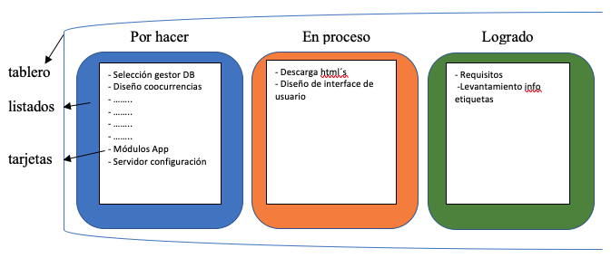
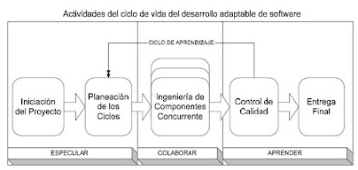

# Capítulo Marco Metodológico: {#mm}

En este capítulo, se presenta el enfoque metodológico adoptado para este estudio. La metodología Kanban \@ref(mmmetodologia) se empleó para gestionar el proceso general, mientras que la metodología de Desarrollo Adaptable de Software \@ref(mmasd) guió la creación del software, permitiendo una implementación eficiente y adaptable a las necesidades cambiantes del proyecto **Recuperación, Extracción y Clasificación de Información de SABER UCV**.

## Metodología de Trabajo Kanban: {#mmmetodologia}

En esta metodología se fomenta la cultura de mejora continua, incremental, al identificar cuellos de botella y la limitación del trabajo en curso para aumentar la eficiencia y la productividad. Gracias a su enfoque basado en la colaboración, flexibilidad y respuesta rápida a los cambios, puede considerarse que está dentro de las metodologías "Ágiles".

Mediante la visualización del flujo de trabajo en un tablero, que se aprecia en la figura \@ref(fig:metkanban), se puede facilitar la gestión del proyecto, desde la concepción de una idea, hasta su implementación y entrega. En el caso del desarrollo de software, facilita la toma de decisiones informadas y promueve la transparencia al proporcionar una visualización clara de las tareas y actividades involucradas [@stephens2015].

```{r, metkanban, echo=FALSE, out.width='70%',fig.cap='Representación de un tablero según la metodología Kanban',fig.align='center'}

```

Durante el desarrollo de este Sistema se necesitaba contar con la flexibilidad que ofrece esta metodología, ya que en ella no se tienen que definir roles específicos en el equipo desarrollador, ni tampoco es necesario establecer períodos fijos para alguna fase en particular.

## Desarrollo Adaptable de Software: {#mmasd}

El **Adaptive Software Development (ASD)** [@highsmith2000] es una metodología ágil de desarrollo de software que se centra en la adaptabilidad y capacidad para adaptarse a los cambios, proporcionando una retroalimentación temprana y frecuente, dando flexibilidad para abordar los desafíos cambiantes del desarrollo de software. A diferencia de los enfoques tradicionales, el ASD reconoce la naturaleza impredecible del desarrollo de software y se adapta continuamente para satisfacer las necesidades del cliente en un entorno dinámico y complejo, haciendo énfasis en el principio "Entregar el proyecto que se necesita al final, no el proyecto que se pidió al principio".

### Características:

**Colaboración y Comunicación Constante:** fomenta la colaboración cercana entre los equipos de desarrollo y los *stakeholders*. La comunicación constante permite una comprensión profunda de los requisitos del cliente y facilita ajustes rápidos según las necesidades cambiantes.

**Iteraciones Incrementales:** divide el proyecto en iteraciones cortas y manejables. Cada iteración produce un incremento funcional del software, lo que permite obtener retroalimentación temprana que permite corregir errores y ajustar el rumbo del proyecto antes de que los problemas se vuelvan críticos.

**Flexibilidad y Adaptabilidad:** reconoce que los requisitos del proyecto pueden cambiar con el tiempo. Por lo tanto, se adapta fácilmente a los cambios, permitiendo una rápida reevaluación y ajuste de las estrategias y metas del proyecto asegurando que el producto final esté alineado de manera óptima con las necesidades y expectativas del cliente, incluso en un entorno de desarrollo volátil.

### Ciclos:

El desarrollo adaptable de software se basa en un proceso dinámico e iterativo donde cada ciclo contiene las siguientes fases: Especular-Colaborar-Aprender. El proceso se enfoca en el aprendizaje continuo y la colaboración intensiva entre desarrolladores y clientes, fundamental para enfrentar las cambiantes dinámicas empresariales. Es relevante destacar que, en algunas circunstancias, los ciclos pueden avanzar simultáneamente en ciertas iteraciones, permitiendo así una optimización del tiempo y recursos.

En cada ciclo, se pueden realizar múltiples iteraciones con el objetivo de desarrollar exhaustivamente todos los requisitos contemplados.

Estos ciclos representan un enfoque metodológico que asegura la coherencia y calidad del desarrollo del sistema. A través de la especulación, la colaboración y el aprendizaje continuo, se logra un refinamiento progresivo de las funcionalidades del sistema, garantizando así su robustez y adaptabilidad a las demandas del entorno. Este enfoque iterativo y colaborativo constituye una práctica fundamental en el proceso de desarrollo, facilitando la identificación temprana de posibles desafíos y fomentando la innovación constante en cada etapa del ciclo.

```{r, metdas, echo=FALSE, out.width='60%', fig.cap='Ciclo ASD', fig.align='center'}


```

#### **Especulación:**

Este componente ofrece un espacio para la exploración y la comprensión de la incertidumbre. Permite desviarse del plan inicial sin temor, transformando los errores en oportunidades de aprendizaje. Aceptar que no se sabe todo impulsa la disposición para aprender y experimentar.

#### **Colaboración:**

Las aplicaciones complejas requieren la recopilación y el análisis de grandes volúmenes de información y ejecución de tareas. Este proceso es inmanejable para un individuo. En entornos dinámicos, donde fluyen grandes cantidades de datos, es esencial la colaboración. Un solo individuo o un pequeño grupo no puede abarcar todo el conocimiento necesario.

#### **Aprendizaje:**

La evaluación continua del conocimiento a través de retroalimentaciones y reuniones grupales al final de cada ciclo iterativo es esencial. Este enfoque difiere de la evaluación al final del proyecto. Evaluar constantemente permite enfrentar y resolver de manera efectiva los cambios constantes del proyecto y su adaptación.
