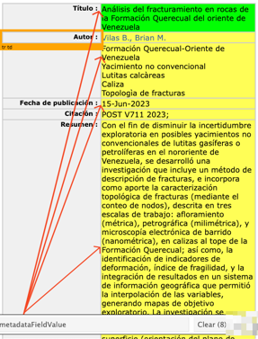
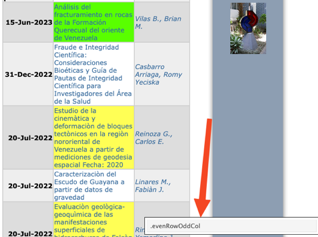

# Desarrollo de la Solución: {#desarrollo}

En este Capítulo en \@ref(desarollodescripcion) se presenta la **Descripción General de la Solución**. Posteriormente se muestra la \@ref(desarrolloarquitectura) **Arquitectura de la Solución** con el "Modelo-Vista-Controlador". En \@ref(desarrollociclos) se exponen los cuatro **Ciclos de Desarrollo** que se efectuaron, mientras que en \@ref(pruebas) **Pruebas** se encuentran las distintas pruebas que fueron ejecutadas para medir el comportamiento y redindimiento del software desarrollado.

## Descripción General de la Solución: {#desarollodescripcion}

Se implementa un Sistema de Recuperación de Información sobre un corpus de documentos de tesis de grado y trabajos de grado que originalmente se encuentran alojados en el repositorio digital Saber UCV . Utilizando técnicas de extracción de datos de archivos HTML, desde la ficha de cada investigación, se obtienen detalles como el título, el nombre del autor, palabras clave, fecha de publicación y el resumen.

Posteriormente el Sistema descarga el documento referenciado en cada ficha, el cual contiene el texto completo de la investigación, da lectura y clasifica información sobre el nombre de la facultad, la escuela o postgrado donde fue realizado el trabajo e igualmente extrae el nombre del tutor.

Todos los datos obtenidos son sometidos a técnicas del estado del arte en el Procesamiento del Lenguaje Natural y la Minería de Texto para conformar un corpus anotado, un índice invertido y una tabla con los vectores de *embeddings* (vector database), esenciales para un eficiente manejo de la base de datos.

El Sistema incluye una aplicación web que permite a los usuarios desde un navegador explorar extensivamente el corpus anotado, realizando consultas de texto y aplicando varios filtros como la selección de la jerarquía, el área académica y el rango de fechas.

La relevancia de los resultados recuperados se determina mediante una función de ponderación y los documentos se presentan de manera priorizada para mejorar la experiencia del usuario.

Adicionalmente, el Sistema ofrece recomendaciones de documentos que presentan similitud con aquellos que fueron recuperados en el proceso anterior y muestra "Mapas de Conocimiento" mediante una herramienta gráfica interactiva de visualización.

La solución implementada cuenta con procesos automatizados de actualización para incorporar las nuevas investigaciones que sean añadidas al repositorio Saber UCV.

El Sistema se soporta en un sistema distribuido conformado por contenedores que son gestionados por un orquestador con la arquitectura "modelo-vista-controlador".

## Arquitectura de la Solución: {#desarrolloarquitectura}

La arquitectura "Modelo-Vista-Controlador" se muestra en la figura \@ref(fig:arquitecturamvc) y posteriormente se describe el comportamiento y las interacciones de los componentes.

```{r, arquitecturamvc, echo=FALSE, out.width='90%',fig.cap='Modelo de Arquitectura MVC',fig.align='center'}
knitr::include_graphics("images/05-desarrollo/MVC9.png")

```

### **Modelo:**

El *Modelo,* en el contexto de esta propuesta, es la parte del Sistema que se ocupa de la obtención, manipulación y gestión de los datos. Esto incluye la descarga de la información, la clasificación, el Procesamiento del Lenguaje Natural, la Minería de Texto y la creación del índice invertido. Esta parte del Sistema también incluye la lógica para generar los *embeddings* y manejar el corpus anotado. En la implementación el manejador de base de datos que usa es PostgreSQL.

Es el encargado de realizar las tareas de actualizar el corpus periódicamente y las recomendaciones de documentos a medida que se agreguen nuevos textos. En \@ref(desarrollociclos4) el tercer ciclo de desarrollo se expondrán con detalle los componentes del *Modelo*. Estos son los principales procesos contenidos en el *Modelo*:

1.  **Procesamiento de Texto:**

    -   Tokenización: Dividir el texto en palabras o frases significativas.

    -   Lematización: Reducir las palabras a su forma base para un análisis más preciso.

    -   POS: etiquetado de partes del discurso.

2.  **Minería de Texto:**

    -   Análisis de Frecuencia: Determinar la frecuencia de ocurrencia de palabras o frases.

3.  **Generación de Embeddings:**

    -   Utilización de modelo preentrenado para convertir palabras o frases en vectores numéricos.

    -   Convertir en vectores las palabras que componen el *query* para realizar comparaciones semánticas y determinar similitudes entre palabras o documentos.

4.  **Creación del Índice Invertido:**

    -   Organizar los términos y sus ubicaciones en los documentos para permitir búsquedas eficientes.

    -   Asociar cada término con la lista de documentos en los que aparece.

5.  **Gestión de la Base de Datos:**

    -   Almacenar y recuperar datos estructurados para su posterior consulta.

    -   Actualizar el corpus con nuevos datos.

6.  **Cálculo de Relevancia:**

    -   Aplicar algoritmos para calcular la relevancia de los documentos en función de las consultas del usuario.

    -   Ordenar los resultados en función de su relevancia para presentar los documentos más relevantes primero.

7.  **Actualización de datos:**

    -   Los procesos descritos anteriormente son ejecutados y/o actualizados periódicamente.

    -   Se realiza la validación de la integridad de datos para asegurar que los nuevos datos se integren correctamente sin errores o inconsistencias, eliminando posibles duplicados o valores incorrectos.

### **Vista:**

La *Vista* se implementa mediante el *framework* "Shiny" [@shiny] [^05-desarrollo-1] que permite crear aplicaciones web interactivas y tiene un componente de "User Inferface (UI)" donde el usuario introduce el texto con el que se hará la búsqueda y aplica filtros como jerarquía, área académica y rango de fechas. Posterior a la definición de los atributos del *query*, se genera la acción y al recibir la respuesta desde el Controlador, la *Vista* se actualiza y muestra las tablas con los resultados de las búsqueda, las representaciones visuales como el "Mapa del Conocimiento" y las recomendaciones de documentos similares.

[^05-desarrollo-1]: El framework Shiny incluye dos componentes principales. El primero es la UI (Interface de Usuario), que corresponde a la "Vista". El otro componente es el "Server" que en la representación actual es el Controlador.

### **Controlador:**

El *Controlador* se implementa mediante el el *framework* "Shiny" que tiene un componente denominado "Server" que es el responsable de manejar las interacciones del usuario, gestionar las consultas de texto y aplicar los filtros seleccionados. También se encarga de orquestar las operaciones entre el *Modelo* y la *Vista*, asegurando que los datos se presenten correctamente y que las consultas se procesen de manera eficiente. Desde el *Controlador* se hace el llamado al componente del *Modelo* donde se encuentra la API para generar el *embedding* del *query* y determinar la relevancia de los documentos recuperados. El *Controlador* aplica el re ordenamiento para mostrar en orden los resultados más relevantes. En él se conforma la estructura de datos necesaria para representar el "Mapa del Conocimiento" con datos obtenidos del *Modelo*.

## Ciclos de Desarrollo: {#desarrollociclos}

Los Ciclos de Desarrollo \@ref(mm) constituyen fases críticas del proceso, donde se conciben, diseñan y perfeccionan las funcionalidades del Sistema. Cada uno de estos ciclos está estructurado en tres etapas fundamentales: la etapa de especulación, donde se plantean las ideas y se exploran posibles soluciones; la etapa de colaboración, donde se trabaja en equipo para implementar estas ideas y se evalúan los resultados; y la etapa de aprendizaje, donde se analizan las experiencias pasadas y se ajustan las estrategias para futuras iteraciones.

Para el desarrollo del SCSU se hizo un proceso iterativo donde en cada ciclo se abordó cada una de las fases descritas y así se fueron añadiendo funcionalidades al Sistema.

La literatura en este tema siempre especifica a un cliente del que hay que obtener retroalimentación temprana, para así adaptar el producto a medida que evoluciona. Esto fue lo que se hizo en reuniones continuas en la materia *Tópicos Especiales en Sistemas de Información y Gerencia* que representó a la unidad requirente (cliente) y así se fueron evaluando los requisitos y se formularon las correspondientes hipótesis, se observó y se midió el desempeño, por ejemplo, en los modelos de aprendizaje automático preentrenados usados para los procesamiento de los textos.

Los Ciclos que se van a exponer son los siguientes: en \@ref(desarrollociclos1) se exponen las tres iteraciones realizadas para la **Conformación del Conjunto de Datos**. En \@ref(desarrollociclos3) se revisa el **Prototipo del SCSU**, mientras que en \@ref(desarrollociclos4) se hace la **Integración de los Componentes del Software** y en \@ref(desasarrollociclos5) se hace una versión del Sistema que incluye un **Buscador Semántico**.

### Ciclo - Conformación del Conjunto de Datos: {#desarrollociclos1}

En este ciclo es donde se ejecutaron las tareas que permitieron conformar el conjunto de datos, proceso necesario para poder desarrollar el Sistema Complementario Saber UCV acorde a lo planteado en el \@ref(objeespe) **Objetivo Específico** **1**.

Se realizaron tres iteraciones para lograr el objetivo. La primera \@ref(scrapeo) fue la **Extracción de Datos web**, también conocidas como "web scraping", la segunda iteración \@ref(labels) correspondió al **Levantamiento de las Categoría**s, que son los nombres de las carreras de pregrado y de los postgrados que se imparten en la Universidad Central de Venezuela, mientras que en la tercera \@ref(asignacion) iteración se hizo la **Clasificación de los Trabajos** asociando a cada investigación el nombre de la carrera o del postgrado e igualmente se hizo la extracción del nombre del tutor, acorde a lo planteado en el \@ref(objeespe) **Objetivo Específico 2**.

#### Iteración- "Extracción de Datos web Saber UCV": {#scrapeo}

##### Especulación:

El repositorio Saber UCV en la sección "Comunidades/Tesis" aloja las cantidades de trabajos por nivel académico que se muestran en el cuadro \@ref(tab:cantidadesteg) :

```{r cantidadesteg, echo=FALSE, fig.cap='Cantidades de Trabajos por Categoría'}

totales_tegs <- readRDS('data/totales_tegs.rds') |>
  select(-fecha)

flextable(totales_tegs) |>
  set_caption(caption='Cantidades de Trabajos por Categoría')|>
  add_footer_lines(paste("cifras de Saber.UCV a la fecha", 
                         format(Sys.time(), "%d/%m/%Y")
                         ))|>
  theme_vanilla()|>
  # set_table_properties(width = 1, layout = "autofit")
  autofit(add_w = 0.2, add_h = 0)


```

En la minería de datos con la extracción de datos web es posible "recolectar, procesar, analizar y extraer útiles conocimientos a partir de los datos disponibles" [@aggarwal2018]. Por esto se planteó replicar en un conjunto de datos alojado localmente, la información contenida en el repositorio Saber UCV, incluyendo: categoría (pregrado, otros, maestría, doctorado), el título, autor, fecha de publicación, palabras clave, *url* de descarga [^05-desarrollo-2] y el texto del resumen. Al obtener esta información se puede dar inicio a la conformación del corpus.

[^05-desarrollo-2]: este *url* correponde a el documento escrito del trabajo de grado o tesis que se encuentra alojado en word o pdf.

##### Colaboración:

En esta etapa se realizaron dos procesos de extracción de datos web usando el lenguaje de programación `r version$version.string[1]` [@R].

1.  El primero fue encontrar los *url*´s de cada trabajo alojado en el repositorio Saber UCV. Usando usando la extensión *SelectorGadget* (<https://selectorgadget.com/>) del navegador *Google Chrome* se puede obtener mediante un click en un elemento de la página la etiqueta *css* asociada al nodo que se desea extraer. En este caso al visitar la página "[http://saber.ucv.ve/handle/10872/1957/browse?type=dateissued&sort_by=2&order=DESC&rpp=1000](#0)", se identificó la etiqueta ´*evenRowOddCol´*, ver figura \@ref(fig:nodosurl), que identifica a los nodos dentro de la página que tienen los enlaces *href* a las fichas de cada investigación.

    Posteriormente con el paquete *rvest* [@rvest] que permite la descarga de páginas web y la manipulación de nodos XML se pudieron extraer los `r prettyNum(rowSums(totales_tegs),big.mark=".")` *urls* a visitar.

```{r nodosurl, echo=FALSE, fig.align='center', fig.cap=c('Etiquetas nodos url´s'), fig.show='hold', out.width="50%"}

knitr::include_graphics(c("images/05-desarrollo/1_ciclo/Picture3.png",
                          "images/05-desarrollo/1_ciclo/Picture2.png"))
#
#

```

2.  En una segunda fase se localizó en la ficha de un trabajo alojado en Saber UCV y mediante la misma técnica indicada en el punto anterior, se identificó la etiqueta *css*, en este caso la *'.metadataFieldValue' ,* para extraer los valores del: título, autor, fecha de publicación, palabras clave, url de descarga del documento y el texto del resumen. En la figura \@ref(fig:nodosurl)-b se aprecia una imagen de una ficha. Al contar con el listado de url´s y la identificación de los datos a extraer, se hizo un bucle para visitar cada enlace, decargarlo, acceder a los nodos, extraer los valores e irlos almacenando en una estructura de datos.

##### Aprender:

Se enfrentaron las siguientes dificultades y se adoptaron en algunos casos las correspondientes soluciones:

1.  Se realizaron varios intentos para la descarga y extracción de los valores. Para la obtención de cada campo, en principio se tomó de referencia la posición fija en que aparecía dentro de la ficha, porque se había asumido que las estas tenían la misma estructura para todos los trabajos no siendo así. En algunas aparecían otros valores, p. ej. el de "colección", alterando la posición en que se encuentra el dato a extraer. La solución adoptada fue que primero se localizarán dentro la ficha los títulos de los campos, con esto se generó el listado de los valores posicionales y relativo a estos se extrajeron los valores propuestos.

2.  Algunos valores de las fechas contenían información parcial faltando el mes y/o el día. Se adoptó un método de imputar el valor "1" tanto el mes como el día faltante.

3.  Adoptar previsiones para caídas del servidor de Saber UCV y resguardar en cada vuelta del bucle la información extraída, para no perder el trabajo de extracción acumulado en caso de una falla remota o local en el acceso al servidor.

4.  La revisión del conjunto de datos obtenido mostró que existen valores duplicados en el título de los trabajos y en los resúmenes, algunas veces por la introducción de algún carácter adicional o mínimas alteraciones . Para descartar registros repetidos se aplicó una función de limpieza al texto (convertir a minúscula, remover signos puntuación, acentos, etc.). Posteriormente se obtuvieron sendos valores *hash* sobre el título y el resumen, y luego se descartaron los *hashes* duplicados. Adicionalmente se decidió usar el *hash* obtenido del "título"como el identificador único de cada documento. En el cuadro \@ref(tab:cantidadesduplicados) se muestra la cantidad de valores duplicados que se encontraron según el método descrito.

    ```{r cantidadesduplicados, echo=FALSE, fig.cap='Cantidades de Trabajos por Categoría', message=FALSE, warning=FALSE}


    duplicados_tegs <- readRDS('data/duplicados_tabla.rds') 

    flextable(duplicados_tegs) |>
      set_caption(caption='Cantidades de Trabajos Duplicados')|>
      add_footer_lines(paste("cifras de Saber.UCV a la fecha", 
                             format(Sys.time(), "%d/%m/%Y")
                             ))|>
      theme_vanilla()|>
      # set_table_properties(width = 1, layout = "autofit")
      autofit(add_w = 0.2, add_h = 0)|>
      style(j = 4, 
            pr_t = fp_text_default(
              # italic = TRUE, 
              color = "red"))


    ```

#### Iteración- Levantamiento de Categorías: {#labels}

##### Especulación:

Para poder clasificar cada investigación es necesario contar con las categorías que serán asignadas. Se entiende por "categoría" el nombre de la carrera de pregrado o el postgrado, junto con la facultad, que constituyen la oferta de la Universidad Central de Venezuela en educación universitaria.

Al no encontrarse el listado de categorías disponible en el propio repositorio Saber UCV fue necesario realizar una búsqueda web de esta información, extraerla y estructurarla, para así contar con el conjunto de datos de categorías que permita ejecutar la siguiente iteración que es la de **Extracción y Clasificación de las Investigaciones** \@ref(asignacion).

##### Colaboración:

Se visitó al sitio oficial de la Universidad Central de Venezuela para revisar la oferta de pregrados y postgrados. Para los postgrados se encontró para cada categoría (especialización, maestría y doctorado) una página con el listado, p. ej.

<http://www.ucv.ve/organizacion/vrac/gerencia-de-investigacion-cientifica-y-humanistica/gerencia-de-estudios-de-postgrado/programas-de-postgrado-ucv/maestria.html> [^05-desarrollo-3]. En la figura \@ref(fig:maestrias) se aprecian las potenciales etiquetas para las maestrías.

[^05-desarrollo-3]: previendo posibles modificacions en las páginas que contienen los listado de postgrados, se procedió a respaldarlas y forman parte del contenido del repositorio asociado a esta Investigación para garantizar la reproducibilidad de los resultados obtenidos. Para la fecha de redacción de este documento el contenido de los *urls* indicados fue modificado

```{r maestrias, echo=FALSE, fig.align='center', fig.cap=c('Listado de Maestrías'), fig.show='hold', out.width="40%"}

knitr::include_graphics(c("images/05-desarrollo/1_ciclo/maestrias.png"
                          ))
```

Mediante la técnica de recuperación de datos web la información descrita en \@ref(scrapeo) se procedió a extraer el nombre de cada postgrado, añadir el nivel académico y asociar la facultad a la cual está adscrito. La cantidad de postgrados agrupados por nivel académico se muestran en el cuadro \@ref(tab:resultpostgrado).

```{r resultpostgrado, echo=FALSE, fig.cap='Cantidades de Postgrado por Categoría', message=FALSE, warning=FALSE}
df_cdad_postgrados <- readRDS('data/df_cdad_postgrados.rds') 

flextable(df_cdad_postgrados) |>
  set_caption(caption='Cantidades de Postgrados por Categoría')|>
  theme_vanilla()|>
  # set_table_properties(width = 1, layout = "autofit")
  autofit(add_w = 0.2, add_h = 0)


```

En cuanto a los pregrados no se encontró en el sitio de la Universidad en una página centralizada la información y se procedió a obtenerla de la página [wikipedia](https://es.wikipedia.org/wiki/Anexo:Facultades_de_la_Universidad_Central_de_Venezuela) asociada a la U.C.V. recuperando un total del 50 nombres de escuelas de pregrado junto con la facultad de dependencia.

##### Aprender:

1.  En el caso de los postgrados, inicialmente se esperaba que sólo estuvieran asociados a Facultades pero también se encontró que el Centro de Estudios del Desarrollo y el Centro de Estudios Integrales del Ambiente dictan este tipo de estudios.

2.  Se evaluó que existen nombres postgrados duplicados con la misma categoría, lo que puede generar problemas en la clasificación de las investigaciones teniendo como ejemplo la "Maestría en Estadística" que se dicta en la Facultad de Agronomía y en la Facultad de Ciencias Económicas y Sociales.

3.  Se detectó que en pregrado existen escuelas que otorgan distintos títulos, p. ej. de la "Escuela de Administración y Contaduría" se pueden obtener los títulos de "contador" o de "licenciado en administración". Esto es algo a tener presente al momento de hacer la categorización ya que el nombre de la escuela no sirve en estos casos para realizarla, siendo necesario agregar al conjunto de datos el atributo de los títulos emitidos.

4.  Algunos cuidados que se tuvieron que realizar sobre los textos fue la limpieza de estos, ya que en los listados se encontró que algunos nombres le faltaban palabras y la revisión de nombres, dada la cantidad total de `r rowSums(df_cdad_postgrados) + 50` dependencias, se hizo manualmente para evitar errores que llevasen a problemas en la categorización.

#### Iteración- Extracción y Clasificación de las Investigaciones: {#asignacion}

En esta iteración se omiten diversos problemas que se encontraron para el procesamiento de lectura y clasificación de los documentos, ya que extenderse en este punto abultaría considerablemente el contenido expuesto.

##### Especulación:

Para las investigaciones que reposan en Saber UCV que cuentan con un archivo anexo, correspondiente al documento de la misma, es posible realizar la descarga, extraer una porción de texto y adoptando métodos basados en reglas de coincidencia de patrones, con las etiquetas obtenidas en la iteración \@ref(labels) **Levantamiento de Categorías**, hacer la categorización por área de estudio, asignando el nombre del pre o postgrado, la escuela-postgrado y la facultad-centro de adscripción. Igualmente de esta porción de texto se estima viable extraer el nombre del tutor.

##### Colaboración:

Motivado a que en la primera iteración \@ref(scrapeo) para conformar el conjunto de datos se había obtenido el *url* asociado al documento soporte de la investigación, se procedió mediante un bucle a realizar la descarga de cada documento y extraer una cantidad de dos mil caracteres, partiendo del principio de que los trabajos de grado o tesis en sus primeras páginas tienen el nombre de la carrera o el postgrado, el nombre de la facultad-centro donde se cursó el estudio y el nombre del tutor.

En esta iteración fue necesario realizar distintas adaptaciones para lograr la coincidencia de patrones. Teniendo en cuenta que son `r rowSums(df_cdad_postgrados) + 50` etiquetas las que se usarán para realizar la clasificación, llegando a tener algunas 14 palabras, es elevada la probabilidad de que no se pueda hacer el "pattern matching" entre el texto y la categoría.

Lo anterior motivo a realizar un proceso de limpieza, modificación y disminución de la cantidad de palabras, tanto en las etiquetas como en el texto extraído. Se evaluó en cada adaptación cuáles razones impedían clasificar los documentos aún pendientes, se tomaron los correctivos y así se fue incrementando, de forma iterativa, la precisión en este proceso.

También se tuvo que tomar en cuenta el orden en que iba a ejecutar la secuencia de encontrar las coincidencias. Ejemplo es que varias facultades contienen las mismas tres palabras en la parte inicial de su nombre: *Facultad de Ciencias*, *Facultad de Ciencias* Jurídicas y Políticas, *Facultad de Ciencias* Económicas y Sociales y la *Facultad de Ciencias* Veterinarias. La secuencia para hacer la detección de la coincidencia fue buscar en orden decreciente por el total de caracteres que tenga el nombre de la facultad.

Adicionalmente en el proceso de hacer coincidir las frases, se encontraron 17 postgrados que no estaban en el listado previamente conformado, los cuales se tuvieron que agregar al conjunto de datos de las categorías.

Para aquellos casos donde no se podía hacer *match* se aplicó el algorimo "Smith Waterman" [@smith1981] el cual fue expuesto en \@ref(alghist) el Capítulo del Marco Teórico. Con este algoritmo se pueden alinear dos cadenas de texto cuando una de ellas no tiene coincidencia absoluta con la otra, como puede pasar en este caso por la introducción de caracteres adicionales.

Un elemento que introdujo ruido en el texto leído de los documentos, fue la aparición de diversos *encodings* que no resultó viable codificarlos a "UTF-08", lo que hizo que aparecieran caracteres no reconocidos dentro del texto dificultando la tarea de lograr realizar el proceso de "pattern matching" para obtener la clasificación. El algorimo SW fue efectivo para solucionar este problema más que otros como el de "Distancia de Levenshtein" o similares.

```{r lecturaclasificacion, echo=FALSE}
# df_draw_seleccion <- readRDS('data/df_draw_seleccion.rds')
# 
# sin_lectura <- as.numeric(table(nchar(df_draw_seleccion$texto_intro)==0)[2])+
#   as.numeric(table(is.na(df_draw_seleccion$texto_intro))[2])
# 
# df_clasificados <- df_draw_seleccion%>%
#   filter(facultad != 'sin clasificación')
# 
# clasificados= nrow(df_clasificados)
# 
# totales_clasificacion <- df_draw_seleccion%>%
#   group_by(facultad)%>%
#   count(facultad)%>%
#   mutate(facultad= str_to_title(facultad) ) %>%
#   rename(Total=n,Facultad= facultad)
# 
# totales_porarea <- table(df_draw_seleccion$nombre)%>%
#   as.data.frame()
# 
#   
# tutores <- as.numeric(table(df_draw_seleccion$texto_tutor=="sin información")[1])
# 
# tutores_distintos <-length( unique(df_draw_seleccion$texto_tutor))
```

Sobre un total de `r prettyNum(nrow(df_draw_seleccion),big.mark=".")` potenciales documentos se lograron clasificar `r prettyNum(clasificados,big.mark=".")` investigaciones, mientras que `r sin_lectura` no disponían información en el texto del documento y resultaba inviable hacer la categorización. En algunos casos esta falta de información estuvo motivada en que el archivo contenía imágenes por estar escaneado el contenido o los documentos anexos no eran trabajos de grado o tesis sino informes de algún otro estilo.

La cantidad de categorías que se encontraron fueron `r nrow(totales_porarea)-1`. En el cuadro \@ref(tab:totalesporfacultad) se pueden ver los trabajos que pudieron ser clasificados por cada Facultad y el total de los que no se pudieron clasificar.

```{r totalesporfacultad,echo=FALSE, fig.cap='Cantidades de investigaciones clasificadas por Facultad', message=FALSE, warning=FALSE}

flextable(totales_clasificacion) |>
  set_caption(caption='Cantidades de investigaciones clasificadas por Facultad')|>
  theme_vanilla()|>
  # set_table_properties(width = 1, layout = "autofit")
  autofit(add_w = 0.2, add_h = 0)


```

En cuanto a la extracción de los nombres de los tutores lo que se hizo fue extraer el texto que se encontraba delimitado entre la propia palabra "tutor" y el brinco de línea "\\n". En el procedimiento también fue necesario remover algunas palabras de los textos, como las abreviaturas de los títulos académicos que preceden al nombre del tutor. Los resultados obtenidos fue que se pudo extraer un total de `r prettyNum(tutores,big.mark=".")` nombres de tutores y una cantidad de `r prettyNum(tutores_distintos,big.mark="." )` nombres únicos.

Es importante destacar que en varios casos, en las cifras anteriores, el texto extraído no se corresponde propiamente al nombre del tutor por la organización visual del texto del documento, no obstante en la mayoría de los casos sí fue exitoso este proceso. En las Sección \@ref(pruebas) se hace una evaluación estadística de la precisión alcanzada en esta extracción.

##### Aprender:

El proceso descrito presentó diversos inconvenientes que abarcaban diversas aristas que tratamos de agrupar a continuación:

1.  Aparición de errores en la redacción y reglas ortográficas por parte de los autores, como por ejemplo, escribir mal el nombre del "título al que optan" o la facultad donde realizaron los estudios. Esto implicó realizar reemplazos de palabras en los textos y limpiezas para disminuir el ruido y facilitar el proceso de obtener la coincidencia.

2.  Cambios en el estilo formal con que se deben presentar los documentos de grado en las distintas facultades o niveles académicos, cuestión que dificultó la detección de las reglas para hacer la comparación. Ante esto se buscó encontrar las formas más genéricas para hacer la comparación, así como la adopción de cuatro estrategias tratando de que primero coincidiera el nombre del título, en caso de fallo se siguió con el nombre del pregrado o postgrado, si nuevamente fallaba se procedía a hacer la búsqueda del nombre de la facultad, y finalmente si ninguna de las estrategias anteriores tenía éxito se aplicaba el algorítmo "Smith Waterman", siendo importante señala que puede generar falso positivos al aplicarse quedando pendiente hacer la revisión de estas métricas.

3.  Dentro de los archivos descargados se encontraron algunos en formato de presentaciones *power point* los cuales fueron desechados sólo siendo procesados los que estuviesen en formato *word* o *pdf*. También se encontraron trabajos que contaban con más de un archivo, ya que estaban separados por capítulos-archivo. En este caso sólo se tomó el primer archivo en la lista de url´s disponibles para tratar de hacer el proceso de clasificación. En la fase inicial se descargaron 12.765 documentos para evaluar las razones de que un trabajo de grado tuviese más de un documento anexo.

4.  Se hicieron algunas simplificaciones sobre postgrados que dependen de dos facultades imputándolo sólo a una que fuese la primera en aparecer en el texto. Como queda fuera del alcance de esta Investigación determinar los casos en que existen este tipo de adscripciones compartidas se hizo esta simplificación.

5.  Algunos trabajos en su primera página incluyen el nombre de dos facultades o escuelas creando errores en la clasificación. P. ej., investigaciones que indican en la portada el siguiente texto "Facultad de Ciencias, Escuela de Computación, título: se realiza la propuesta de un sistema de gestión académica para la Escuela de Economía de la Facultad de Ciencias Económicas....", lo cual genera dos posibles clasificaciones. En estos casos se optó por realizar la clasificación con base en la primera coincidencia detectada.

6.  En el texto tutores se encontraron trabajos que tiene tutor académico, tutor industrial, cotutor y otras variantes. Generalmente se hace una disposición en la escritura de colocar el tipo de cada tutor alíneado en los extremos de una línea y los nombres en la parte inferior, quebrando la regla de extracción que se había diseñando. Esto pareciera un problema a enfrentar con técnicas de segmentación de archivos que tienen en consideración la disposición visual. En el caso de esta investigación no se adoptaron métodos para abordar este problema.

7.  Se simplificaron algunos nombres de especializaciones por la cantidad de palabras que tienen estableciendo un límite, o *prunning*, de 5 palabras para el nombre del postgrado, lo que implica que algunos trabajos habrán quedado agrupados en la misma categoría. Estos casos mayormente están asociados a las especializaciones en el área de medicina.

8.  En este proceso de clasificación no resultaba conveniente usar técnicas de aprendizaje automático dada la cantidad de categorías y el gran desbalanceo de clases.

9.  Se detectó que en Saber UCV en la categoría que se denomina "otros" se encuentran documentos que corresponden a especializaciones y también a trabajos de ascenso de profesores.

Anexo: cantidad de trabajos por área académica

Tener presente Tema13_Proceso de MD_011118  laminas de Haydemar

### Ciclo-Prototipo del SCSU: {#desarrollociclos3}

En este ciclo se desarrolló la primera aproximación al **Prototipo del Sistema Complementario Saber UCV** con tres iteraciones. Al tener el corpus conformado en el ciclo anterior \@ref(desarrollociclos1) **Conformación del Copus**, en la primera iteración de este ciclo \@ref(iternlp) se realizó la **Preparación del Corpus**. En la segunda iteración \@ref(iterbol) se creó una aplicación interactiva en la que se implementó el **Modelo de Búsqueda Boleano** para que a partir de una búsqueda de texto se pudiesen recuperar textos alojados en el corpus y visualizar los "Mapas de Conocimiento" \@ref(mapacon) generados con el subconjunto de investigaciones representadas. Posteriormente en la iteración \@ref(itervec) se implementó el índice **Invertido Invertido** usando un gestor de base de dato.

Todo las rutinas y codificaciones que se mencionan a continuación fueron realizadas en el lenguaje `r version$version.string[1]` [@R].

#### Iteración- Preparación del Corpus: {#iternlp}

En esta iteración el Corpus que se conformó en \@ref(desarrollociclos1) fue sometido a distintos procesamientos conocidos como "Preparación del Corpus" mediante la aplicación de técnicas de PLN, ver @ref(nlproc). Posteriormente mediante el *framework* "shiny" se implementó una visualización de los "Mapas de Conocimiento" por área de estudio, según la clasificación obtenida en \@ref(asignacion).

##### Especulación:

Creando un corpus anotado, marcando y etiquetando con métodos del Procesamiento del Lenguaje Natural, elementos específicos, como palabras, frases o partes del discurso (POS \@ref(pos)), se facilita el acceso a información de relevancia para los investigadores mediante el análisis lingüístico de los documentos recolectados. Para

En el esquema --- se muestra el pipeline a que fue sometido cada documento mediante la librería [@spacyr] que a su vez en un *wrapper* de la librería Spacy [@spacy2020] . El modelo preentrenado "es_core_news_lg". La selección de esta librería se basó en que da soporte a 73 idiomas e incluye directamente la ejecución de los pipelines ahorrando tiempo en la codificación para el etiquetado y lematización

Tokenización, Part of Speach, lematización

POS

NLP

Shiny app: identificar tendencias adil2019

Recomendaciones

Diagramas simplificados

Revisar diagrama StanfordCoreNlp2014.pdf. Buscar foto en relacionado_tesis imagenes. Usar la imagen con el termino Overall System archictectur y adaptar

Visualizacion grafos. Mencionar paper A Visual Query System for Scholar Networks

adil2019.pdf uso del text mining, tendencias y modelos de extracción de información

Utilidades de contar con un corpus anotado Navegacion_de_corpus_a_traves_de_anotaci

Citar **ir.pdf** para ir engine y términos de query

##### Colaboración:

##### Aprender:

#### Iteración- Modelo de búsqueda boleano {#iterbol}

##### Especulación:

##### Colaboración:

##### Aprender:

#### Iteracion - Modelo Índice Invertido {#itertsvec}

##### Especulación:

##### Colaboración:

##### Aprender:

Leer cita páginas de

Rank, revisar la funcion

### Ciclo Integración de Componentes del software: {#desarrollociclos4}

##### Especulación:

Del paper 1242572.1242745.pdf hay algunas ideas y diagramas que pueden ayudar en la fase de especulacion también Se propone que el sistema a implementar sea una aplicación web, ya que la información necesitará ser consultada desde lugares remotos

Del libro Modern Information Retrieval\_ The Concepts - Ricardo Baeza-Yates ideas sobre UI, principios

RJ-2017-065.pdf conceptos de docker

ten-simple-rules-dockerfiles.pdf conceptos de docker de hacer reproducible el Sistema implementado

En seccion del UML citar UML y Patrones Craig Larman.pdf

Del paper 1908.06121 ideas del framework general, la propuesta de sistema

##### Colaboración:

##### Aprender:

### Ciclo Buscador Semántico: {#desasarrollociclos5}

##### Especulación:

##### Colaboración:

##### Aprender:

Comparar tiempos de búsqueda

Evaluar uso de UMAP para generar representación de títulos con datos de embeddings

Citar 2005.04961 por el rerank de embeddings

## Pruebas: {#pruebas}

### Funcionales: {#pruebas1}

### Rendimiento: {#pruebas2}

Shinytest

Tiempos de búsqueda

### Relevancia: {#pruebas3}
