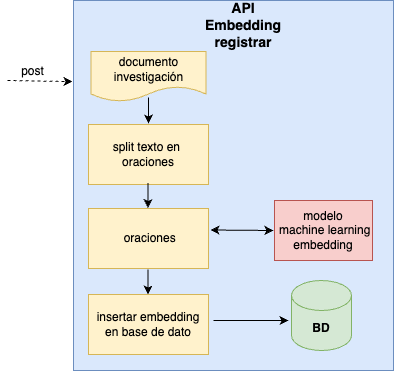
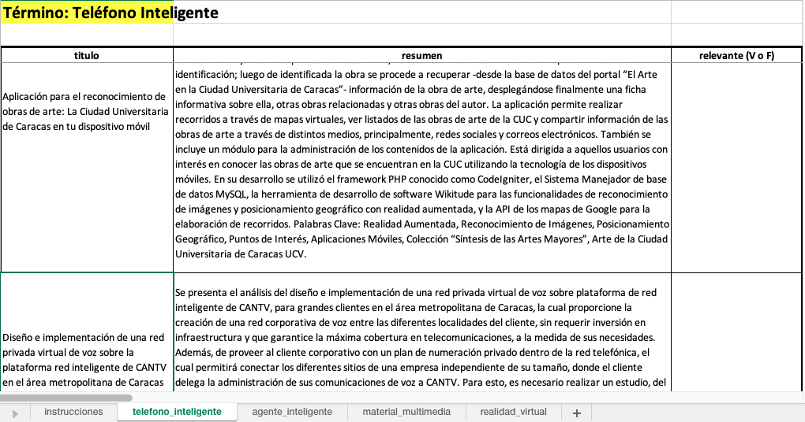

# Desarrollo de la Solución {#desarrollo}

## Descripción General de la Solución {#desarollodescripcion}

Se implementa un sistema de recuperación de información sobre un corpus de documentos de tesis de grado y trabajos de grado que originalmente se encuentran alojados en el repositorio digital Saber UCV . Utilizando técnicas de extracción de datos de archivos html, desde la ficha de cada investigación se obtiene: el título, el nombre del autor, palabras clave, fecha de publicación, el resumen y el *enlace* de descarga del documento que la sustenta.

Posteriormente, el sistema descarga el documento referenciado en cada ficha, el cual contiene el texto completo de la investigación, da lectura y clasifica la información sobre el nombre de la facultad, la escuela o postgrado donde fue realizado el trabajo e igualmente extrae el nombre del tutor.

Como consecuencia, todos los datos obtenidos son sometidos a técnicas del estado del arte en el procesamiento del lenguaje natural y la minería de texto para conformar un corpus anotado, un índice invertido y una tabla con los vectores de *embeddings* (*Vector Database*), esenciales para un eficiente manejo de la base de datos.

Adicionalmente, el sistema incluye una aplicación web que permite a los usuarios desde un navegador explorar extensivamente el corpus anotado, realizando consultas de texto y aplicando varios filtros como la selección de la jerarquía, el área académica y el rango de fechas.

Complementariamente, la relevancia de los resultados recuperados se determina mediante una función de ponderación y los documentos se presentan de manera priorizada para mejorar la experiencia del usuario.

Adicionalmente, el sistema ofrece recomendaciones de documentos que presentan similitud con aquellos que fueron recuperados en el proceso anterior y muestra mapas de conocimiento mediante una herramienta gráfica interactiva de visualización.

Cabe destacar que la solución implementada cuenta con procesos automatizados de actualización para incorporar las nuevas investigaciones que sean añadidas al repositorio Saber UCV.

Finalmente, el sistema se soporta en un sistema distribuido conformado por contenedores que son gestionados por un orquestador con la arquitectura "modelo-vista-controlador".

## Arquitectura de la Solución {#desarrolloarquitectura}

La arquitectura "modelo-vista-controlador" se muestra en la Figura \@ref(fig:arquitecturamvc) y posteriormente se describe el comportamiento y las interacciones de los componentes.

```{r, arquitecturamvc, echo=FALSE, out.width='90%',fig.cap='Modelo de Arquitectura MVC',fig.align='center'}
knitr::include_graphics("images/05-desarrollo/MVC9.png")

```

### **Modelo**

El modelo*,* en el contexto de esta propuesta, es la parte del sistema que se ocupa de la obtención, manipulación y gestión de los datos. Esto incluye la descarga de la información, la clasificación, el procesamiento del lenguaje natural, la minería de texto y la creación del índice invertido. Esta parte del sistema también incluye la lógica para generar los *embeddings* y manejar el corpus anotado. En la implementación del sistema el manejador de base de datos que se usa es PostgreSQL.

En complemento a lo anterior, al modelo igualmente le corresponde realizar las tareas de actualizar el corpus periódicamente y las recomendaciones de documentos a medida que se agreguen nuevos textos en Saber UCV. En \@ref(desarrollociclos4), el tercer ciclo de desarrollo se expondrán con detalle los componentes del modelo y a continuación se enumeran los principales procesos que él sustenta:

1.  **Creación del Índice Invertido:**

    -   Organizar los términos y sus ubicaciones en los documentos para permitir búsquedas eficientes.

    -   Asociar cada término con la lista de documentos en los que aparece.

2.  **Procesamiento de Texto:**

    -   Tokenización: dividir el texto en palabras o frases significativas.

    -   Lematización: reducir las palabras a su forma base para un análisis más preciso.

    -   POS: etiquetado de partes del discurso.

3.  **Minería de Texto:**

    -   Análisis de frecuencia: determinar la frecuencia de ocurrencia de palabras o frases.

4.  **Generación de Embeddings:**

    -   Utilización de un modelo preentrenado para convertir palabras o frases en vectores numéricos.

    -   Convertir en vectores las palabras que componen el *query* para realizar comparaciones semánticas y determinar similitudes entre palabras o documentos.

5.  **Gestión de la Base de Datos:**

    -   Almacenar y recuperar datos estructurados para su posterior consulta.

    -   Actualizar el corpus con nuevos datos.

6.  **Cálculo de Relevancia:**

    -   Aplicar algoritmos para calcular la relevancia de los documentos en función de las consultas del usuario y de los parámetros establecidos con anterioridad.

    -   Ordenar los resultados en función de su relevancia para presentar los documentos más relevantes primero.

7.  **Actualización de datos:**

    -   Los procesos mencionados previamente son ejecutados y/o actualizados periódicamente.

    -   Se realiza la validación de la integridad de datos para asegurar que los nuevos datos se integren correctamente sin errores o inconsistencias, eliminando posibles duplicados o valores incorrectos.

### **Vista**

La vista se implementa mediante el *framework* Shiny [@shiny] [^05-desarrollo-1] que permite crear aplicaciones web interactivas y tiene un componente de "user inferface (ui)" donde el usuario interactúa al introducir el texto con el que se hará la búsqueda y aplica los siguientes filtros: jerarquía, área académica nivel 1 (facultad), área académica nivel 2 (escuela o postgrado) y rango de fechas. Posterior a la definición de los atributos del *query*, se desencadenan acciones que son enviadas al controlador y al recibir la respuesta la vista se actualiza y muestra las tablas con los resultados de la búsqueda, las representaciones visuales como el mapas de conocimiento y las recomendaciones de documentos similares.

[^05-desarrollo-1]: El framework Shiny incluye dos componentes principales. El primero es la ui (interfaz de Usuario), que corresponde a la "Vista". El otro componente es el "server" que en la representación actual es el controlador.

### **Controlador**

El controlador se implementa mediante el *framework* Shiny que tiene un componente denominado "server" que es el responsable de manejar las interacciones del usuario, gestionar las consultas de texto y aplicar los filtros seleccionados. También se encarga de orquestar las operaciones entre el modelo y la vista, asegurando que los datos se presenten correctamente y que las consultas se procesen de manera eficiente. Desde el *controlador* se hace el llamado al componente del modelo donde se encuentra la API para generar el *embedding* del *query* y determinar la relevancia de los documentos recuperados. El controlador aplica el re ordenamiento para mostrar en orden los resultados más relevantes. En él se conforma la estructura para representar el mapas de conocimiento con datos obtenidos del *modelo*.

## Ciclos de Desarrollo {#desarrollociclos}

Los Ciclos de Desarrollo constituyen fases críticas del proceso donde se conciben, diseñan y perfeccionan las funcionalidades del sistema. Cada uno de estos ciclos está estructurado en tres etapas fundamentales: la etapa de especulación, donde se plantean las ideas y se exploran posibles soluciones; la etapa de colaboración, donde se trabaja en equipo para implementar estas ideas y se evalúan los resultados; y la etapa de aprendizaje, donde se analizan las experiencias pasadas y se ajustan las estrategias para futuras iteraciones.

Para el desarrollo del SCSU se hizo un proceso iterativo donde en cada ciclo se abordó cada una de las fases descritas y así incrementalmente se fueron añadiendo funcionalidades al sistema.

La literatura en este tema siempre especifica a un cliente del que hay que obtener retroalimentación temprana para así adaptar el producto a medida que evoluciona. Esto fue lo que se hizo en reuniones continuas en la materia *Tópicos Especiales en Sistemas de Información y Gerencia* que representó a la unidad requirente (cliente) y así se fueron evaluando los requisitos y se formularon las correspondientes hipótesis, se observó y se midió el desempeño, por ejemplo, en los modelos de aprendizaje automático preentrenados, usados para el procesamiento de los textos.

\newpage

<br> <br>

### Ciclo - Conformación del Conjunto de Datos {#desarrollociclos1}

En este ciclo es donde se ejecutaron las tareas que permitieron conformar el conjunto de datos acorde a lo planteado en \@ref(objeespe), "Objetivo Específico - 1".

#### Iteración- "Extracción de Datos Web Saber UCV" {#scrapeo}

**Especulación**

El repositorio Saber UCV en la sección "Comunidades-Tesis" aloja las cantidades de trabajos por nivel académico que se muestran en el Cuadro \@ref(tab:cantidadesteg) :

```{r cantidadesteg, echo=FALSE, fig.cap='Cantidades de Trabajos por Categoría', warning=FALSE }

totales_tegs <- readRDS('data/totales_tegs.rds') |>
  select(-fecha)

totales_tegs1 <- prettyNum(sum(totales_tegs[1,]), big.mark='.')

flextable(totales_tegs) |>
  set_caption(caption='Cantidades de Trabajos por Categoría')|>
  add_footer_lines(paste("cifras de Saber.UCV a la fecha", 
                         "15/10/2023"
                         ))|>  #format(Sys.time(), "%d/%m/%Y"
  theme_vanilla()|>
  # set_table_properties(width = 1, layout = "autofit")
  autofit(add_w = 0.2, add_h = 0)


```

En la minería de datos con la extracción de datos web es posible "recolectar, procesar, analizar y extraer útiles conocimientos a partir de los datos disponibles" [@aggarwal2018]. Por esto se planteó replicar en un conjunto de datos alojado localmente la información contenida en el repositorio Saber UCV que asciende a una cantidad de `r totales_tegs1` investigaciones, incluyendo los siguientes campos: categoría (pregrado, otros, maestría, doctorado), título, autor, fecha de publicación, palabras clave, enlacede descarga [^05-desarrollo-2] y resumen. Al obtener esta información se puede dar inicio a la conformación del corpus.

[^05-desarrollo-2]: este *enlace* correponde a el documento escrito del trabajo de grado o tesis que se encuentra alojado en word o pdf.

**Colaboración**

En esta etapa se realizaron dos procesos de extracción de datos web usando el lenguaje de programación `r version$version.string[1]` [@R].

1.  El primero fue encontrar los enlaces de cada trabajo alojado en el repositorio Saber UCV. Usando la extensión *SelectorGadget* ([https://selectorgadget.com/](#0){.uri}) del navegador *Google Chrome* se puede obtener mediante un clic en un elemento de la página la etiqueta css asociada al nodo que se desea extraer. En este caso al visitar la página "[http://saber.ucv.ve/handle/10872/1957/browse](#0)", se identificó la etiqueta `evenRowOddCol`, ver Figura \@ref(fig:nodosurl), que identifica a los nodos dentro de la página que tienen los enlaces `href` a las fichas de cada investigación.

    Posteriormente, con el paquete rvest [@rvest] que permite la descarga de páginas web y la manipulación de nodos XML se pudieron extraer los `r prettyNum(rowSums(totales_tegs),big.mark=".")` enlaces a visitar.

```{r nodosurl, echo=FALSE, fig.align='center', fig.cap=c('Etiquetas de nodos url'), fig.show='hold', out.width="50%"}

knitr::include_graphics(c("images/05-desarrollo/1_ciclo/Picture3.png",
                          "images/05-desarrollo/1_ciclo/Picture2.png"))
#knitr::include_graphics("images/05-desarrollo/1_ciclo/Picture2.png")
#knitr::include_graphics("images/05-desarrollo/1_ciclo/Picture3.png")

```

2.  En una segunda fase, mediante la misma técnica indicada en el punto anterior, se localizó en la ficha de un trabajo la etiqueta css, en este caso la *`.metadataFieldValue`* que está asociada al nodo que contiene los valores del: título, autor, fecha de publicación, palabras clave, enlace de descarga del documento y el texto del resumen. En la Figura \@ref(fig:nodosurl)-b, se aprecia una imagen de la ficha mencionada. Al contar con el listado de enlaces y la identificación de los datos a extraer, se hizo un bucle para visitar cada enlace, se descargó el archivo `html`, se accedió al nodo, se extrajeron los valores y se fueron almacenando en una estructura de datos.

```{r lecturadupli, echo=FALSE}

duplicados_tegs <- readRDS('data/duplicados_tabla.rds') 
```

**Aprender**

Se enfrentaron las siguientes dificultades y se adoptaron las correspondientes soluciones:

1.  Se realizaron varios intentos para la descarga y extracción de los valores. Para la obtención de cada campo, en principio se tomó de referencia la posición fija en que aparecía dentro de la ficha, porque se había asumido que estas tenían la misma estructura para todos los trabajos, sin embargo en algunas aparecían otros valores, p. ej. el de "colección", alterando la posición en que se encuentra el dato a extraer. La solución adoptada fue que primero se localizarán dentro de cada ficha, los títulos de los campos, con esto se generó la lista de los valores posicionales y relativo a estos se extrajeron los valores propuestos.

2.  Algunos valores de las fechas contenían información parcial faltando el mes y/o el día. Se adoptó un método de imputar el valor "1" tanto al mes como al día faltante.

3.  Adoptar previsiones para caídas del servidor de Saber UCV y resguardar en cada vuelta del bucle la información extraída, para no perder el trabajo de extracción acumulado, en caso de una falla remota o local en el acceso.

4.  La revisión del conjunto de datos obtenido mostró que existen `r prettyNum(sum(duplicados_tegs$Duplicados),big.mark=".")` documentos duplicados, bien sea en el "título" o en el texto del "resumen". Esto ocurre por la introducción de algún carácter adicional o mínimas alteraciones en el texto. Para descartar estos registros, se aplicó una función de limpieza al texto (convertir a minúscula, remover signos puntuación, etc.). Posteriormente se obtuvieron sendos valores *hash* sobre el título y el resumen y posteriormente se descartaron los *hashes* duplicados. Adicionalmente, se decidió usar el *hash* obtenido del "título procesado" como el identificador único de cada documento. La remoción de investigaciones que puedan estar duplicadas es importante efectuarla, ya que al ejecutar los procesos de recuperación de información o la representación de los resultados en mapas de conocimiento, al incluir textos repetidos, creará representaciones distorsionadas. En el Cuadro \@ref(tab:cantidadesduplicados), se muestra la cantidad de los valores detectados por jerarquía.

```{r cantidadesduplicados, echo=FALSE, fig.cap='Cantidades de Trabajos por Categoría', message=FALSE, warning=FALSE}


#duplicados_tegs <- readRDS('data/duplicados_tabla.rds') 

flextable(duplicados_tegs) |>
  set_caption(caption='Cantidades de Trabajos Duplicados')|>
  add_footer_lines(paste("cifras de Saber.UCV a la fecha", 
                         "15/10/2023")
                         )|> #format(Sys.time(), "%d/%m/%Y"
  theme_vanilla()|>
  # set_table_properties(width = 1, layout = "autofit")
  autofit(add_w = 0.2, add_h = 0)|>
  style(j = 4, 
        pr_t = fp_text_default(
          # italic = TRUE, 
          color = "red"))
```

#### Iteración- Levantamiento de Categorías {#labels}

**Especulación**

(ref:iterclas) "Extracción y Clasificación de las Investigaciones".

Para poder clasificar cada investigación es necesario contar con las categorías que serán asignadas. Se entiende por "categoría" el nombre de la carrera de pregrado o el postgrado, junto con la facultad, que constituyen la oferta de la Universidad Central de Venezuela en educación universitaria.

No obstante, al no encontrarse el listado de categorías disponible en el propio repositorio Saber UCV fue necesario realizar una búsqueda web de esta información, extraerla y estructurarla, para así contar con el conjunto de datos de categorías que permita ejecutar la siguiente iteración, ver \@ref(asignacion), (ref:iterclas)

**Colaboración**

Se visitó al sitio web oficial de la Universidad Central de Venezuela para revisar la oferta de pregrados y postgrados. Para los postgrados se encontró para cada categoría (especialización, maestría y doctorado) una página con el listado, p. ej. [http://www.ucv.ve/organizacion/maestria.html](http://www.ucv.ve/organizacion/vrac/gerencia-de-investigacion-cientifica-y-humanistica/gerencia-de-estudios-de-postgrado/programas-de-postgrado-ucv/maestria.html) [^05-desarrollo-3]. En la Figura \@ref(fig:maestrias), se aprecian las potenciales etiquetas para las maestrías.

[^05-desarrollo-3]: previendo posibles modificacions en las páginas que contienen los listado de postgrados, se procedió a respaldarlas y forman parte del contenido del repositorio asociado a esta Investigación para garantizar la reproducibilidad de los resultados obtenidos. Para la fecha de redacción de este documento el contenido de los *enlaces* indicados fue modificado

```{r maestrias, echo=FALSE, fig.align='center', fig.cap=c('Listado de Maestrías'), fig.show='hold', out.width="40%"}

knitr::include_graphics(c("images/05-desarrollo/1_ciclo/maestrias.png"
                          ))
```

Mediante la técnica de recuperación de datos web antes descrita, ver \@ref(scrapeo), "Extracción de Datos web Saber UCV", se procedió a extraer el nombre de cada postgrado, añadir el nivel académico y asociar la facultad a la cual está adscrito.

La cantidad de postgrados por nivel académico: doctorado, maestría y especializaciones se muestran en el Cuadro \@ref(tab:resultpostgrado).

```{r resultpostgrado, echo=FALSE, fig.cap='Cantidades de Postgrado por Nivel Académico', message=FALSE, warning=FALSE, out.width='50%'}
df_cdad_postgrados <- readRDS('data/df_cdad_postgrados.rds')
#names(df_cdad_postgrados) <- c('Otros', 'Maestría', 'Doctorado')
df_cdad_postgrados <- df_cdad_postgrados[,c(3,2,1)]

flextable(df_cdad_postgrados) |>
  set_caption(caption='Cantidades de Postgrados por Categoría')|>
  theme_vanilla()|>
  # set_table_properties(width = 1, layout = "autofit")
  autofit(add_w = 0.2, add_h = 0)


```

En cuanto a los pregrados no se encontró en el sitio de la Universidad en una página centralizada la información y se procedió a obtenerla de la página [wikipedia](https://es.wikipedia.org/wiki/Anexo:Facultades_de_la_Universidad_Central_de_Venezuela) asociada a la U.C.V., recuperando un total del 50 nombres de escuelas de pregrado junto con la facultad de adscripción.

En la Figura \@ref(fig:jerarquias), se muestran los totales apilados de pregrados y postgrados que se encontraron por facultad-centro de Investigación durante el levantamiento de información, cifra que al totalizar los postgrados y pregrados, alcanza la cantidad de `r sum(50+ rowSums(df_cdad_postgrados))` áreas de conocimiento.

```{r jerarquias,echo=FALSE, fig.cap='Total pregrados y postgrados por facultad-centro', message=FALSE, out.width='70%'}
totales_facultad <- readRDS('data/totales_facultad.rds')

ggbarplot(totales_facultad,
          x='facultad',
          y='cdad',
          label.rectangle=FALSE,
          # label = distribucion$nn,
          fill = 'jerarquía',
          # color = "#4785FF",
          color = 'jerarquía',
          palette = "Paired",
          # label=TRUE,
          label=format(totales_facultad$cdad,),
          lab.size = 3,
          lab.col = 'black',
          # lab.pos = c("in"),
          # xticks.by=2,
          # ylab = TRUE,
          # yticks.by=100
)+
  theme(axis.text.x = element_text(color = "grey20",
                                   size = 6, 
                                   angle=30,
                                   hjust = 1,
                                   vjust = 1, 
                                   face = "plain"))+ 
  grids(axis='y')


```

**Aprender**

1.  En el caso de los postgrados, inicialmente se esperaba que solo estuvieran asociados a facultades pero también se encontró que el Centro de Estudios del Desarrollo y el Centro de Estudios Integrales del Ambiente imparten este tipo de estudios.

    \newpage

2.  Se evaluó que existen nombres de postgrados duplicados con la misma categoría, lo que puede generar problemas en la clasificación de las investigaciones, teniendo como ejemplo la "Maestría en Estadística" que se dicta en la Facultad de Agronomía y en la Facultad de Ciencias Económicas y Sociales.

3.  Se detectó que en pregrado existen escuelas que otorgan distintos títulos, p. ej. de la "Escuela de Administración y Contaduría" se pueden obtener los títulos de "contador" o de "licenciado en administración". Esto es algo a tener presente al momento de hacer la categorización, ya que el nombre de la escuela no sirve en estos casos para realizarla, siendo necesario agregar al conjunto de datos el atributo que contenga el nombre de los títulos emitidos según la escuela.

4.  Sobre los textos se tuvieron que realizar modificaciones ya que en los listados se encontró que algunos nombres les faltaban palabras. La revisión final de nombres, dada la cantidad total de `r rowSums(df_cdad_postgrados) + 50` dependencias, se hizo manualmente para evitar posteriores categorizaciones erróneas.

#### Iteración- Extracción y Clasificación de las Investigaciones {#asignacion}

En esta iteración se mencionan los principales obstáculos y las estrategias implementadas para alcanzar el objetivo de realizar la clasificación de cada trabajo alojado en Saber UCV, no obstante, se omite especificar algunos de los problemas que se encontraron, ya que extenderse en esto abultaría considerablemente el contenido expuesto.

**Especulación**

Para las investigaciones que reposan en Saber UCV que cuentan con un archivo anexo, correspondiente al documento de la misma, es posible realizar la descarga, extraer una porción de texto y adoptando métodos basados en reglas de coincidencia de patrones, con las etiquetas obtenidas en la iteración anterior, ver \@ref(labels), "Levantamiento de Categorías", hacer la categorización por área de estudio, asignando el nombre del pre o postgrado, la escuela-postgrado y la facultad-centro de adscripción. Igualmente de esta porción de texto se estima viable extraer el nombre del tutor.

**Colaboración**

Motivado a que en la primera iteración para conformar el conjunto de datos se había obtenido el enlace asociado al documento soporte de la investigación, se procedió mediante un bucle a realizar la descarga de cada documento y extraer una cantidad de dos mil caracteres, partiendo del principio de que los trabajos de grado o tesis en sus primeras páginas tienen el nombre de la carrera o el postgrado, el nombre de la facultad-centro donde se cursó el estudio, el nombre del título al que optan y el nombre del tutor.

De igual manera, en esta iteración fue necesario realizar distintas adaptaciones para lograr la coincidencia de patrones. Teniendo en cuenta que son `r rowSums(df_cdad_postgrados) + 50` etiquetas las que se usarán para realizar la clasificación, llegando a tener 14 palabras algunas categorías, es elevada la probabilidad de que no se pueda hacer el "*pattern matching*" entre el texto y la etiqueta.

Lo anterior motivó a realizar un proceso de limpieza, modificación y disminución de la cantidad de palabras, tanto en las etiquetas como en el texto extraído. Se evaluó en cada adaptación cuáles razones impedían clasificar los documentos aún pendientes, se tomaron los correctivos y así se fue incrementando, de forma iterativa, la exactitud en este proceso.

También se tuvo que tomar en cuenta el orden en que se iba a ejecutar la secuencia de encontrar las coincidencias. Ejemplo de lo mencionado es que varias facultades contienen las mismas tres palabras en la parte inicial de su nombre: Facultad de Ciencias, Facultad de Ciencias Jurídicas y Políticas, Facultad de Ciencias Económicas y Sociales y la Facultad de Ciencias Veterinarias. La secuencia para hacer la detección de la coincidencia fue buscar realizar la comparación de cada elemento ordenado en forma decreciente, según el total de caracteres que tenga el nombre de la facultad, para evitar clasificaciones erróneas.

Adicionalmente, en el proceso de hacer coincidir las frases se encontraron 17 postgrados que no estaban en el conjunto de datos de las categorías, los cuales se tuvo que proceder a agregar.

Igualmente, para aquellos casos donde no se podía hacer *match,* se aplicó el algoritmo "Smith Waterman" [@smith1981], expuesto en \@ref(alghist), "Marco Teórico-Referencial", el cual permite alinear dos cadenas de texto cuando una de ellas no tiene coincidencia absoluta con la otra, como puede pasar en este caso por la introducción de caracteres adicionales.

Otro punto a mencionar es el problema que se generó al realizar la lectura de algunos documentos en los cuales se introdujeron caracteres aleatorios en el texto de los documentos, motivado a la aparición de diversos *encodings,* los cuales no resultó viable codificarlos a "UTF-08", haciendo que aparecieran caracteres no reconocidos dentro del texto y consecuentemente dificultando la tarea de lograr realizar el proceso de "pattern matching". El algorimo SW nuveamente resultó eficaz para darle solución a este problema, aunque igualmente se hicieron pruebas con otros métodos como el algoritmo "Distancia de Levenshtein" o variaciones de este.

```{r lecturaclasificacion, echo=FALSE}
df_draw_seleccion <- readRDS('data/df_draw_seleccion.rds')%>%
  rename(Fecha= fecha_procesada)

sin_lectura <- as.numeric(table(nchar(df_draw_seleccion$texto_intro)==0)[2])+
  as.numeric(table(is.na(df_draw_seleccion$texto_intro))[2])
# 
df_clasificados <- df_draw_seleccion%>%
  filter(facultad != 'sin clasificación')

clasificados= nrow(df_clasificados)
# 
totales_clasificacion <- df_draw_seleccion%>%
  group_by(facultad)%>%
  count(facultad)%>%
  mutate(facultad= str_to_title(facultad) ) %>%
  rename(Total=n,Facultad= facultad)%>%
  filter(!is.na(Facultad))%>%
  filter(Facultad!='Sin Clasificación')
# 
totales_porarea <- table(df_draw_seleccion$nombre)%>%
  as.data.frame()
df_ascenso <- readRDS('data/df_ascenso.rds')
#   
# tutores <- as.numeric(table(df_draw_seleccion$texto_tutor=="sin información")[1])
# 
# tutores_distintos <-length( unique(df_draw_seleccion$texto_tutor))
```

Como resultado de los procesos ejecutados se obtuvo que sobre un total de `r prettyNum(nrow(df_draw_seleccion),big.mark=".")` potenciales documentos se lograron clasificar `r prettyNum(clasificados,big.mark=".")` investigaciones, mientras que `r sin_lectura` no disponían información en el texto del documento y resultaba inviable hacer la categorización. En algunos casos la falta de información estuvo motivada en que el archivo contenía imágenes por estar escaneado el contenido o también en que los documentos anexos no fuesen trabajos de grado o tesis, sino informes de algún otro estilo.

Otro resultado que se obtuvo, a nivel de cifras agregadas, es la cantidad de categorías distintas, con al menos una investigación asignada a una facultad o centro, que ascendió a `r nrow(totales_porarea)-1`, que se distribuyen por facultad según lo que se observa en la Figura \@ref(fig:categorias).

```{r categorias,echo=FALSE, fig.cap='Cantidades de categorías por facultad y nivel académico', message=FALSE, warning=FALSE,fig.show='hold',out.width="80%"}
library(lubridate)


categorias_asignadas <- readRDS('data/categorias_asignadas.rds')

ggbarplot(categorias_asignadas,
          x='facultad',
          y='cdad',
          label.rectangle=FALSE,
          # label = distribucion$nn,
          fill = 'Jerarquía',
          # color = "#4785FF",
          color = 'Jerarquía',
          palette = "Paired",
          # label=TRUE,
          label=format(categorias_asignadas$cdad,),
          lab.size = 3,
          lab.col = 'black',
          # lab.pos = c("in"),
          # xticks.by=2,
          # ylab = TRUE,
          # yticks.by=100
)+
  theme(axis.text.x = element_text(color = "grey20",
                                   size = 6, 
                                   angle=30,
                                   hjust = 1,
                                   vjust = 1, 
                                   face = "plain"))+ 
  grids(axis='y')

fecha_min <- min(df_draw_seleccion$Fecha)%>%
  as.Date()%>%
  format('%m/%d/%Y')

fecha_max <- max(df_draw_seleccion$Fecha) %>%
  as.Date()%>%
  format('%m/%d/%Y')
```

Para ilustar algunos de los resultados generados, en la Figura \@ref(fig:totalesporfacultad), se pueden ver primero la cantidad total de investigaciones que pudieron ser clasificadas por cada facultad - centro de estudios y en la segunda posición, la cantidad de documentos disponibles por fecha de publicación que abarcan el período `r fecha_min` al `r fecha_max`.

```{r totalesporfacultad,echo=FALSE, fig.cap='Cantidades de investigaciones clasificadas por facultad y por año de publicación', message=FALSE, warning=FALSE,fig.show='hold',out.width="48%"}
#el cuadro @ref(tab:totalesporfacultad) y
library(ggpubr)
library(scales)
articulos_rm2 <- paste('en ',
                       'tutorado',
                       'señor ',
                       'm\\.sc\\.|m\\.sc |sc\\.|msc\\.|msc |ph\\.',
                       ' [a-z]\\: | [a-z]\\.| i\\: ',
                       'señora ',
                       'academico e industrial',
                       'industrial',
                       'academic[ao]s\\:|academic[oa]s\\.|academic[ao]s |academic[ao]\\:|academic[oa]\\.|academic[ao] |acad\\.\\:|acad\\.|acad ',
                       'autor[ea]s',
                       'autor\\.|autor ',
                       'cedula',
                       ' la ',
                       'alumnas',
                       'alumnos',
                       'licenciad[ao]\\.|licenciad[ao]',
                       'bachilleres',
                       'bachiler\\.|bachiller',
                       'br\\.',
                       'br ',
                       ' al ',
                       ' el ',
                       ' de ',
                       ' los ',
                       ' las ',
                       ' del ',
                       ' por ',
                       'profesora\\.|profesora |profª\\.',
                       'profesor[ae]s\\.|profesor[ae]s |profe\\.|profesor',
                       'titular|dedicacion exclusiva',
                       'profesor\\.|profesor ',
                       'profa\\.|prof\\. a ',
                       'prof\\.',
                       'prof ',
                       'profa ',
                       'abg\\.|abg ',
                       'arq\\.|arq |arqte |arqta ',
                       'propuesto',
                       'dra\\.|dra ',
                       't\\.s\\.u\\.|tsu\\.|tsu ',
                       'dr\\.|dr ',
                       'soc\\.',
                       'bra\\.|bra ',
                       'od\\.|oda\\.|odontolog[ao]',
                       'dsc\\.',
                       'dra ',
                       'esp\\.|esp |especialista',
                       ' m\\.',
                       ' eng\\.',
                       '\\(es\\)',
                       'dr |doc\\.|doc |drs\\.',
                       ' c\\.i\\. ',
                       'doctora\\.|doctora ',
                       'jefes',
                       'asesora',
                       'coordinadora',
                       'asesor',
                       'coordinador',
                       'doctor\\.|doctor ',
                       'lic\\.|lic |licd[ao]\\.|licd[ao] ',
                       'ingenier[oa]|ing\\º,ing\\.|ingº|ing ',
                       'lcd[ao]\\.',
                       'geolog[oa]',
                       'lcd[ao] ',
                       'pasante',
                       'tesistas|tesista',
                       'guia\\:,guia\\.|guia ',
                       'ftco\\.|ftico\\.',
                       'farmaceutic[ao]|mercadeo|toxicologia|farmacologo',
                       '\\:|\\-',
                       'econ\\.|econ ',
                       'zoot\\.|zoot ',
                       'ing\\.|ing ',
                       'agr\\.|agr ',
                       'mgs\\.|mgs |ms\\.|msg\\.| ms |mag\\.|mc\\.|mci\\.|mcs\\.|md\\.|mg\\.|mgr\\.|mgrs\\.|mgsc\\.|mgse\\.|mgster\\.|mv\\.',
                       'medic[ao]',
                       'phd\\.|phd ',
                       'magister\\.|magister ',
                       'scientiarum\\.|scientiarum |scientiarun ',
                       'caracas\\,|caracas\\.|caracas',
                       'venezuela\\,|venezuela\\.|venezuela',
                       'maracay\\,|maracay\\.|maracay',
                       sep = '|')

limpieza_texto4 <- function(texto){
  texto%>%
    enc2utf8()%>%
    str_replace_all('[Pp][Hh]\\.[Dd]\\. ',' ')%>%
    str_replace_all(' [A-Z]\\.[A-Z]\\. ',' ')%>%
    str_replace_all(' [A-Z]\\. ',' ')%>%
    str_replace_all('ª',' ')%>%
    str_replace_all('\\|',' ')%>%
    tolower()%>%
    gsub('á','a',.)%>%
    gsub('è','e',.)%>%
    gsub('é','e',.)%>%
    gsub('é','e',.)%>%
    gsub('í','i',.)%>%
    gsub('ó','o',.)%>%
    gsub('ú','u',.)%>%
    gsub('í','i',.) %>%
    gsub('ı́́','i' ,.)%>%
    gsub('ı́', 'i',.)%>%
    gsub('á' ,'a' ,.)%>%
    gsub('ó','o',.)%>%
    gsub('ó','o' ,.)%>%
    gsub('ú','u',.) %>%
    gsub('ñ','ñ',.)%>%
    str_replace_all('\\(a\\)\\.|\\(a\\)','')%>%
    chartr("áéíóú", "aeiou", .) %>%
    gsub('[[:digit:]]+',' ',.)%>%
    str_replace_all('[0-9]',' ')%>%
    # str_replace_all('[[:punct:]]',' ') %>%
    # str_replace_all('industrial',' ')%>%
    str_replace_all('\\(es\\)',' ')%>%
    # gsub('\\:|\\-|\\,|\\;|\\(|\\)',' ',.)%>%
    gsub('\\(|\\)','',.)%>%
    gsub(' i\\:','',.)%>%
    gsub('\\:|\\-|\\_|\\;|\\(|\\)',' ',.)%>%
    str_replace_all(articulos_rm2,' ')#%>%
    #str_squish()
}


# flextable(totales_clasificacion) |>
#   set_caption(caption='Cantidades de investigaciones clasificadas por Facultad')|>
#   theme_vanilla()|>
#   # set_table_properties(width = 1, layout = "autofit")
#   autofit(add_w = 0.2, add_h = 0)

cdad_tutores <- df_draw_seleccion%>%
  mutate(texto_tutor= limpieza_texto4(texto_tutor),
         texto_tutor= str_to_title(texto_tutor))%>%
  group_by(texto_tutor)%>%
  count()%>%
  arrange(desc(n))%>%
  filter(!str_detect(texto_tutor,'Sin Informacion|^Autora|^Autor'))%>%
  filter(nchar(texto_tutor)>4)

distribucion <- cdad_tutores%>%
  group_by(n)%>%
  count()%>%
  mutate(cdad=as.integer( nn*n))%>%
  rename(`Cdad. investigaciones tuteladas por mismo tutor`=n,
         'Frecuencia'=nn)%>%
  ungroup()

masdeunaportutor <- distribucion%>%
  slice(-1)%>%
  pull(cdad)%>%
  sum()

ggdotchart(totales_clasificacion,
           x = "Facultad", 
           y = "Total",
           color = "#A1CAE3",                                # Color by groups
           # palette = c("#00AFBB"), # Custom color palette
           sorting = "descending",                       # Sort value in descending order
           add = "segments",                             # Add segments from y = 0 to dots
           rotate = TRUE,                                # Rotate vertically
           # group = "cyl",                                # Order by groups
           dot.size = 6,                                 # Large dot size
           label = format(totales_clasificacion$Total, big.mark = ".", decimal.mark= ","),                        # Add mpg values as dot labels
           font.label = list(color = "black", size = 12,
                             vjust = 0.5,hjust=.6),               # Adjust label parameters
           ggtheme = theme_pubr(),
           xlab=FALSE,
           ylab = FALSE,
           title ='Cantidad Investigaciones por Facultad',
           font.title=list(size=12, color='#3D3D3D'))%>%
  ggpar(subtitle='')+
  scale_y_continuous(labels = comma_format(big.mark = ".",
                                           decimal.mark = ","),limits=c(0,3100))+
  theme(axis.text.x = element_text(face="bold", color='#3D3D3D', 
                                   size=11 ))+
  theme(axis.text.y = element_text( color='#3D3D3D', 
                                   size=8))


gghistogram(df_draw_seleccion,
            x = "Fecha",
            bins = 25, 
                 fill = "#A1CAE3", color = "#4785FF", rug = TRUE)%>%
    ggpar(subtitle='Cantidad de documentos disponibles por año de publicación',
          ylab='cantidad')+
  scale_y_continuous(labels = comma_format(big.mark = ".",
                                           decimal.mark = ","))+ 
  grids(axis='y')

```

Por otra parte, en cuanto a la obtención de los nombres de los tutores, el procedimiento adoptado fue nuevamente realizar algunas limpiezas sobre el texto como remover dígitos, abreviaturas de títulos académicos (PhD, MgS, etc), y luego extraer el texto que se encontraba delimitado entre la propia palabra "tutor" y el brinco de línea "\\n" más próximo a la aparición de dicha palabra. Con el procedimiento descrito se pudo extraer un total de `r prettyNum(sum(cdad_tutores$n),big.mark=".")` nombres en la misma cantidad de investigaciones, cifra equivalente al `r prettyNum(round(sum(cdad_tutores$n)/nrow(df_draw_seleccion)*100,1),decimal.mark = ",")`% del total, así como `r prettyNum(nrow(cdad_tutores),big.mark="." )` nombres distintos [^05-desarrollo-4].

[^05-desarrollo-4]: la diferencia entre la cantidad de "nombres" y los "nombres distintos" se motiva en que un mismo tutor puede haber tutoreado a más de un estudiante en la elaboración del trabajo de grado o tesis. Los nombres que aparecen más de una vez aportan mayor confianza a que el nombre se haya extraído con éxito, ya que existen múltiples coincidencias en la extracción del nombre.

Dentro del mismo contexto, en la Figura \@ref(fig:tutores), se aprecia el histograma que muestra la frecuencia para la cantidad de investigaciones que corresponden a un tutor que tiene un nombre coincidente, lo que se explica, p. ej., con el valor de la segunda barra de izquierda a derecha, el cual se debe interpretar de la siguiente forma: existen 487 casos donde un tutor aparece mencionado en dos trabajos de grado.

```{r tutores,echo=FALSE, fig.cap='Histógrama nombres tutores extraídos ', message=FALSE, warning=FALSE,fig.show='hold',out.width="90%"}

textos_smith <- readRDS('data/textos_smith.rds')
per_smith <- round(nrow(textos_smith)/nrow(df_draw_seleccion)*100,1)
ggbarplot(distribucion,
          x="Cdad. investigaciones tuteladas por mismo tutor" ,
          y='Frecuencia',
          label.rectangle=FALSE,
          # label = distribucion$nn,
          fill = "#A1CAE3", 
          color = "#4785FF",
          # label=TRUE,
          label=format(distribucion$Frecuencia, big.mark = ".", decimal.mark= ","),
          lab.size = 2,
          lab.col = 'black',
          lab.pos = c("out"),
          xticks.by=2,
          # ylab = TRUE,
          # yticks.by=100
          )+
  theme(axis.text.x = element_text(color = "grey20",
                                   size = 6, 
                                   # hjust = .5, 
                                   vjust = .5, 
                                   face = "plain"))+
  scale_y_continuous(labels = comma_format(big.mark = ".",
                                           decimal.mark = ","))

```

Con mayor nivel de detalle se tiene que, la cantidad de trabajos donde fue detectado que un tutor tuvo dos o más trabajos tutelados es `r prettyNum(masdeunaportutor, big.mark = ".",decimal.mark = ",")`, equivalente a un `r prettyNum(round(masdeunaportutor/nrow(df_draw_seleccion)*100,1),decimal.mark = ",")`%. La cifra anterior tiene la significancia de mostrar que para más de la mitad de los trabajos existe la certeza de que se encontró un nombre idéntico en al menos dos casos, brindando mayor confianza sobre el proceso ejecutado.

Por otro lado, en los otros `r prettyNum(max(distribucion$Frecuencia), big.mark='.')` casos en que solo se encontró un tutor por investigación, al realizar un análisis exploratorio se pudo apreciar que en una variedad de casos el nombre no fue escrito en forma idéntica entre un trabajo y otro, p. ej. dejando unicamente la inicial del segundo apellido u omitiendo el segundo nombre. Escapa al alcance de este trabajo realizar la depuración que permita consolidar más trabajos de grado al correspondiente tutor.

**Aprender**

A continuación se agrupan y enuncian los principales inconvenientes que se encontraron y se indica el aprendizaje obtenido para fases sucesivas de desarrollo:

1.  Aparición de errores en la redacción y ortografía por parte de los autores, como por ejemplo, escribir incorrectamente el nombre del título al que optan o la facultad donde realizaron los estudios. Esto implicó crear reglas para realizar reemplazos de palabras en los textos y limpiezas para facilitar el proceso de obtener la coincidencia. Un problema que se presentaría al intentar extender el SCSU a otros repositorios, cuando los trabajos de grado no estén categorizados, es que el procedimiento anterior no es completamente extrapolable si los nombres de los postgrados-escuelas y el de las facultades son distintos, ya que las reglas de modificación de texto son específicas para el corpus de la Universidad Central de Venezuela.

2.  Cambios en el estilo y formalidades con que se deben presentar los documentos de grado en las distintas facultades o niveles académicos, cuestión que dificultó la detección de las reglas para hacer la comparación. Ante esto, se buscó encontrar las formas más genéricas en el procesamiento así como la adopción de un procedimiento que progresivamente intentaba obtener la coindicidencia: primero con el nombre del título. En caso de fallo se sigue con el nombre del pregrado o postgrado. Si nuevamente fallaba, se procedía a hacer la búsqueda del nombre de la facultad. Finalmente, si ninguna de las estrategias anteriores tenía éxito, se aplicaba el algoritmo "Smith Waterman".

    Con este último método se pudieron clasificar `r prettyNum(nrow(textos_smith), big.mark='.')` trabajos, que equivalen a un `r prettyNum(per_smith,decimal.mark = ',')`% del total. Es importante señalar que al aplicar este recurso se pueden generar "falsos positivos" y por esto en la sección \@ref(pruebas), "Pruebas de Aceptación", se hace una estimación estadística del error que puede representar acudir a este método.

3.  Dentro de los archivos descargados se encontraron algunos en formato de presentaciones *power point* los cuales fueron desechados solo siendo procesados los que estuviesen en formato *word* o *pdf* . Esto llevó a condicionar que para ejecutar la descarga y hacer el procesamiento de extracción de datos, la extensión debía ser alguna de las mencionadas como válidas*.*

4.  También se encontraron trabajos que contaban con más de un archivo disponible para descargar. En la fase inicial se descargaron 12.765 de documentos, aunque la cantidad de trabajos disponibles en el repositorio, incluyendo duplicados, era `r prettyNum(sum(duplicados_tegs$Disponibles),big.mark=".")`. Al evaluar las razones que motivaban que existiera una cantidad superior de archivos vs. documentos, se distinguieron casos en que por investigación existía un archivo por capítulo y no se encontraba algún elemento que indicará la secuencia en que se debía cargar cada archivo para armar el documento unificado. Para estos casos solo se tomó el primer archivo en la lista de enlaces disponibles para tratar de hacer el proceso de clasificación.

5.  Se hicieron algunas simplificaciones sobre postgrados que dependen de dos facultades, imputándolo solo a una, que fuese la primera en aparecer en el texto. Como queda fuera del alcance de esta investigación determinar los casos en que existe este tipo de adscripciones compartidas, se hizo esta simplificación [^05-desarrollo-5].

6.  Algunos trabajos en su primera página incluyen el nombre de dos facultades o escuelas creando errores en la clasificación, p. ej., investigaciones que indican en la portada el siguiente texto "Facultad de Ciencias, Escuela de Computación, título: se realiza la propuesta de un sistema de gestión académica para la Escuela de Economía de la Facultad de Ciencias Económicas....", lo cual genera mútilples clasificaciones. En estos casos se optó por realizar la imputación con base en la primera coincidencia detectada.

7.  En la obtención del nombre del tutor es importante destacar que en varios casos el texto extraído no se corresponde propiamente al nombre del mismo, motivado a que la escritura de la portada puede responder a la representación visual. Se encontraron trabajos que tienen tutor académico, tutor industrial, cotutor y otras variantes, donde se hace una disposición en la escritura de colocar el tipo de cada tutor alíneado, cada uno en los extremos de una línea y los nombres también se disponen en los extremos de la línea superior, quebrando la regla de extracción que se había diseñando. Esto pareciera un problema a enfrentar con técnicas de segmentación de archivos que tienen en consideración la disposición visual. En el caso de esta investigación no se adoptaron métodos para abordar este problema. En las sección \@ref(pruebas), "Pruebas de Aceptación", se hace una evaluación estadística de la precisión alcanzada en esta extracción.

8.  Se simplificaron algunos nombres de especializaciones por la cantidad de palabras que tienen estableciendo un límite, o *prunning*, de 5 palabras para el nombre del postgrado, lo que implica que algunos trabajos habrán quedado agrupados en la misma categoría. Estos casos mayormente están asociados a las especializaciones en el área de medicina, teniendo de ejemplo la Figura \@ref(fig:especial).

    ```{r especial, echo=FALSE, fig.align='center', fig.cap=c('Ejemplo de nombres simplificados'), fig.show='hold', out.width="70%"}


    knitr::include_graphics(c("images/05-desarrollo/1_ciclo/especializaciones2.png"))

    ```

9.  En este proceso de clasificación no resultaba conveniente usar técnicas de aprendizaje automático dada la cantidad de categorías y el gran desbalanceo de clases.

10. Se detectó que en Saber UCV en la categoría que se denomina "otros", se encuentran documentos que corresponden a especializaciones y también se alojan `r nrow(df_ascenso)` investigaciones que son "trabajos de ascenso" de profesores.

[^05-desarrollo-5]: Un ejemplo de esto es la Maestría en Física Médica que es impartida de manera conjunta por la Facultad de Ciencias y por la Facultad de Medicina. Al no disponer de información oficial sobre otros casos de postrgrados que presenten esta característica, se adoptó el método mencionado de imputar solo a una dependencia que sea la primera en aparecer en el texto.

#### Objetivos Alcanzados:

1.  Obtener las fichas de `r prettyNum(nrow(df_draw_seleccion),big.mark=".")` investigaciones, equivalente al 100% de los trabajos de pre y postgrado alojados en Saber UCV (descartando los duplicados), conforme a lo propuesto en el "Objetivo Específico 1".

2.  Obtener `r rowSums(df_cdad_postgrados)` nombres de postgrado y 50 de carreras de pregrado, generando 454 etiquetas en total que sirvieron de insumo para alcanzar lo propuesto en el "Objetivo Específico 2".

3.  Categorizar `r prettyNum(clasificados,big.mark=".")` investigaciones por área académica, equivalente al `r  prettyNum(round( clasificados/nrow(df_draw_seleccion)*100,1), decimal.mark=",")`% de toda la información a clasificar, de acuerdo al "Objetivo Específico 2".

4.  Extraer `r prettyNum(sum(cdad_tutores$n),big.mark=".")` nombres de tutores, equivalente al `r prettyNum(round(sum(cdad_tutores$n)/nrow(df_draw_seleccion)*100,1),decimal.mark = ",")`% del total de investigaciones, que también se estableció como parte del "Objetivo Específico 2".

\newpage

<br> <br>

### Ciclo-Prototipo del SCSU {#desarrollociclos3}

En este ciclo se abordan integralmente los diversos aspectos que permiten hacer la implementación del prototipo del SCSU con distintas iteracciones donde inicialmente se hace la preparación del corpus, se crean recomendaciones de documentos de interés, así como hace el diseño y puesta en marcha de una versión simplificada del sistema incluyendo una interfaz de usuario, un servidor para atender las peticiones y el sistema gestor de base de datos.

#### Iteración- Preparación del Corpus {#iternlp}

En esta iteración el corpus conformado fue sometido a distintos procesamientos conocidos como "preparación del corpus" mediante la aplicación de técnicas de PLN.

**Especulación**

Creando un corpus anotado con métodos del procesamiento del lenguaje natural se facilita el acceso a información de relevancia para los investigadores mediante el análisis lingüístico de los documentos recolectados [@article].

**Colaboración**

Para realizar el etiquetado de la "parte del discurso (POS)", se hizo una revisión exhaustiva de distintos *frameworks* para realizar el anotado del corpus, como *Freeling* [@padro12], CoreNLP [@manning-etal-2014-stanford], UDPipe [@UDPipe-2] y se decidió acudir a la librería spacyr [@spacyr] que es un *wrapper* de la librería spaCy [@spacy2020], que se ejecuta en el lenguaje Python. Esta librería, en lo relativo al etiquetado de las palabras por su función gramátical, lo hace acorde al marco de trabajo propuesto en la investigación "Universal Dependencies" [@demarneffe2021]. La implementación de spaCy dispone de un encadenamiento en el flujo de trabajo, resultando conveniente aplicarlo dentro del desarrollo del SCSU. Otra de las características que dispone, es contar con varios modelos preentrenados disponibles para realizar el etiquetado, e igualmente cuenta con métricas de desempeño que se encuentran dentro del estado del arte en el campo del procesamiento del lenguaje natural.

En complemento de los anterior, la librería carga el modelo preentrenado de aprendizaje automático para el idioma español denominado "es_core_news_lg". Mediante un flujo de trabajo que se observa en la Figura \@ref(fig:spacypi), se ejecutan procesos que permiten conformar el corpus anotado.

```{r spacypi,echo=FALSE, fig.align='center', fig.cap='Arquitectura general- pipeline Spacy',  out.width="80%"}
knitr::include_graphics("images/05-desarrollo/2_ciclo/nlp/spacy_pipeline1.png")
```

Ilustrativamente se muestra el texto "*... y algunos no-metales. Contrariamente a lo...*", que al aplicar los métodos que dispone "spacyr", permite generar el corpus anotado que se puede ver en la Figura \@ref(fig:corpusano), donde se aprecia:

-   Código identificador del documento.

-   Código identificador de la oración dentro del documento.

-   Código identificador del token dentro del documento.

-   Token.

-   Lema.

-   Etiquetado de parte del discurso (POS) para cada token.

```{r corpusano, echo=FALSE, fig.align='center', fig.cap='Detalle anotación del corpus',  out.width="90%" }
pos_total <- readRDS('data/pos_total.rds')
total_adj <- pos_total%>%
  filter(POS=='ADJ')%>%
  pull(Cantidad)

total_noum <- pos_total%>%
  filter(POS=='NOUN')%>%
  pull(Cantidad)

cdad_vocabulario <- readRDS('data/cdad_vocabulario.rds')
cdad_lemmas <- readRDS('data/cdad_lemmas.rds')
total_tokens <- sum(pos_total$Cantidad)
knitr::include_graphics("images/05-desarrollo/2_ciclo/nlp/corpusanotado2.png")
```

Por ende, el corpus anotado cuenta con `r prettyNum(nrow(df_draw_seleccion), big.mark='.')` documentos que generan `r prettyNum(total_tokens, big.mark = '.')` tokens, un vocabulario de `r prettyNum(cdad_vocabulario, big.mark = '.')` palabras distintas y `r prettyNum(cdad_lemmas, big.mark = '.')` lemas únicos. Los tokens, agrupados por función gramatical se presentan [^05-desarrollo-6] en el gráfico \@ref(fig:posgr) :

[^05-desarrollo-6]: El proyecto Universal Dependencies disponible en el enlace <https://universaldependencies.org> contiene la documentación sobre las distintas funciones gramaticales que fueron etiquetadas.

```{r posgr,echo=FALSE, fig.align='center', fig.cap='Cantidad de palabras por función gramatical',  out.width="70%"}
library(ggpubr)


ggdotchart(pos_total,
           x = "POS", 
           y = "Cantidad",
           color = "#4785FF",                                # Color by groups
           # palette = c("#00AFBB"), # Custom color palette
           sorting = "descending",                       # Sort value in descending order
           add = "segments",                             # Add segments from y = 0 to dots
           rotate = TRUE,                                # Rotate vertically
           # group = "cyl",                                # Order by groups
           dot.size = 8,                                 # Large dot size
           label = format(pos_total$Cantidad, big.mark = ".", decimal.mark= ","),                        # Add mpg values as dot labels
           font.label = list(color = "black", size = 10,
                             vjust = 0.5),               # Adjust label parameters
           ggtheme = theme_pubr(),
           xlab=FALSE,
           ylab = FALSE,
           
           title ='Corpus Anotado',
           font.title=list(size=14, color='#3D3D3D'))%>%
  ggpar(subtitle='cantidad de palabras por función gramatical')+
  scale_y_continuous(labels = comma_format(big.mark = ".",
                                           decimal.mark = ","),limits=c(0,800000))+
  theme(axis.text.x = element_text(face="bold", color='#3D3D3D', 
                                   size=11 ))+
  theme(axis.text.y = element_text( color='#3D3D3D', 
                                   size=8))
```

```{r posfun, echo=FALSE, eval=FALSE, fig.cap='cantidad de palabras por función gramatical', message=FALSE, warning=FALSE}

flextable(pos_total) |>
  set_caption(caption='Totales Etiquetado Gramatical')|>
  theme_vanilla()|>
  # set_table_properties(width = 1, layout = "autofit")
  autofit(add_w = 0.2, add_h = 0)
```

En el mismo orden de ideas, realizando el análisis exploratorio del corpus, es interesante ver la cantidad de palabras únicas por función gramatical y el ratio que presentan con respecto al total de palabras por "POS" que se vio en la Figura \@ref(fig:posgr). En la Tabla \@ref(tab:lemmasg), se observa que las categorías del "etiquetado de la parte del discurso" que contienen mayor cantidad de información son los nombres propios (PROPN), los adjetivos (ADJ), números (NUM) y los sustantivos (NOUN) pero los nombres propios al ser únicos en cada trabajo y los números al representar cantidades, realmente la mayor cantidad de información del corpus se encuentra en los adjetivos y sustantivos, lo que refuerza la construcción y representación de los mapas de conocimiento mediante la selección de las palabras que tienen esas funciones gramaticales.

```{r lemmasg, echo=FALSE, fig.cap='Cantidad de palabras por función gramatical', message=FALSE, warning=FALSE}

lemmas_agrupados <- readRDS('data/lemmas_agrupados.rds')

flextable(lemmas_agrupados) |>
  set_caption(caption='Ratio de cantidad única de lemas Vs. cantidad total de lemas')|>
  theme_vanilla()|>
  # set_table_properties(width = 1, layout = "autofit")
  autofit(add_w = 0.2, add_h = 0)|>
  style(j = 4, 
        pr_t = fp_text_default(
          # italic = TRUE, 
          color = "#4785FF"))

```

Por otra parte se tiene que, contar con un corpus anotado permite ir inspeccionando los patrones que se presentan en él. Un ejemplo se tiene en la Figura \@ref(fig:compurake), donde mediante el método *Rake*, que basado en la determinación de la frecuencia de palabras y patrones co-ocurrentes, logra extraer términos clave, en este caso para las palabras clave asociadas al subconjunto de trabajos que fueron realizados en la Escuela de Computación.

```{r compurake, echo=FALSE, fig.align='center', fig.cap=c('Palabras clave en investigaciones de la Escuela de Computación'), fig.show='hold', out.width="60%"}

knitr::include_graphics("images/05-desarrollo/2_ciclo/nlp/computacion_noun_adj.png")
```

Cabe destacar que la tabla que conforma el corpus anotado para esta fase de la investigación, se alojó en memoria RAM en una estructura de datos tabular denominada *dataframe* del lenguaje R, sin ser registrada en un gestor de base de datos.

**Aprender**

Al analizar el corpus anotado se detectaron algunos puntos a considerar para análisis posteriores.

-   El proceso de separación por tokens y de lematización, como ya se mencionó, se hizo con la librería spacyr, que hace estos procesos mediante el uso de un modelo preentrenado de aprendizaje automático. Hubo ciertos términos que son muy específicos de un área de conocimiento, como en la química, donde los *c*ompuestos, moléculas, nomenclaturas u otros, contienen denominaciones conformadas por cadenas de letras mayúsculas seguidas de puntos, que no presentan estructuras gramaticales propias del lenguaje natural, sino de un dominio específico, ver Figura \@ref(fig:quimica). Al tener un modelo intentando hacer la separación de los tokens o el etiquetado bajo unos textos con los cuales no fue entrenado, el proceso falla en la ejecución de sus tareas. Este problema, para ese tipo de términos, no fue resuelto al no disponer con un modelo entrenado para este dominio. En investigaciones posteriores pudiera realizarse un sobreentrenamiento que incluyera el etiquetado de estos *tokens* de dominios muy especializados, como generalmente se presenta en carreras científicas y así poder mejorar la fase del etiquetado de las funciones gramaticales (POS).

    ```{r quimica, echo=FALSE, fig.align='center', fig.cap=c('Texto "resumen" de trabajo de grado de Maestría en Química. Autora: Margarita González'), fig.show='hold', out.width="90%"}

    knitr::include_graphics("images/05-desarrollo/2_ciclo/quimica.png")
    ```

-   La lematización permitió reducir en un `r prettyNum(100-round((cdad_lemmas/cdad_vocabulario)*100,1), decimal.mark = ',')` % el vocabulario al pasar de `r prettyNum(cdad_vocabulario, big.mark = '.')` palabras a `r prettyNum(cdad_lemmas, big.mark = '.')` lemas. Específicamente los lemas que se van a usar en fases posteriores del análisis son los que están categorizados en el etiquetado del discurso como "ADJ" (adjetivos) que totalizan `r prettyNum(total_adj, big.mark='.')`, equivalentes a un `r prettyNum(round((total_adj/total_tokens)*100,1), decimal.mark = ',')`% del total de palabras y los "NOUMS" (sustantivos) son `r prettyNum(total_noum, big.mark='.')` equivalentes al `r prettyNum(round((total_noum/total_tokens)*100,1), decimal.mark = ',')`% de las palabras presentes en el corpus. En el registro en base de datos se conservará completo el corpus anotado, independientemente de la función gramatical.

-   Los textos del "resumen" que se encuentran en la ficha de cada trabajo alojado en Saber UCV, en `r sum(str_detect(df_draw_seleccion$resumen,'(?i)abstract:|(?i)abstract '))` casos, equivalentes al `r round(sum(str_detect(df_draw_seleccion$resumen,'(?i)abstract:|(?i)abstract'))/nrow(df_draw_seleccion)*100,1)`% del total, contienen una porción de texto en idioma inglés referente al "abstract", siendo óptimo aislar únicamente las partes que se encuentran en idioma español para que funcione correctamente el "etiquetado de la parte del discurso".

#### Iteración - Recomendación Documentos {#imrecomendacion}

En esta iteración se revisó la creación de recomendaciones de investigaciones, basándose en la similitud que presente un documento con el resto de los documentos que conformal el corpus.

**Especulación**

Se ha determinado que los investigadores no necesariamente realizan la búsqueda de documentos que le puedan ser de interés mediante un *query* que contenga términos clave, sino a partir de un documento que les resulta de interés, quieren localizar otros que puedan compartir ciertos aspectos [@zhou2018].

Dentro de este contexto se tiene que, la similitud de un documento con otro se puede entender en esta implementación, como aquellos que tienden a compartir palabras y dentro de una "*term document matrix*" generan vectores similares [@jurafsky2009]. Es por esto que se considera que los documentos que presenten mayor similitud pueden resultar de interés para los investigadores, expandiendo así las posibilidades de inspección del corpus.

**Colaboración**

Mediante la creación de una *"term document matrix"*, usando el *framework* para análisis cuantitativo de textos quanteda [@quanteda], la matriz obtenida refleja características esenciales de los documentos, en lo relativo a las palabras que lo conforman y su frecuencia.

(ref:parecido) "parecidos".

En cada fila de la matriz se representa un documento, también equivalente a un vector. Midiendo la similitud *coseno*, revisada en \@ref(similitud), con la función "`textstat_simil`", entre un determinado documento y el resto de los que conforman el corpus, es viable determinar cuáles son los más (ref:parecido)

Se realizó un proceso iterativo para calcular la similitud coseno entre documentos y se pudo apreciar que los resultados de similitud pueden resultar de interés en diversos casos, como el que se muestra en la Figura \@ref(fig:similitudreco).

```{r similitudreco, echo=FALSE, fig.align='center', fig.cap='Resultado de recomendaciones al documento: "Diseño de un sistema para la desinfección de aguas de consumo humano y de uso industrial empleando un material inorgánico antibacterial"', fig.show='hold', out.width="90%"}

knitr::include_graphics("images/05-desarrollo/2_ciclo/similitud_reco2.png")
```

**Aprendizaje:**

Es necesario señalar que el método adaptado no se considera que esté dentro del "estado del arte" para realizar recomendaciones, no obstante, se hace la evaluación de este recurso dentro del SCSU al ser de sencilla implementación, cálculos rápidos, robustos que no consumen mayores recursos computacionales, los cuales quedan disponibles para otras tareas que ejecuta el SCSU.

#### Iteración- Implementación Prototipo {#iterbol}

En esta iteración se hace el desarrollo del prototipo de un "sistema de recuperación de información" que servirá de base para probar distintas funcionalidades con las cuales contará el Sistema Complementario Saber UCV. En particular se hace el prototipo de la aplicación web, mediante el uso del *framework* Shiny y se establecen los casos de uso para que el usuario pueda realizar procesos de búsqueda sobre el corpus anotado que se conformó anteriormente, ver \@ref(iternlp), "Preparación del Corpus".

Especificamente, en este prototipo solo se va a trabajar con el subconjunto de las investigaciones que han sido realizadas en la Facultad de Ciencias y ante un *query* son extraídos los documentos que contengan tales palabras y con ellos se representan los mapas de conocimiento.

Igualmente se tiene que, esta implementación se apoya en el uso del sistema gestor de base de datos PostgreSQL, ya que este *software* nativamente cuenta con la funcionalidad de construir un índice invertido, sobre un conjunto de documentos y así se da sustento a las "búsquedas de texto completo".

**Especulación**

Contar con un prototipo permitirá evaluar las posibles interacciones entre el usuario y la versión que se adopte para estar en producción del Sistema Complementario Saber UCV, así como analizar los tiempos de respuesta y los resultados de las visualizaciones.

Dentro de los planteado se tiene que, para el desarrollo de este prototipo se seleccionan los textos resúmenes que fueron categorizados como pertenecientes a la Facultad de Ciencias.

Durante la fase de especulación de este ciclo se realizaron los diagramas de caso de uso que se ven en las figuras \@ref(fig:protoUC1) y \@ref(fig:protoUC11):

\newpage

```{r protoUC1, echo=FALSE, fig.align='center', fig.cap='Caso de Uso 1 - Prototipo SCSU - nivel 1', out.width=c("45%"), fig.show='hold'}


```

```{r protoUC11, echo=FALSE, fig.align='center', fig.cap='Caso de uso 1.1 - Prototipo SCSU - nivel 2', out.width=c("45%"), fig.show='hold'}

knitr::include_graphics("images/05-desarrollo/2_ciclo/UC/prototipo_nivel2.png")
```

En el Cuadro \@ref(tab:prototipoUC1), se muestra el caso de uso UC.1 de prototipo del SCSU.

\newpage

```{r prototipoUC1, echo=FALSE}

titulo_tabla <- 'Prototipo SCSU UC.1'

nombre_uc <- 'UC.1: Realizar proceso de recuperación de información (query)'

descripcion_uc <- 'El usuario realiza búsquedas sobre los textos que conforman el corpus del prototipo'

actor_uc <- 'Usuario'

flujo_basico <- 'El caso de uso inicia cuando el usuario ingresa a la aplicación y el prototipo muesta dos campos: \n 1) En el primero debe introducir el texto a buscar. \n 2) En el segundo, en el que aparece por defecto el valor 60, se corresponde con las cantidades de coocurrencias que serán presentadas en los  mapas de conocimiento. \n 3) El usuario hace clic en el "buscar palabras" \n 4) El prototipo presenta los resultados obtenidos \n 5) El caso de uso termina'

#######flujo alternativo
flu_alt_titulo <- c('N/A')
flu_alt_descrip <- c('N/A')

#######Precondiciones
precond_titulo <- c('N/A')
precond_descri <- c('N/A')

#######Postcondiciones
postcond_titulo <- c('Éxito','Fracaso')
postcond_descri <- c('El prototipo presenta: \n 1) Total de investigaciones por jeraraquías de las investigaciones que fueron recuperadas \n 2) Gráfico con  mapas de conocimiento. \n 3) Tabla con datos de los texto resumen recuperados de acuerdo al query','N/A')


#####
df_encabezado=data.frame(`a`=c('Nombre',
                     'Descripción',
                     'Actor',
                     'Flujo de Eventos',
                     'Flujo Básico',
                     flujo_basico,
                     'Flujo Alternativo',
                     'Título'),
               `b`=c(nombre_uc,
                    descripcion_uc,
                    actor_uc,
                    '',
                    '',
                    '',
                    '',
                    'Descripción'))


df_flujo_alt <- data.frame(`a`=flu_alt_titulo,
                  `b`=flu_alt_descrip)

df_precondiciones <- data.frame(`a`=c('Precondiciones',
                                      'Título',
                                      precond_titulo),
                                `b`=c('',
                                      'Descripción',
                                      precond_descri))

df_postcondiciones <- data.frame(`a`=c('Postcondiciones',
                                       'Título',
                                       postcond_titulo),
                                 `b`=c('',
                                       'Descripción',
                                       postcond_descri))


indice_1=nrow(df_encabezado)+nrow(df_flujo_alt)+1
indice_2=nrow(df_encabezado)+nrow(df_flujo_alt)+nrow(df_precondiciones)+1
######

df <- bind_rows(df_encabezado,
                df_flujo_alt,
                df_precondiciones,
                df_postcondiciones)


flextable(df)%>%
  delete_part(part = "header")%>%
  theme_box()%>%
  fontsize(size = 10)%>%
  bg(i=1,j=1, bg = "#C2C2C2", part = "body")%>%
  bg(i=2,j=1, bg = "#C2C2C2", part = "body")%>%
  bg(i=3,j=1, bg = "#C2C2C2", part = "body")%>%
  merge_at(i=4)%>%
  bg(i=4, bg = "#8F8F8F", part = "body")%>%
  merge_at(i=5)%>%
  bg(i=5, bg = "#A3A3A3", part = "body")%>%
  merge_at(i=6)%>%
  merge_at(i=7)%>%
  bg(i=7, bg = "#A3A3A3", part = "body")%>%
  bg(i=8, bg = "#C2C2C2", part = "body")%>%
  merge_at(i=indice_1)%>%
  bg(i=indice_1, bg = "#A3A3A3", part = "body")%>%
  bg(i=indice_1+1, bg = "#C2C2C2", part = "body")%>%
  merge_at(i=indice_2)%>%
  bg(i=indice_2, bg = "#A3A3A3", part = "body")%>%
  bg(i=indice_2+1, bg = "#C2C2C2", part = "body")%>%
  set_caption(caption=titulo_tabla)%>%
  align(i=4, align = 'center')%>%
  # align(i=5, align = 'center')%>%
  align(i=indice_1, align = 'center')%>%
  align(i=indice_2, align = 'center')%>%
  width(j = 1, width = 1)%>%
  width(j = 2, width = 6)%>%
  height(height = .1)
  
  

```

En la Figura \@ref(fig:sidebar) se muestra el *mock-up* de la interfaz para el prototipo del SCSU.

```{r sidebar, echo=FALSE, fig.align='center', fig.cap='Mock-Up de campos de entrada en la interfazde prototipo', out.width="25%"}


```

En lo relativo a los mapas de conocimiento, motivado a que visualizar gráficamente los resultados es una forma conveniente de ayudar a los usuarios a descubrir relaciones y patrones presentes en los textos que pueden estar ocultos [@li2018], en la Figura \@ref(fig:mapacon), se muestra la propuesta de representación de los mapas en el prototipo.

```{r mapacon, echo=FALSE, fig.align='center', fig.cap='Representación mapas de conocimiento', out.width="70%"}

knitr::include_graphics("images/05-desarrollo/2_ciclo/UI/mapcon.png")

```

Otro punto a señalar es que, para implementar la búsqueda de texto se usará PostgreSQL V16, por lo cual en la fase de "especulación" se realizó el diseño del modelo "entidad-relación" que se ve en detalle en la Figura \@ref(fig:entrel).

```{r entrel, echo=FALSE, fig.align='center', fig.cap='Modelo Entidad-Relación', out.width=c("60%")}

knitr::include_graphics("images/05-desarrollo/2_ciclo/esquemas/diagrama_entidadrel.png")
```

En el modelo indicado, la entidad "corpus" se apoya en la tabla "POS" que contiene el detalle del etiquetado de la parte del discurso para cada palabra (token) presente en cada documento, mientras que la tabla "indice invertido" se destinará a almacenar la estructura que permite general la búsqueda de texto y básicamente almacena cada palabra que compone el vocabulario y el *id* de los documentos donde aparece cada palabra.

Cabe destacar que, un factor determinante para la selección de PostgreSQL es el soporte que tiene para ejecutar procesos de "búsqueda de texto completo (*full text search*)" en el idioma español.

Igualmente se tiene que, el esquema de la arquitectura general de la aplicación, el cuál se implementará en el *framework* Shiny, se representa en la Figura \@ref(fig:esqshinyproto).

```{r esqshinyproto, echo=FALSE, fig.align='center', fig.cap='Esquema general de prototipo de la aplicación', out.width="50%"}
knitr::include_graphics("images/05-desarrollo/2_ciclo/esquemas/shinyappproto.png")
```

**Colaboración**

La aplicación web que formará parte de prototipo, una vez que se tiene conformado el corpus anotado, se debe iniciar el poblado de la base de datos con las tres tablas que se mostraron en el diagrama de entidad relación propuesto en \@ref(fig:entrel) .

A continuación se describen los procesos con los que se realizó el "poblado**"** que sirve al prototipo.

1.  **Tabla Corpus**: con los datos del corpus anotado se conforma la tabla con los siguientes datos: jerarquía, título, nombre autor, fecha publicación, nombre de tutor, texto resumen, palabras claves, nombre de la facultad y nombre de la escuela-postgrado y el código único identificador de cada documento.

    1.  **Tabla "indiceinvertido":** mediante una extensión de PostrgreSQL V16.1 denominada "`TS_Vector`", se crea una columna de nombre "`document_tokens`", donde se almacena una estructura de datos de tipo "`tsvector`", que facilita al gestor de BD la búsqueda de texto completo. El *script* siguiente hace el trabajo de crear el índice invertido mediante la función "`to_tsvector`", para los datos del "título", "palabras claves", "autor" y del "resumen". En el mismo proceso se añaden pesos distintos (importancia para el criterio de reordenamiento de los resultados, según lo visto en \@ref(ranking), "Re Ordenamiento" ) a cada atributo mediante la función "`setweight`".

        \newpage

        ```{SQL, echo=TRUE, eval=FALSE}
        ALTER TABLE Corpus ADD COLUMN document_tokens tsvector
        GENERATED ALWAYS AS ((setweight(to_tsvector('spanish',
                                coalesce(autor,'')),'A') ||  
                              setweight(to_tsvector('spanish',
                                coalesce(titulo,'')),'B')||  
                              setweight(to_tsvector('spanish',
                                coalesce(kw,'')),'C')    ||  
                                setweight(to_tsvector('spanish',
                                coalesce(resumen,'')),'D'))) 
                                STORED;

        ```

        En la Figura \@ref(fig:doctok), se puede ver parcialmente la estructura de datos de tipo "`tsvector`" que se genera para el texto "Las planicies de inundación son sistemas asociados al margen de un río que están sujetas a pulsos estacionales de inundación y sequía. La desembocadura del Río Mapire constituye un sistema complejo de planicie de inundación, como resultado del aumento del nivel de agua en el río por un efecto de represamiento por el Río Orinoco durante la época lluviosa. El gradiente de inundación que se forma genera un estrés ambiental en el sistema suelo que depende de la duración y profundidad...." .

        ```{r doctok, echo=FALSE, fig.align='center', fig.cap='Estructura de datos índice invertido', out.width="85%"}

        knitr::include_graphics("images/05-desarrollo/2_ciclo/esquemas/doc_tokens.png")

        ```

        La función "`to_tsvector`" hace el *parseo* de un documento a tokens y estos son modificados realizando el *stemming* para extraer la raíz de la palabra, proceso que se revisó en \@ref(steaming), "*Stemming"*, lo cual ayuda a disminuir el espacio de búsqueda y a realizar la recuperación de textos de manera más eficiente. Para lograr ejecutar este proceso, es necesario dar el parámetro `spanish` a la función, para que sea sobre la base del idioma español que sea extraída la raíz.

        Igualmente, la posición de la palabra dentro del texto también queda registrada para así poder determinar en un *query* de varias palabras la cercanía que tienen dentro del texto las palabras que son buscadas, dando una mayor relevancia a las que estén más cercanas.

        Otro aspecto a destacar es que ciertas palabras de uso común y frecuente, denominadas *stopwords*, como: el, la, y, a, en, con, para; no son registradas, es decir que son omitidas así como los signos de puntuación, con lo cual un *query* que contenga una *stopword* o un signo de puntuación, no será buscada la coincidencia al no formar parte de la estructura de datos "`tsvector`".

        Para culminar el proceso de creación del índice invertido se debe ejecutar el comando "`CREATE INDEX document_weights_idx ON Corpus USING GIN (document_tokens);`" que cierra el ciclo de la generación del índice y es lo que permite realizar los procesos de búsqueda en una forma más eficiente, disminuyendo los tiempos de respuesta, debiendo tener presente que la creación del índice puede incrementar entre un cincuenta y doscientos por ciento el espacio de almacenamiento al ser generado. Una de las bondades que adicionalmente brinda la función "`TS_VECTOR`", es que al añadir nuevos documentos a la base de datos, el índice será actualizado automáticamente.

2.  **Tabla "POS":** con los procesos que fueron ejecutados en \@ref(iternlp), "Etiquetado de la Parte del Discurso", se obtuvieron los datos que formarán parte de esta tabla, donde cada palabra que conforma el corpus pasa a ser una fila identificando el documento de origen, la oración dentro del documento donde se encuentra la palabra, el número de orden de aparición de la palabra, la palabra, su lema y la función gramatical asignada, idéntico a lo que se observó en la Figura \@ref(fig:spacypi).

En cuanto a la aplicación web, mediante el *framework* Shiny se implementó el prototipo con la codificación de dos componentes principales que son: la interfaz de usuario (ui) y el servidor (*server*).

Es importante señalar que Shiny se sustenta en el uso de la "programación reactiva", lo que significa que ante cambios en los "campos de entrada" en la interfaz de usario (ui), los componentes relacionados se actualizan dinámicamente desde el componente "server" sin necesidad de recargar la página, permitiendo crear una experiencia al usuario fluida. Shiny utiliza conceptos como "observadores" y "reactividad" para mantener sincronizados los elementos de la ui con los datos subyacentes, que en el caso de prototipo son el texto del *query*, el valor para establecer la cantidad de coocurrencias a representar en el "mapa del conocimiento" y el botón para ejecutar el *query*.

\
A nivel de la aplicación web, en la interfaz de usuario están estos tres componentes:

1.  **textInput**: corresponde a la casilla del *query*.

2.  **numericInput**: la cantidad de palabras que se van a mostrar en la representación de los mapas de conocimiento.

3.  **actionBttn**: botón de acción para ejecutar el query.

En el servidor de la aplicación, a nivel de generación de estructuras a ser representadas como resultados dispone de estos componentes:

1.  **dataTableOutput**: mediante la librería datatable [@DT] se genera una tabla con los resultados obtenidos donde se incluyen los atributos: "fecha","títutlo", "autor", "resumen", "facultad", "escuela", "nombre tutor".

2.  **renderPlot**: con el uso de la librería ggraph [@ggraph] se crea un grafo que reproduce los mapas de conocimiento, representando las palabras mediante nodos y la coocurrencia implica la unión mediante arcos, y a mayor grosor en el arco, quiere decir que la cantidad de veces que se presenta la coocurrencia es mayor.

En la Figura \@ref(fig:prototipoapp), se muestra la versión implementada del prototipo donde ante la búsqueda de la palabra "física" se recuperan los documentos que incluyen tal palabra y se generan los mapas de conocimiento.

```{r prototipoapp, echo=FALSE, fig.align='center', fig.cap='Resultado de búsqueda "física" en prototipo', out.width="80%"}

knitr::include_graphics("images/05-desarrollo/2_ciclo/UI/prototipo_app.png")
```

**Lógica de la Aplicación**

En el detalle que se expone en las siguientes líneas es necesario mencionar que Shiny, funciona a nivel de computo como monohilo (*single-threaded*), por lo cual es estrictamente necesario que los pasos sean ejecutados secuencialmente según lo descrito.

1.  **Definición "texto búsqueda":** el usuario define el texto del *query* y la cantidad de coocurrencias.

2.  **Procesamiento *query* texto:** cuando el servidor recibe el texto para generar el *query*, este es procesado con la sintaxis del siguiente código:

    ```{SQL, echo=TRUE, eval=FALSE}
    "select titulo, id_doc, facultad, jerarquia ,fecha,
      autor, kw, resumen, nombre, tutor from Corpus where
      document_tokens @@ websearch_to_tsquery('spanish',
        'texto a buscar') 
      order by ts_rank_cd (document_tokens,
        websearch_to_tsquery('spanish','texto a buscar')) desc
    ```

    Lo relevante es apreciar que el texto del *query*, mediante la función "`websearch_to_tsquery`", es sometido a un *parseo* que lo convierte a la estructura de datos "`tsvector`", revisada anteriormente, y así la hace compatible con el contenido de la columna "`document_tokens`". El operador de coincidencia "`@@`" es el que determina si el texto del "`tsquery`" coincide con los distintos textos registrados en el "`tsvector`". Si la frase del query, p. ej."física química", que incluye dos palabras, el operador lógico que se intercala entre cada palabra es el "y (AND)", no obstante, la propia función "`websearch_to_tsquery`" permite que se defina que pueda ser el operador "o (OR)", por ejemplo si se escribe "física OR química" [^05-desarrollo-7].

    También incluye la función "`order by ts_rank_cd`" la cual es una implementación del método "*cover density* *ranking*" que fue introducido en la investigación de [@clarke2000], donde la relevancia se determina mediante la proximidad y coocurrencia de las palabras que conforman el *query* dentro de cada documento del corpus ejecutando el reordenamiento, según lo visto en \@ref(ranking), "Re Ordenamiento",teniendo como base los criterios de peso que habían sido definidos al crear el "`tsvector`" y también toma en cuenta la proximidad que puedan tener las distintas palabras que componen el query. Es conveniente citar la documentación de PostgreSQL relativa a esta función "...*es decir, consideran la frecuencia con la que los términos de la consulta aparecen en el documento, la proximidad de los términos en el documento y la importancia de la parte del documento en la que aparecen. Sin embargo, el concepto de relevancia es vago y muy específico de cada aplicación. Diferentes aplicaciones pueden requerir información adicional para la clasificación, por ejemplo, la hora de modificación del documento*".\

3.  **Query datos mapas de conocimiento:** con la lista de "id_docs", que fue obtenida en el paso anterior, se ejecuta un segundo *query* sobre la tabla "POS", se seleccionan las filas que tienen la lista de "id_docs" y aquellas en las cuales las palabras (*tokens*) cumplan con la condición de ser sustantivos y adjetivos, obteniendo la tabla filtrada con "doc_id", "token_id", "sentence_id", "pos", "lemma".

    Contar en esta tabla con el "doc_id", "token_id" y el "sentence_id", sirve para determinar el nivel de representación de las coocurrencias a modo de granularidad, permitiendo que posteriormente el resultado pueda ser representado con palabras que coocurren: a) una seguida de otra, b) dentro de la misma oración, o, c) dentro del mismo texto resumen.

4.  **Generación de estructura mapas de conocimiento-coocurrencia:** los datos obtenidos en el paso previo se les aplica la función `coocurrence` de la librería UDPipe [@udpipe-4] que convierte los datos en una tabla de coocurrencias, donde se puede ajustar la granularidad revisada en el paso anterior.

5.  **Render resultados:** el servidor hace el render del "`dataTableOutput`" y del "`renderPlot`" mencionados.

[^05-desarrollo-7]: Otros operadores que se pueden usar en esta función son: "!" para excluir un término, "\<-\>" para indicar que las palabras deben aparecer una seguida de otra. En la documentación oficial de PostgreSQL disponible en el enlace <https://www.postgresql.org/docs/current/textsearch-controls.html> se encuentra más información sobre los operadores que se pueden aplicar en los procesos de búsqueda.

**Aprender**

En la fase de aprendizaje se pudo detectar que es conveniente hacer distintas representaciones de los mapas de conocimiento con distintas granularidades y que incorporar interactividad a la representación puede constituir una herramienta de filtrado adicional para inspeccionar el corpus. En el ciclo \@ref(desarrollociclos4), "Ciclo de Integración de Componentes del Software", será abordado en detalle la propuesta final que se implementó en este particular.

Igualmente, se constató la necesidad de mejorar los niveles de reproducibilidad para realizar la implementación del sistema, mediante configuraciones que puedan ser independientes del sistema operativo y demás dependencias que estén preinstaladas en el *host*, lo que llevó a realizar el diseño de la aplicación y sus componentes, mediante el uso de contenedores orquestados, lo cual se expondrá en \@ref(desarrollociclos4), "Ciclo Integración de Componentes del Software".

Al crear el índice invertido se pudo apreciar que el peso de la tabla con los datos del corpus se incrementó en aproximadamente un 40%, no obstante, por ser un conjunto de datos relativamente pequeño, esto no representa un mayor problema, pero sí se debe tener en cuenta en caso de que el sistema diese soporte a un corpus mucho mayor.

Otro proceso de aprendizaje de este ciclo fue, hacer los ajustes a la función de reordenamiento, según la relevancia, donde se estableció la siguiente jerarquía:

1.  Autor.

2.  Título.

3.  Palabras clave.

4.  Texto resumen.

Lo que quiere decir que si ante un texto de una búsqueda, en los documentos que conforman el corpus, las palabras de *query* presentan coincidencia en el título, la función de relevancia le otorgará mayor peso a ese documento por sobre otro que pueda tener la misma coincidencia de aparición, pero en el texto resumen. Este ejemplo aplica para el resto de las combinaciones posibles.

Adicionalmente, realizar el etiquetado de las partes del discurso, previamente a realizar la selección de los textos que serán representados mediante mapas de conocimiento, representa una mejora en los tiempos que tarda el prototipo en realizar el render, lo cual refuerza la necesidad de contar con un sistema gestor de base de datos que pueda tener indexadas las distintas tablas que conforman el SCSU.

#### Objetivos Alcanzados:

1.  Implementar un buscador de texto sobre un subconjunto del corpus.

2.  Hacer las pruebas de integración entre la base de datos con la aplicación web.

3.  Contar con almacenamiento persistente para los datos.

4.  Generar recomendaciones de documentos que sean similares a una determinada investigación, acorde a \@ref(objeespe), "Objetivo Específico - 4".

\newpage

<br> <br>

### Ciclo Integración de Componentes del Software {#desarrollociclos4}

En este ciclo, tomando de insumo los aprendizajes obtenidos en los ciclos anteriores, se hace la integración de los distintos componentes y se realizan las modificaciones que permiten obtener la primera versión completa y funcional del SCSU, que puede ser puesto en producción.

**Especulación**

Usando las técnicas y métodos aplicados en ciclos anteriores e integrando los aprendizajes obtenidos, se puede implementar el SCSU. Concretamente se tendrá como insumo en este ciclo lo revisado y obtenido en:

1.  Usar la arquitectura "modelo-vista-contralador" revisada en \@ref(desarrolloarquitectura), "Arquitectura de la Solución".

2.  Usar el corpus conformado en \@ref(desarrollociclos1), "Conformación del Conjunto de Datos".

3.  Usar los documentos clasificados que se obtuvieron en \@ref(asignacion), "Clasificación de Documentos".

4.  Usar el método "Búsqueda de textos" revisado en \@ref(desarrollociclos3), "Prototipo del SCSU".

5.  Usar el método de representación de mapas de conocimiento revisado en \@ref(fig:mapacon), "Prototipo del SCSU".

6.  Usar el método para realizar la generación de "recomendaciones" revisado en \@ref(imrecomendacion), "Recomendación de Documentos".

En el proceso de especulación de este ciclo se aplicaron los métodos de la "ingeniería de software" necesarios para implementar el SCSU estableciendo formalmente los requerimientos funcionales y no funcionales, los diagramas y tablas de casos de uso, el modelo entidad-relación y demás aspectos necesarios, para posteriormente en la fase de colaboración realizar la implementación del sistema.

\newpage

**Requerimientos Funcionales del SCSU:**

1.  **Interactividad:**

-   **Descripción**

    La aplicación web debe ser altamente interactiva permitiendo al usuario de una manera fluida y receptiva interactuar con la interfaz para realizar búsquedas, explorar resultados y utilizar funcionalidades como filtros e inspección de mapas de conocimiento.

-   **Criterios de Aceptación**

    -   La interfaz de usuario debe responder de manera rápida y efeciciente a las interacciones del usuario.

2.  **Búsqueda de Contenido:**

-   **Descripción**

    El sistema debe permitir a los usuarios realizar búsquedas de contenido utilizando palabras clave o frases. La búsqueda debe ser insensible a mayúsculas y minúsculas, y devolver resultados en función a las palabras clave ingresadas.

    **Criterios de Aceptación**

    -   El sistema debe proporcionar una interfaz de usuario intuitiva para la entrada de términos de búsqueda.
    -   Los resultados de la búsqueda deben mostrar: títulos, autores, fecha elaboración, palabras clave, facultad, nombre tutor, resúmenes.
    -   La búsqueda debe ser eficiente, respondiendo en un tiempo razonable.
    -   Se debe permitir a los usuarios hacer clic en un resultado para obtener más detalles sobre una investigación.

3.  **Filtrado de Búsquedas:**

-   **Descripción**

    El sistema debe permitir a los usuarios aplicar filtros avanzados a los resultados de búsqueda para refinar y limitar la información recuperada. Los filtros pueden incluir fechas, jerarquía (nivel académico), facultad, escuela-postgrado.

    \newpage

-   **Criterios de Aceptación**

    -   Los filtros deben ser fácilmente accesibles y configurables.

    -   Las opciones de criterios de búsqueda deben actualizarse dinámicamente al aplicar los filtros.

    -   Debe ser posible combinar múltiples filtros para refinar aún más la búsqueda.

4.  **Generar Mapas de Conocimiento:**

-   **Descripción**

    El sistema debe tener la capacidad de generar mapas de conocimiento con la información recuperada. Estos mapas deben representar de manera clara las relaciones y conexiones entre los conceptos dentro de la información mediante una estructura de grafos.

-   **Criterios de Aceptación**

    -   La generación de mapas de conocimiento debe ser automática y basarse en la estructura y contenido de los documentos recuperados.

    -   Los mapas deben ser interactivos, permitiendo a los usuarios explorar y comprender las relaciones entre los conceptos.

    -   Deben existir opciones para ajustar la complejidad y el nivel de detalle de los mapas.

5.  **Jerarquizar los Documentos Recuperados:**

-   **Descripción**

    El sistema debe asignar un *ranking* a los documentos recuperados en función de su relevancia con respecto a la consulta realizada. La clasificación debe ser transparente y basada en algoritmos que consideren diversos factores como la frecuencia y proximidad de términos clave.

-   **Criterios de Aceptación**

    -   Aplicar algoritmo para reordamiento y evaluar las métricas de desempeño.

    -   Se debe proporcionar una opción para ordenar los resultados de búsqueda según diferentes criterios, como relevancia o fecha.

6.  **Generar Recomendaciones:**

-   **Descripción**

    El sistema debe ofrecer recomendaciones de contenido relevante basadas en similitud que tenga un documento con los otros que conforman el corpus.

-   **Criterios de Aceptación**

    -   Las recomendaciones deben ser presentadas de manera clara indicando el título de la investigación recomendada con un vínculo al trabajo presentado.

7.  **Actualizar Periódicamente las Investigaciones:**

-   **Descripción**

    El sistema debe realizar actualizaciones periódicas de la información almacenada, garantizando que los resultados de búsqueda sean siempre actuales y reflejen los documentos incorporados a Saber U.C.V. y que estos sean clasificados por área de conocimiento.

-   **Criterios de Aceptación**

    -   Deben establecerse intervalos regulares de actualización de la base de datos.

    -   Las actualizaciones no deben afectar negativamente el rendimiento del sistema durante las operaciones normales.

8.  **Cuadros de Ayuda (*Tooltips*):**

-   **Descripción**

    El sistema debe proporcionar cuadros de ayuda (*tooltips*) contextuales para guiar a los usuarios durante la interacción con la interfaz. Estos cuadros deben explicar términos técnicos, funciones específicas y proporcionar orientación sobre el uso eficaz del sistema.

-   **Criterios de Aceptación**

    -   Deben existir cuadros de ayuda accesibles en puntos clave de la interfaz de usuario.

    -   Los *tooltips* deben ser informativos y fácilmente comprensible su contenido.

9.  **Accesibilidad Web:**

-   **Descripción**

    El acceso a la aplicación se debe realizar mediante un navegadores web desde cualquier sitio.

-   **Criterios de Aceptación**

    -   Se debe garantizar la compatibilidad con los navegadores web más utilizados, como Chrome, Firefox, Safari y Edge.

**Requerimientos No Funcionales del SCSU**

1.  **Rendimiento del Sistema:**

-   **Descripción**

    El sistema debe ser capaz de manejar eficientemente los volúmenes de datos proporcionando tiempos de respuesta rápidos. El rendimiento del sistema debe optimizarse para garantizar una experiencia de usuario fluida y satisfactoria, independientemente de la complejidad de las consultas o la cantidad de usuarios concurrentes.

-   **Criterios de Aceptación**

    -   El tiempo de respuesta promedio para una consulta estándar no debe superar un segundo.

        \newpage

2.  **Utilización de Componentes *open source:***

-   **Descripción**

    El SCSU debe utilizar componentes de software (bibliotecas, frameworks y herramientas) que estén bajo licencias *open source*.

-   **Criterios de Aceptación**

    -   Se debe realizar una evaluación de la licencia de los componentes utilizados para garantizar su compatibilidad con el modelo de desarrollo y distribución del proyecto.

3.  **Reproducibilidad del SCSU:**

-   **Descripción**

    El sistema debe ser reproducible, lo que significa que la construcción, implementación y ejecución del software deben proporcionar resultados consistentes en diferentes entornos y momentos, siguiendo prácticas y estándares que faciliten la reproducibilidad del proceso de desarrollo.

-   **Criterios de Aceptación**

    -   Todas las dependencias externas, incluyendo bibliotecas y componentes *open source*, deben estar claramente especificadas y gestionadas.

    -   La aplicación debe ser capaz de ejecutarse correctamente en diferentes sistemas operativos y configuraciones de infraestructura.

4.  **Preprocesamientos:**

-   **Descripción**

    El sistema, bien sea al momento de conformar la base de datos o al realizar actualizaciones, en la mayor medida posible debe ejecutar el preprocesamiento de los textos (PLN-POS, remoción *stopwords*, índice invertido, etc.) para minimizar los cómputos al momento de la demanda de recursos cuando el usuario realiza las búsquedas.

    \newpage

-   **Criterios de Aceptación**

    -   El sistema debe realizar el preprocesamiento de textos de manera eficiente durante la construcción inicial de la base de datos y las actualizaciones periódicas.

5.  **Modularidad del Sistema:**

-   **Descripción**

    El sistema debe ser modular, dividiendo sus componentes en piezas simples que utilizan contenedores. Estos componentes deben estar orquestados de manera eficiente, permitiendo el intercambio, la asignación de recursos y la modificación de módulos individuales con un impacto mínimo en el resto del sistema.

-   **Criterios de Aceptación**

    -   Los componentes del sistema deben estar encapsulados en contenedores, facilitando su independencia y despliegue consistente.

    -   Los componentes del sistema deben estar orquestados de manera eficiente, permitiendo una coordinación efectiva entre ellos y permitiendo la definición de asignación de recursos.

    -   Los componentes deben ser intercambiables y modificables de manera independiente, fomentando la flexibilidad y la evolución del sistema a lo largo del tiempo.

6.  **Mantenibilidad del Sistema:**

-   **Descripción**

    El sistema debe ser diseñado de manera que permita la realización periódica de mantenimiento sin degradar el rendimiento ni la operatividad del sistema.

-   **Criterios de Aceptación**

    -   La realización de mantenimiento no debe causar una degradación significativa en el rendimiento del sistema garantizando la continuidad operativa.

    -   La realización del mantenimiento debe definirse con carácter periódico en la configuración.

**Diagramas de Caso de Uso**

El SCSU cuenta con los casos de uso que se observan en las figuras \@ref(fig:uc1), \@ref(fig:uc12), \@ref(fig:uc2), \@ref(fig:uc3), \@ref(fig:uc31), \@ref(fig:uc4) ; seguido de las tablas \@ref(tab:tablauc1) ,\@ref(tab:tablauc11) , \@ref(tab:tablauc2), \@ref(tab:tablauc3), \@ref(tab:tablauc321), \@ref(tab:tablauc322), \@ref(tab:tablauc4), que contienen la descripción de cada caso.

```{r uc1,echo=FALSE, fig.align='center', fig.cap='SCSU: Diagrama de casos de uso 1, nivel 1.', out.width="40%"}
knitr::include_graphics("images/05-desarrollo/4_ciclo/UC/SCSU_UC1_nivel1.png")
```

<br><br>

```{r uc12,echo=FALSE, fig.align='center', fig.cap='SCSU: Diagrama de casos de uso 1, nivel 1.', out.width="50%"}

```

<br><br>

```{r uc2,echo=FALSE, fig.align='center', fig.cap='SCSU: Diagrama de casos de uso 2.', out.width="40%"}
knitr::include_graphics("images/05-desarrollo/4_ciclo/UC/SCSU_UC2_nivel1.png")
```

<br><br>

```{r uc3,echo=FALSE, fig.align='center', fig.cap='SCSU: Diagrama de casos de uso 3, nivel 1', out.width="40%"}
knitr::include_graphics("images/05-desarrollo/4_ciclo/UC/SCSU_UC3_nivel1.png")
```

<br><br>

```{r uc31,echo=FALSE, fig.align='center', fig.cap='SCSU: Diagrama de casos de uso 3, nivel 2.', out.width="50%"}
knitr::include_graphics("images/05-desarrollo/4_ciclo/UC/SCSU_UC3_nivel2.png")
```

<br><br>

```{r uc4,echo=FALSE, fig.align='center', fig.cap='SCSU: Diagrama de casos de uso 4.', out.width="40%"}
knitr::include_graphics("images/05-desarrollo/4_ciclo/UC/SCSU_UC4.png")
```

<br><br>

\newpage

\newpage

```{r tablauc1, echo=FALSE}
####################################################################################
# Datos Entrada
####################################################################################

titulo_tabla <- 'SCSU UC.1.'

nombre_uc <- 'UC.1: Realizar proceso de recuperación de información (query)'

descripcion_uc <- 'El usuario realiza búsquedas sobre los textos que conforman el corpus'

actor_uc <- 'Usuario'

flujo_basico <- 'El caso de uso inicia cuando el usuario ingresa a la aplicación: \n 1) Introduce el texto a buscar. \n 2) El usuario hace clic en "búsqueda" \n 4) El SCSU presenta los resultados obtenidos \n 4) El caso de uso termina'

#######flujo alternativo
flu_alt_titulo <- c('Aplica filtros')
flu_alt_descrip <- c('El usuario aplica filtros para restringir la búsqueda')

#######Precondiciones
precond_titulo <- c('N/A')
precond_descri <- c('N/A')

#######Postcondiciones
postcond_titulo <- c('Éxito','Fracaso')
postcond_descri <- c('El prototipo presenta: \n 1)Tabla con los resultados que incluye los campos "fecha", "título", "palabras claves", "autor", "facultad", "dependencia" y "tutor"  \n 2) Gráfico con frecuencia de aparición del texto del query por año','No presenta ningún resultado')

####################################################################################
# Otras variables
####################################################################################

df_encabezado=data.frame(`a`=c('Nombre',
                               'Descripción',
                               'Actor',
                               'Flujo de Eventos',
                               'Flujo Básico',
                               flujo_basico,
                               'Flujo Alternativo',
                               'Título'),
                         `b`=c(nombre_uc,
                               descripcion_uc,
                               actor_uc,
                               '',
                               '',
                               '',
                               '',
                               'Descripción'))


df_flujo_alt <- data.frame(`a`=flu_alt_titulo,
                           `b`=flu_alt_descrip)

df_precondiciones <- data.frame(`a`=c('Precondiciones',
                                      'Título',
                                      precond_titulo),
                                `b`=c('',
                                      'Descripción',
                                      precond_descri))

df_postcondiciones <- data.frame(`a`=c('Postcondiciones',
                                       'Título',
                                       postcond_titulo),
                                 `b`=c('',
                                       'Descripción',
                                       postcond_descri))


indice_1=nrow(df_encabezado)+nrow(df_flujo_alt)+1
indice_2=nrow(df_encabezado)+nrow(df_flujo_alt)+nrow(df_precondiciones)+1
######

df_salida <- bind_rows(df_encabezado,
                df_flujo_alt,
                df_precondiciones,
                df_postcondiciones)


flextable(df_salida)%>%
  delete_part(part = "header")%>%
  theme_box()%>%
  fontsize(size = 10)%>%
  bg(i=1,j=1, bg = "#C2C2C2", part = "body")%>%
  bg(i=2,j=1, bg = "#C2C2C2", part = "body")%>%
  bg(i=3,j=1, bg = "#C2C2C2", part = "body")%>%
  merge_at(i=4)%>%
  bg(i=4, bg = "#8F8F8F", part = "body")%>%
  merge_at(i=5)%>%
  bg(i=5, bg = "#A3A3A3", part = "body")%>%
  merge_at(i=6)%>%
  merge_at(i=7)%>%
  bg(i=7, bg = "#A3A3A3", part = "body")%>%
  bg(i=8, bg = "#C2C2C2", part = "body")%>%
  merge_at(i=indice_1)%>%
  bg(i=indice_1, bg = "#A3A3A3", part = "body")%>%
  bg(i=indice_1+1, bg = "#C2C2C2", part = "body")%>%
  merge_at(i=indice_2)%>%
  bg(i=indice_2, bg = "#A3A3A3", part = "body")%>%
  bg(i=indice_2+1, bg = "#C2C2C2", part = "body")%>%
  set_caption(caption=titulo_tabla)%>%
  align(i=4, align = 'center')%>%
  # align(i=5, align = 'center')%>%
  align(i=indice_1, align = 'center')%>%
  align(i=indice_2, align = 'center')%>%
  width(j = 1, width = 1)%>%
  width(j = 2, width = 6)%>%
  height(height = .1)

```

\newpage

<br> <br>

```{r tablauc11, echo=FALSE}
####################################################################################
# Datos Entrada
####################################################################################

titulo_tabla <- 'SCSU UC.1, Nivel 2.'

nombre_uc <- 'UC.1. Nivel 2: Realizar proceso de recuperación de información (query) aplicando filtros.'

descripcion_uc <- 'El usuario realiza búsquedas sobre los textos que conforman el corpus aplicando filtros'

actor_uc <- 'Usuario'

flujo_basico <- 'El caso de uso inicia cuando el usuario ingresa a la aplicación y decide aplicar filtros al realizar la búsqueda. Los campos que se muestran son: \n 1) Introducir el texto a buscar. 2) Filtrar el nivel académico. 3) Filtrar la facultad  4) Filtrar la escuela o postgrado  5) Definir rango de fechas 6) Seleccionar "generación de coocurrencias (mapas de conocimiento)"  7) El usuario hace clic en el "búsqueda"  8) El SCSU presenta los resultados obtenidos 9) El caso de uso termina'

#######flujo alternativo
flu_alt_titulo <- c('Sin filtros')
flu_alt_descrip <- c('El usuario no aplica ningún filtro y aparecen todos los resultados que contienen el texto de query')

#######Precondiciones
precond_titulo <- c('N/A')
precond_descri <- c('N/A')

#######Postcondiciones
postcond_titulo <- c('Éxito','Fracaso')
postcond_descri <- c('El SCSU presenta: \n 1)Tabla con los resultados que incluye los campos "fecha", "título", "palabras claves", "autor", "facultad", "dependencia" y "tutor"  \n 3) Gráfico con frecuencia de aparición del texto del query por año \n 4) Gráfico con  mapas de conocimiento', 'No presenta ningún resultado')

####################################################################################
# Otras variables
####################################################################################

df_encabezado=data.frame(`a`=c('Nombre',
                               'Descripción',
                               'Actor',
                               'Flujo de Eventos',
                               'Flujo Básico',
                               flujo_basico,
                               'Flujo Alternativo',
                               'Título'),
                         `b`=c(nombre_uc,
                               descripcion_uc,
                               actor_uc,
                               '',
                               '',
                               '',
                               '',
                               'Descripción'))


df_flujo_alt <- data.frame(`a`=flu_alt_titulo,
                           `b`=flu_alt_descrip)

df_precondiciones <- data.frame(`a`=c('Precondiciones',
                                      'Título',
                                      precond_titulo),
                                `b`=c('',
                                      'Descripción',
                                      precond_descri))

df_postcondiciones <- data.frame(`a`=c('Postcondiciones',
                                       'Título',
                                       postcond_titulo),
                                 `b`=c('',
                                       'Descripción',
                                       postcond_descri))


indice_1=nrow(df_encabezado)+nrow(df_flujo_alt)+1
indice_2=nrow(df_encabezado)+nrow(df_flujo_alt)+nrow(df_precondiciones)+1
######

df_salida <- bind_rows(df_encabezado,
                df_flujo_alt,
                df_precondiciones,
                df_postcondiciones)


flextable(df_salida)%>%
  delete_part(part = "header")%>%
  theme_box()%>%
  fontsize(size = 10)%>%
  bg(i=1,j=1, bg = "#C2C2C2", part = "body")%>%
  bg(i=2,j=1, bg = "#C2C2C2", part = "body")%>%
  bg(i=3,j=1, bg = "#C2C2C2", part = "body")%>%
  merge_at(i=4)%>%
  bg(i=4, bg = "#8F8F8F", part = "body")%>%
  merge_at(i=5)%>%
  bg(i=5, bg = "#A3A3A3", part = "body")%>%
  merge_at(i=6)%>%
  merge_at(i=7)%>%
  bg(i=7, bg = "#A3A3A3", part = "body")%>%
  bg(i=8, bg = "#C2C2C2", part = "body")%>%
  merge_at(i=indice_1)%>%
  bg(i=indice_1, bg = "#A3A3A3", part = "body")%>%
  bg(i=indice_1+1, bg = "#C2C2C2", part = "body")%>%
  merge_at(i=indice_2)%>%
  bg(i=indice_2, bg = "#A3A3A3", part = "body")%>%
  bg(i=indice_2+1, bg = "#C2C2C2", part = "body")%>%
  set_caption(caption=titulo_tabla)%>%
  align(i=4, align = 'center')%>%
  # align(i=5, align = 'center')%>%
  align(i=indice_1, align = 'center')%>%
  align(i=indice_2, align = 'center')%>%
  width(j = 1, width = 1)%>%
  width(j = 2, width = 6)%>%
  height(height = .1)

```

\newpage

<br> <br>

```{r tablauc2, echo=FALSE}
####################################################################################
# Datos Entrada
####################################################################################

titulo_tabla <- 'SCSU UC. 2.'

nombre_uc <- 'UC.2: Realizar Inspección de Recomendaciones'

descripcion_uc <- 'El usuario inspecciona un documento de interés haciendo clic y se muestran las títulos y vínculos a investigaciones recomendadas'

actor_uc <- 'Usuario'

flujo_basico <- 'El caso de uso inicia cuando \n 1) El usuario inspecciona la tabla con los resultados de la búsqueda y hace clic sobre una fila y se expande la fila asociada a una investigación. \n 2) El caso de uso termina'

#######flujo alternativo
flu_alt_titulo <- c('No inspecciona')
flu_alt_descrip <- c('No se despliega el área que muestra las recomendaciones')

#######Precondiciones
precond_titulo <- c('Realizar query')
precond_descri <- c('Haber realizado el UC. 1.')

#######Postcondiciones
postcond_titulo <- c('Éxito','Fracaso')
postcond_descri <- c('El SCSU presenta: \n 1) Listado con hasta cinco títulos de documentos recomendados que contienen el hipervínculo a la investigación alojada en Saber UCV ','No se muestran recomendaciones por no disponer de documentos similares en el corpus')

####################################################################################
# Otras variables
####################################################################################

df_encabezado=data.frame(`a`=c('Nombre',
                               'Descripción',
                               'Actor',
                               'Flujo de Eventos',
                               'Flujo Básico',
                               flujo_basico,
                               'Flujo Alternativo',
                               'Título'),
                         `b`=c(nombre_uc,
                               descripcion_uc,
                               actor_uc,
                               '',
                               '',
                               '',
                               '',
                               'Descripción'))


df_flujo_alt <- data.frame(`a`=flu_alt_titulo,
                           `b`=flu_alt_descrip)

df_precondiciones <- data.frame(`a`=c('Precondiciones',
                                      'Título',
                                      precond_titulo),
                                `b`=c('',
                                      'Descripción',
                                      precond_descri))

df_postcondiciones <- data.frame(`a`=c('Postcondiciones',
                                       'Título',
                                       postcond_titulo),
                                 `b`=c('',
                                       'Descripción',
                                       postcond_descri))


indice_1=nrow(df_encabezado)+nrow(df_flujo_alt)+1
indice_2=nrow(df_encabezado)+nrow(df_flujo_alt)+nrow(df_precondiciones)+1
######

df_salida <- bind_rows(df_encabezado,
                df_flujo_alt,
                df_precondiciones,
                df_postcondiciones)


flextable(df_salida)%>%
  delete_part(part = "header")%>%
  theme_box()%>%
  fontsize(size = 10)%>%
  bg(i=1,j=1, bg = "#C2C2C2", part = "body")%>%
  bg(i=2,j=1, bg = "#C2C2C2", part = "body")%>%
  bg(i=3,j=1, bg = "#C2C2C2", part = "body")%>%
  merge_at(i=4)%>%
  bg(i=4, bg = "#8F8F8F", part = "body")%>%
  merge_at(i=5)%>%
  bg(i=5, bg = "#A3A3A3", part = "body")%>%
  merge_at(i=6)%>%
  merge_at(i=7)%>%
  bg(i=7, bg = "#A3A3A3", part = "body")%>%
  bg(i=8, bg = "#C2C2C2", part = "body")%>%
  merge_at(i=indice_1)%>%
  bg(i=indice_1, bg = "#A3A3A3", part = "body")%>%
  bg(i=indice_1+1, bg = "#C2C2C2", part = "body")%>%
  merge_at(i=indice_2)%>%
  bg(i=indice_2, bg = "#A3A3A3", part = "body")%>%
  bg(i=indice_2+1, bg = "#C2C2C2", part = "body")%>%
  set_caption(caption=titulo_tabla)%>%
  align(i=4, align = 'center')%>%
  # align(i=5, align = 'center')%>%
  align(i=indice_1, align = 'center')%>%
  align(i=indice_2, align = 'center')%>%
  width(j = 1, width = 1)%>%
  width(j = 2, width = 6)%>%
  height(height = .1)

```

\newpage

<br> <br>

```{r tablauc3, echo=FALSE}
####################################################################################
# Datos Entrada
####################################################################################

titulo_tabla <- 'SCSU UC. 3.'

nombre_uc <- 'UC.3: Realizar inspección de  mapas de conocimiento'

descripcion_uc <- 'El usuario revisa los  mapas de conocimiento generados con los documentos que fueron recuperados en el query'

actor_uc <- 'Usuario'

flujo_basico <- 'El caso de uso inicia cuando el usuario: \n 1) Hace clic en la pestaña de nombre "coocurrencias". \n 2) Se muestra un gráfico interactivo con los  mapas de conocimiento generados. \n 3) El caso de uso termina'

#######flujo alternativo
flu_alt_titulo <- c('Sin Coocurrencia')
flu_alt_descrip <- c('El usuario no selecciona la ventana "coocurrencia" y no se muestran los  mapas de conocimiento')

#######Precondiciones
precond_titulo <- c('Realizar query')
precond_descri <- c('Haber realizado el UC. 1.')

#######Postcondiciones
postcond_titulo <- c('Éxito','Fracaso')
postcond_descri <- c('El usuario navega con las flechas del teclado o con la rueda de scroll del mouse haciendo zoom in o zoom out sobre el gráfico de  mapas de conocimiento para ver el detalle de los datos representados','No se muestran  mapas de conocimiento por no disponer de datos para que sea generado el gráfico')

####################################################################################
# Otras variables
####################################################################################

df_encabezado=data.frame(`a`=c('Nombre',
                               'Descripción',
                               'Actor',
                               'Flujo de Eventos',
                               'Flujo Básico',
                               flujo_basico,
                               'Flujo Alternativo',
                               'Título'),
                         `b`=c(nombre_uc,
                               descripcion_uc,
                               actor_uc,
                               '',
                               '',
                               '',
                               '',
                               'Descripción'))


df_flujo_alt <- data.frame(`a`=flu_alt_titulo,
                           `b`=flu_alt_descrip)

df_precondiciones <- data.frame(`a`=c('Precondiciones',
                                      'Título',
                                      precond_titulo),
                                `b`=c('',
                                      'Descripción',
                                      precond_descri))

df_postcondiciones <- data.frame(`a`=c('Postcondiciones',
                                       'Título',
                                       postcond_titulo),
                                 `b`=c('',
                                       'Descripción',
                                       postcond_descri))


indice_1=nrow(df_encabezado)+nrow(df_flujo_alt)+1
indice_2=nrow(df_encabezado)+nrow(df_flujo_alt)+nrow(df_precondiciones)+1
######

df_salida <- bind_rows(df_encabezado,
                df_flujo_alt,
                df_precondiciones,
                df_postcondiciones)


flextable(df_salida)%>%
  delete_part(part = "header")%>%
  theme_box()%>%
  fontsize(size = 10)%>%
  bg(i=1,j=1, bg = "#C2C2C2", part = "body")%>%
  bg(i=2,j=1, bg = "#C2C2C2", part = "body")%>%
  bg(i=3,j=1, bg = "#C2C2C2", part = "body")%>%
  merge_at(i=4)%>%
  bg(i=4, bg = "#8F8F8F", part = "body")%>%
  merge_at(i=5)%>%
  bg(i=5, bg = "#A3A3A3", part = "body")%>%
  merge_at(i=6)%>%
  merge_at(i=7)%>%
  bg(i=7, bg = "#A3A3A3", part = "body")%>%
  bg(i=8, bg = "#C2C2C2", part = "body")%>%
  merge_at(i=indice_1)%>%
  bg(i=indice_1, bg = "#A3A3A3", part = "body")%>%
  bg(i=indice_1+1, bg = "#C2C2C2", part = "body")%>%
  merge_at(i=indice_2)%>%
  bg(i=indice_2, bg = "#A3A3A3", part = "body")%>%
  bg(i=indice_2+1, bg = "#C2C2C2", part = "body")%>%
  set_caption(caption=titulo_tabla)%>%
  align(i=4, align = 'center')%>%
  # align(i=5, align = 'center')%>%
  align(i=indice_1, align = 'center')%>%
  align(i=indice_2, align = 'center')%>%
  width(j = 1, width = 1)%>%
  width(j = 2, width = 6)%>%
  height(height = .1)
```

\newpage

<br> <br>

```{r tablauc321, echo=FALSE}
####################################################################################
# Datos Entrada
####################################################################################

titulo_tabla <- 'SCSU UC. 3. Nivel 2.1.'

nombre_uc <- 'UC.3. Nivel 2.1: Realizar inspección  mapas de conocimiento'

descripcion_uc <- 'El usuario inspecciona un arco del  mapas de conocimiento'

actor_uc <- 'Usuario'

flujo_basico <- 'El caso de uso inicia cuando el usuario: \n 1) Hace clic sobre un arco de los  mapas de conocimiento. \n 2) Aparece un "popup" con resultados. \n 3) El caso de uso termina'

#######flujo alternativo
flu_alt_titulo <- c('Sin clic arco')
flu_alt_descrip <- c('El usuario no selecciona ningún arco en  mapas de conocimiento')

#######Precondiciones
precond_titulo <- c('1) Realizar query', 'Selecc ventana "coocurrencia"')
precond_descri <- c('2) Haber realizado el UC. 1.', 'Haber realizado el UC. 3.')

#######Postcondiciones
postcond_titulo <- c('Éxito','Fracaso')
postcond_descri <- c('Ventana popup con el listado de documentos que contienen las palabras que las une el arco sobre el cual se realizó el clic . En el listado se muestra el "título","fecha","palabras claves","autor","facultad","escuela/postgrado"','No se muestra tabla por no disponer de datos para generarla')

####################################################################################
# Otras variables
####################################################################################

df_encabezado=data.frame(`a`=c('Nombre',
                               'Descripción',
                               'Actor',
                               'Flujo de Eventos',
                               'Flujo Básico',
                               flujo_basico,
                               'Flujo Alternativo',
                               'Título'),
                         `b`=c(nombre_uc,
                               descripcion_uc,
                               actor_uc,
                               '',
                               '',
                               '',
                               '',
                               'Descripción'))


df_flujo_alt <- data.frame(`a`=flu_alt_titulo,
                           `b`=flu_alt_descrip)

df_precondiciones <- data.frame(`a`=c('Precondiciones',
                                      'Título',
                                      precond_titulo),
                                `b`=c('',
                                      'Descripción',
                                      precond_descri))

df_postcondiciones <- data.frame(`a`=c('Postcondiciones',
                                       'Título',
                                       postcond_titulo),
                                 `b`=c('',
                                       'Descripción',
                                       postcond_descri))


indice_1=nrow(df_encabezado)+nrow(df_flujo_alt)+1
indice_2=nrow(df_encabezado)+nrow(df_flujo_alt)+nrow(df_precondiciones)+1
######

df_salida <- bind_rows(df_encabezado,
                df_flujo_alt,
                df_precondiciones,
                df_postcondiciones)


flextable(df_salida)%>%
  delete_part(part = "header")%>%
  theme_box()%>%
  fontsize(size = 10)%>%
  bg(i=1,j=1, bg = "#C2C2C2", part = "body")%>%
  bg(i=2,j=1, bg = "#C2C2C2", part = "body")%>%
  bg(i=3,j=1, bg = "#C2C2C2", part = "body")%>%
  merge_at(i=4)%>%
  bg(i=4, bg = "#8F8F8F", part = "body")%>%
  merge_at(i=5)%>%
  bg(i=5, bg = "#A3A3A3", part = "body")%>%
  merge_at(i=6)%>%
  merge_at(i=7)%>%
  bg(i=7, bg = "#A3A3A3", part = "body")%>%
  bg(i=8, bg = "#C2C2C2", part = "body")%>%
  merge_at(i=indice_1)%>%
  bg(i=indice_1, bg = "#A3A3A3", part = "body")%>%
  bg(i=indice_1+1, bg = "#C2C2C2", part = "body")%>%
  merge_at(i=indice_2)%>%
  bg(i=indice_2, bg = "#A3A3A3", part = "body")%>%
  bg(i=indice_2+1, bg = "#C2C2C2", part = "body")%>%
  set_caption(caption=titulo_tabla)%>%
  align(i=4, align = 'center')%>%
  # align(i=5, align = 'center')%>%
  align(i=indice_1, align = 'center')%>%
  align(i=indice_2, align = 'center')%>%
  width(j = 1, width = 1)%>%
  width(j = 2, width = 6)%>%
  height(height = .1)
```

\newpage

<br> <br>

```{r tablauc322, echo=FALSE}
####################################################################################
# Datos Entrada
####################################################################################

titulo_tabla <- 'SCSU UC. 3. Nivel 2.2.'

nombre_uc <- 'UC.3. Nivel 2.2: modificar cantidad de coocurrencias en  mapas de conocimiento'

descripcion_uc <- 'El usuario modifica el valor correspondiente a la cantidad de coocurrencias a ser representadas en el  mapas de conocimiento'

actor_uc <- 'Usuario'

flujo_basico <- 'El caso de uso inicia cuando el usuario: \n 1) Modifica el valor que aparece por defecto (60) de coocurrencias a representar. \n 2) El caso de uso termina'

#######flujo alternativo
flu_alt_titulo <- c('No modifica el valor')
flu_alt_descrip <- c('El usuario no modifica el valor que aparece por defecto')

#######Precondiciones
precond_titulo <- c('1) Realizar query', 'Selecc ventana "Coocurrencia"')
precond_descri <- c('2) Haber realizado el UC. 1.', 'Haber realizado el UC. 3.')

#######Postcondiciones
postcond_titulo <- c('Éxito','Fracaso')
postcond_descri <- c('Se modifica el  mapas de conocimiento representado.','No se muestra tabla por no disponer datos suficientes para generarla')

####################################################################################
# Otras variables
####################################################################################

df_encabezado=data.frame(`a`=c('Nombre',
                               'Descripción',
                               'Actor',
                               'Flujo de Eventos',
                               'Flujo Básico',
                               flujo_basico,
                               'Flujo Alternativo',
                               'Título'),
                         `b`=c(nombre_uc,
                               descripcion_uc,
                               actor_uc,
                               '',
                               '',
                               '',
                               '',
                               'Descripción'))


df_flujo_alt <- data.frame(`a`=flu_alt_titulo,
                           `b`=flu_alt_descrip)

df_precondiciones <- data.frame(`a`=c('Precondiciones',
                                      'Título',
                                      precond_titulo),
                                `b`=c('',
                                      'Descripción',
                                      precond_descri))

df_postcondiciones <- data.frame(`a`=c('Postcondiciones',
                                       'Título',
                                       postcond_titulo),
                                 `b`=c('',
                                       'Descripción',
                                       postcond_descri))


indice_1=nrow(df_encabezado)+nrow(df_flujo_alt)+1
indice_2=nrow(df_encabezado)+nrow(df_flujo_alt)+nrow(df_precondiciones)+1
######

df_salida <- bind_rows(df_encabezado,
                df_flujo_alt,
                df_precondiciones,
                df_postcondiciones)


flextable(df_salida)%>%
  delete_part(part = "header")%>%
  theme_box()%>%
  fontsize(size = 10)%>%
  bg(i=1,j=1, bg = "#C2C2C2", part = "body")%>%
  bg(i=2,j=1, bg = "#C2C2C2", part = "body")%>%
  bg(i=3,j=1, bg = "#C2C2C2", part = "body")%>%
  merge_at(i=4)%>%
  bg(i=4, bg = "#8F8F8F", part = "body")%>%
  merge_at(i=5)%>%
  bg(i=5, bg = "#A3A3A3", part = "body")%>%
  merge_at(i=6)%>%
  merge_at(i=7)%>%
  bg(i=7, bg = "#A3A3A3", part = "body")%>%
  bg(i=8, bg = "#C2C2C2", part = "body")%>%
  merge_at(i=indice_1)%>%
  bg(i=indice_1, bg = "#A3A3A3", part = "body")%>%
  bg(i=indice_1+1, bg = "#C2C2C2", part = "body")%>%
  merge_at(i=indice_2)%>%
  bg(i=indice_2, bg = "#A3A3A3", part = "body")%>%
  bg(i=indice_2+1, bg = "#C2C2C2", part = "body")%>%
  set_caption(caption=titulo_tabla)%>%
  align(i=4, align = 'center')%>%
  # align(i=5, align = 'center')%>%
  align(i=indice_1, align = 'center')%>%
  align(i=indice_2, align = 'center')%>%
  width(j = 1, width = 1)%>%
  width(j = 2, width = 6)%>%
  height(height = .1)

```

\newpage

<br> <br>

```{r tablauc4, echo=FALSE}
####################################################################################
# Datos Entrada
####################################################################################

titulo_tabla <- 'SCSU UC. 4.'

nombre_uc <- 'UC.4: ver cuadros de ayuda.'

descripcion_uc <- 'El usuario al pasar el mouse sobre áreas de introducción de datos o pestañas, ve menús de ayuda contextuales para obtener información'

actor_uc <- 'Usuario'

flujo_basico <- 'El caso de uso inicia cuando el usuario: \n 1) Pasa el mouse, sin hacer clic, sobre una determinada área de la interfaz de usuario \n 2) El caso de uso termina'

#######flujo alternativo
flu_alt_titulo <- c('N/A')
flu_alt_descrip <- c('N/A')

#######Precondiciones
precond_titulo <- c('N/A')
precond_descri <- c('N/A')

#######Postcondiciones
postcond_titulo <- c('Éxito','Fracaso')
postcond_descri <- c('Aparece un recuadro en el lateral próximo al puntero del mouse','No se muestra el menú contextual')

####################################################################################
# Otras variables
####################################################################################

df_encabezado=data.frame(`a`=c('Nombre',
                               'Descripción',
                               'Actor',
                               'Flujo de Eventos',
                               'Flujo Básico',
                               flujo_basico,
                               'Flujo Alternativo',
                               'Título'),
                         `b`=c(nombre_uc,
                               descripcion_uc,
                               actor_uc,
                               '',
                               '',
                               '',
                               '',
                               'Descripción'))


df_flujo_alt <- data.frame(`a`=flu_alt_titulo,
                           `b`=flu_alt_descrip)

df_precondiciones <- data.frame(`a`=c('Precondiciones',
                                      'Título',
                                      precond_titulo),
                                `b`=c('',
                                      'Descripción',
                                      precond_descri))

df_postcondiciones <- data.frame(`a`=c('Postcondiciones',
                                       'Título',
                                       postcond_titulo),
                                 `b`=c('',
                                       'Descripción',
                                       postcond_descri))


indice_1=nrow(df_encabezado)+nrow(df_flujo_alt)+1
indice_2=nrow(df_encabezado)+nrow(df_flujo_alt)+nrow(df_precondiciones)+1
######

df_salida <- bind_rows(df_encabezado,
                df_flujo_alt,
                df_precondiciones,
                df_postcondiciones)


flextable(df_salida)%>%
  delete_part(part = "header")%>%
  theme_box()%>%
  fontsize(size = 10)%>%
  bg(i=1,j=1, bg = "#C2C2C2", part = "body")%>%
  bg(i=2,j=1, bg = "#C2C2C2", part = "body")%>%
  bg(i=3,j=1, bg = "#C2C2C2", part = "body")%>%
  merge_at(i=4)%>%
  bg(i=4, bg = "#8F8F8F", part = "body")%>%
  merge_at(i=5)%>%
  bg(i=5, bg = "#A3A3A3", part = "body")%>%
  merge_at(i=6)%>%
  merge_at(i=7)%>%
  bg(i=7, bg = "#A3A3A3", part = "body")%>%
  bg(i=8, bg = "#C2C2C2", part = "body")%>%
  merge_at(i=indice_1)%>%
  bg(i=indice_1, bg = "#A3A3A3", part = "body")%>%
  bg(i=indice_1+1, bg = "#C2C2C2", part = "body")%>%
  merge_at(i=indice_2)%>%
  bg(i=indice_2, bg = "#A3A3A3", part = "body")%>%
  bg(i=indice_2+1, bg = "#C2C2C2", part = "body")%>%
  set_caption(caption=titulo_tabla)%>%
  align(i=4, align = 'center')%>%
  # align(i=5, align = 'center')%>%
  align(i=indice_1, align = 'center')%>%
  align(i=indice_2, align = 'center')%>%
  width(j = 1, width = 1)%>%
  width(j = 2, width = 6)%>%
  height(height = .1)

```

\newpage

<br> <br>

**Modelo Entidad Relación**

El modelo "entidad-relación" que se ve en detalle en la Figura \@ref(fig:diagramer), se construyó teniendo como base el diseño de prototipo. En esta nueva versión hay otras tablas que sirven de apoyo a la entidad "Corpus" como la tabla "Facultad", "Escuela_Postgrado" y "jerarquia".

```{r diagramer, echo=FALSE, fig.align='center', fig.cap='SCSU: Diagrama entidad relación', out.width="80%"}


```

Adicionalmente, a la tabla "corpus" se le añade una columna que se corresponde con las "recomendaciones" generadas para cada documento, donde se almacena una *string* que corresponde a una estructura de datos html.

**Diagrama General del Sistema - Versión Contenedores**

En la Figura \@ref(fig:diagramacontenedores), se define la estructura que será implementada, teniendo en cuenta los requerimientos funcionales y no funcionales indicados anteriormente. La propuesta funciona como un sistema distribuido, ver \@ref(SD), "Sistemas Distribuidos", donde mediante el uso de contenedores, ver \@ref(contenedores), "Contenedores", se crean instancias en las que son ejecutadas los servicios necesarios para que el Sistema Complementario Saber UCV pueda cumplir con los objetivos propuestos. La integración y la asignación de recursos a cada contenedor se hace mediante el uso de un orquestador, ver \@ref(orquestador), "Orquestadores".

```{r diagramacontenedores, echo=FALSE, fig.align='center', fig.cap='SCSU: Diagrama general del sistema en contenedores', out.width="80%"}

knitr::include_graphics("images/05-desarrollo/4_ciclo/digrama_contenedores_modulos.png")
```

En la fase de colaboración de este ciclo se especificarán las tareas y funciones asignadas a cada contenedor.

**Esquema General de Clasificación y Extracción de Datos del SCSU**

En la Figura \@ref(fig:diagramaextra) ,se observa el proceso de extracción y clasificación de datos que realizará el SCSU, obteniendo los valores desde el repositorio Saber UCV, teniendo dos ramas principales que alimentan a la base de datos.

En tal sentido, la lógica de este proceso es que en la primera rama se descarga el documento anexo a cada investigación, cuando se cumplan las condiciones, se hace la lectura del documento y se inicia el proceso de clasificación por facultad y área de estudio, como se vio en \@ref(asignacion), "Iteración- Extracción y Clasificación de las Investigaciones".

Por otra parte, en la segunda rama se hace el "etiquetado del discurso", que fue revisado en \@ref(iternlp), "Iteración- Preparación del Corpus". Es necesario señalar que ambos procesos alimentarán a las correspondientes tablas en la base de datos.

Igualmente se tiene que el proceso indicado, se ejecuta inicialmente para realizar el poblado de la base de datos y también se replica periódicamente, según un parámetro que es definido en el archivo de configuración del orquestador, para proceder a actualizar e incorporar las nuevas investigaciones que se encuentren disponibles en el repositorio Saber UCV.

```{r diagramaextra, echo=FALSE, fig.align='center', fig.cap='Esquema extracción y clasificación de datos', out.width="90%"}


```

**Interfaz Visual (*Mock Up*)**

La interfaz cuenta con tres componentes:

1.  **Sidebar:** en la barra lateral que se ubicará en la parte izquierda de la aplicación y es el área donde el usuario definirá el texto de búsqueda, así como los paremetros que le acompañan. En la Figura \@ref(fig:sidebar2), se puede ver el diseño propuesto.

    ```{r sidebar2,echo=FALSE, fig.align='center', fig.cap='Interfaz de usuario - Sidebar', out.width="35%"}

    
    ```

2.  **Main Tabs:** es la sección de pestañas que se encontrará en la parte media alta de la aplicación y es donde el usuario podrá seleccionar la visualización de los "tabla resultados", bien sea para la tabla de los documentos o para ver los mapas de conocimiento. En la Figura \@ref(fig:maintab), se representa la propuesta. Al seleccionar una pestaña está cambiará el color de fondo verde a gris.

    ```{r maintab, echo=FALSE, fig.align='center', fig.cap='Interfaz de usuario - Pestañas ', out.width="90%"}

    knitr::include_graphics("images/05-desarrollo/4_ciclo/UI/maintab.png")
    ```

3.  **Resultados:** debajo de "Main Tabs" se presentan los resultados obtenidos en el proceso de búsqueda. La representación es contextual basada en la selección de pestaña que está seleccionada ("tabla resultados" o "mapas de conocimiento").

    1.  En la Figura \@ref(fig:tablaresultados2), se puede ver la representación de la tabla de resultados de una búsqueda.

        ```{r tablaresultados2,echo=FALSE, fig.align='center', fig.cap='Interfaz de usuario - Tabla resultados de búsqueda', out.width="90%"}
        knitr::include_graphics("images/05-desarrollo/4_ciclo/UI/tablaresultado.png")
        ```

    2.  En las Figura \@ref(fig:tablaresultados3), se puede ver la representación propuesta de mapas de conocimiento.

        ```{r tablaresultados3,echo=FALSE, fig.align='center', fig.cap='Interfaz de usuario - Mapas de conocimiento', out.width="70%"}
        knitr::include_graphics("images/05-desarrollo/4_ciclo/UI/uimapas.png")
        ```

Adicional a estos tres componentes, la propuesta de interfaz incluye:

1.  **Tooltips**: al hacer *hoover* por áreas de introducción o selección de valores se desplegará un texto de ayuda según se ve en la Figura \@ref(fig:tooltip).

    ```{r tooltip, echo=FALSE, fig.align='center', fig.cap='Interfaz de usuario - Tooltips ', out.width="30%"}
    knitr::include_graphics("images/05-desarrollo/4_ciclo/UI/tooltip.png")
    ```

2.  **Inspección documento:** la tabla de resultados dispondrá de un ícono "+" que expande la tabla para mostrar el detalle y recomendaciones de un documento, como se observa en la Figura \@ref(fig:detalledoc).

    ```{r detalledoc, echo=FALSE, fig.align='center', fig.cap='Interfaz de usuario -Inspección documento ', out.width="80%"}
    knitr::include_graphics("images/05-desarrollo/4_ciclo/UI/uiinspecciontabla.png")
    ```

3.  **Inspección mapas de conocimiento:** la propuesta de visualización del detalle de aparición en documentos de una determinada coocurrencia de dos palabras que se encuentran unidas por un arco se ven en la Figura \@ref(fig:detallemc). La tabla que se muestra aparecerá mediante una ventana desplegable.

    ```{r detallemc, echo=FALSE, fig.align='center', fig.cap='Interfaz de usuario- Inspección mapas de conocimiento ', out.width="60%"}
    knitr::include_graphics("images/05-desarrollo/4_ciclo/UI/uiinspeccionmapas.png")
    ```

    \newpage

**Módulos Aplicación Web**

La aplicación web, que será desarrollada en el *framework* Shiny, según las prácticas de desarrollo recomendadas, se hace bajo la arquitectura de módulos denominados "Shiny modules", descomponiendo en partes independientes cada par de funciones relacionadas en la ui (define la interfaz de usuario) y el *server* (define la lógica del servidor), facilitando la comprensión del funcionamiento de la aplicación, la legibilidad del código, pruebas unitarias y el mantenimiento [@wickham2021]. En la Figura \@ref(fig:shinymodulo), se puede ver la arquitectura de la aplicación que se integrará dentro del sistema distribuido.

```{r shinymodulo,echo=FALSE, fig.align='center', fig.cap='Diagrama aplicación web Shiny versión modular', out.width="60%"}


knitr::include_graphics("images/05-desarrollo/4_ciclo/digrama_shinyapp_modulos.png")
```

**Colaboración**

Según lo propuesto en la fase de Especulación, se hizo el desarrollo del sistema mediante un conjunto de contenedores orquestados, tomando en consideración que es necesario implementar los mecanismos de comunicación necesarios con la definición de una red y de disponer de un volumen compartido con la máquina *host*.

Hay que destacar que, en la implementación se usaron ampliamente los conocimientos adquiridos en ciclos anteriores, no obstante también se tuvieron que revisar documentaciones, probar distintas opciones de librerías e imágenes de contenedores que permitiesen llevar a un entorno de producción el sistema planificado con la debida integración de los componentes.

**Contenedores**

Para realizar la implementación del sistema, apoyado en contenedores para los distintos servicios que lo conforman, se eligió Docker como herramienta. Mediante un archivo denominado "Dockerfile" para cada servicio se especificó el entorno, dependencias y configuraciones necesarias para crear la imagen que servirá para instanciar cada contenedor.

A continuación se indican los contenedores que forman parte del sistema y los puertos que disponden para interactuar unos con otros:

1.  **Nginx:** es el servidor web/proxy inverso de código abierto que en este sistema se usa para redireccionar las peticiones del cliente recibidas en el puerto 80 y 443 al puerto 8080. En este contenedor también se almacena el certificado SSL para permitir conexiones por el protocolo HTTPS en caso de configurar un dominio [^05-desarrollo-8]. Este contenedor fue creado desde la imagen oficial de NGINX que se encuentra en el Docker Hub [^05-desarrollo-9] sin añadir ninguna capa (*layer*) adicional.

2.  **Cerbot:** es una herramienta de código abierto que permite tramitar y habilitar las conexiones mediante el protocolo HTTPS con el uso de un certificado "Let´s Encrypt". El uso de este certificado está asociado al uso de un dominio en el *deploy* de la aplicación. Este contenedor fue instanciado desde una imagen de CERBOT del Docker Hub sin realizar ninguna modificación.

3.  **Shinyproxy:** es una solución de código abierto para alojar aplicaciones Shiny [@shinyproxy2023] que cuenta con una tecnología estable y probada. El uso de este contenedor se justifica en el hecho de que una aplicación Shiny funciona como "*single thread*" y es necesario que ante cada petición de acceso, al servidor despliegue un *workspace* completamente aislado, es decir, un contenedor distinto. Shinyproxy es una implementación del servidor *Spring Boo*t que tiene la capacidad de hacer la replicación indicada y permite controlar los recursos de memoria y *CPU* asignados, así como el *timeout* a cada instancia que se despliega. Otras ventajas que aporta, no implementadas en esta versión del sistema, es que permite establecer *login* en el uso de la aplicación y la creación de grupos de usuarios con perfiles distintos, contando con soporte para distintos métodos de autenticación. Si bien en estos momentos la aplicación está concebida para el libre acceso, en algún momento se pude restringir y no sería necesario hacer modificaciones en la arquitectura, más allá de variaciones en el archivo de configuración. Este contenedor habilita el puerto 8080 para escuchar las peticiones y fue generado desde la imagen almacenada en el Docker Hub, Shinyproxy.

4.  **Shiny Web App**: en la imagen creada se encuentra la aplicación web con todas las dependencias y librerías necesarias para remitir los *queries* al contenedor del manejador de la base de datos, presentar los resultados y generar las visualizaciones correspondientes. Como se indicó anteriormente, cada vez que ocurre desde el navegador del cliente una petición de acceso, desde el contenedor Shinyproxy , se crea una instancia de esta imagen con todos los elementos necesarios para que la *app* funcione. En caso de presentar alguna falla, el sistema es tolerante a los mismos, porque se pueden seguir recibiendo peticiones que replicarían un contenedor nuevo desde la imagen sin afectar al contenedor que presentase el fallo, o viceversa. Desde cada contenedor instanciado de esta imagen se realiza el acceso de lectura al contenedor que contiene PostgreSQL*,* donde reposa la base de datos que contiene los textos ya procesados. La imagen que se usa en este servidor fue definida a medida de las necesidades.

    **Lógica de la Aplicación**

    El esquema general de la aplicación es similar al que se presentó en el prototipo en la Figura \@ref(fig:esqshinyproto). A continuación se mencionan las entradas y salidas que se generan dentro del contenedor.

    1.  **Entradas:** el usuario indica y selecciona los siguientes valores.

        i.  **Definición *query*:** contiene un campo para la entrada de texto con el que se generará el *query*. Muestra tablas precargadas para seleccionar:

            1)  Nivel académico del trabajo - opciones: pregrado, especialización, maestría y doctorado.

            2)  Facultad o centro de adscripción - opciones: 11 facultades más un centro (CENDES).

            3)  Nombre del pregrado o postgrado - opciones: 412 (50 carreras de pregrado y 362 postgrados).

            Cada una de las tablas anteriores se actualiza dinamicamente según se vayan seleccionando las relaciones y las disponibilidades. P. ej., al seleccionar pregrado solo se mostrarán los nombres de las carreras de pregrado, pero si se selecciona también el nombre de la facultad, solo se mostrarán las carreras de pregrado dentro de la facultad seleccionada. Para un determinado filtro se permiten selecciones múltiples dando una total flexibilidad al momento de ejecutar los *queries*. El texto del *query* es procesado convirtiéndolo a minúsculas y removiendo signos de puntuación. En caso de indicar el texto entre comillas el sistema aplicará el método de búsqueda exacta.

        ii. **Selector "Generar Coocurrencias":** es una casilla que sirve para seleccionar si se van a representar los mapas de conocimiento o no. Por defecto está deseleccionado ya que la representación de los mapas incrementa el tiempo de procesamiento.

        iii. **Clic "Inspeccionar Documento":** al obtener los resultados en una tabla se puede inspeccionar un documento particular para ver el texto resumen y las recomendaciones de documentos similares.

        iv. **Cantidad de Coocurrencias:** teniendo como condición que previamente se seleccionara "generar coocurrencias", dentro de la pestaña de "coocurrencias", correspondientes a los mapas de conocimiento, se puede modificar la cantidad de coocurrencias a representar. El valor por defecto representado es 60.

        v.  **Clic "Inspeccionar Mapas de Conocimiento":** dentro de la pestaña de "coocurrencias", correspondientes a los mapas de conocimiento, al tener representadas dos palabras mediante nodos existe un arco que las une. Sobre el arco se puede hacer clic e inspeccionar los documentos que contienen las palabras asociadas por el arco.

    2.  **Salidas:** Ante el *query* se genera.

        i.  **Resultados Query:** en una tabla creada con la librería DT se muestra el listado de documentos recuperados mostrando en cada fila los siguientes atributos: autor, fecha, palabras clave, texto resumen, nombre tutor. Los documentos a presentar y el orden en que son presentados viene desde el contenedor PostgreSQL. Adicionalmente se muestra un enlace al repositorio Saber UCV donde se encuentra alojado el respectivo trabajo (el documento en PDF). Igualmente se presentan los textos que tienen mayor similitud con el documento seleccionado. Un gráfico con la frecuencia por año de los trabajos extraídos mediante el *query*. El gráfico se genera con la librería apexcharter, por lo cual tiene ciertas interactividades mostrando con el *hoover* el valor de la cantidad por año que está representada en cada columna.

        ii. **Mapas de Conocimiento Dinámico:** gráfico de coocurrencia interactivo de palabras que se genera mediante la librería de VisNetwork. Este gráfico permite distintas interacciones con el usuario como hacer *zoom (in-out)*, seleccionar un determinado nodo, usar las teclas izquierda, derecha, arriba y abajo del teclado, así como también permite seleccionar un arco de unión entre dos palabras coocurrentes. Al realizar la selección se filtra un subconjunto de los documentos que contienen ambas palabras representadas por nodos. Los documentos filtrados se mostrarán en una tabla contigua, también generada en DT, donde solo se incluye el texto resumen de cada trabajo.

        iii. **Mapas de Conocimiento Estático:** gráfico de coocurrencias estático de palabras, donde mediante la librería ggraph son generados un par de gráficos con distintas granularidades. El primero exhibe la misma coocurrencia de palabras expuesta en el punto con una visualización estática. En cuanto a la granularidad, se muestran las palabras que coocurren dentro de todo el resumen independientemente de la proximidad que tengan. El segundo gráfico también muestra la coocurrencia, pero solo de palabras que se encuentran en el texto resumen una seguida de otra representando los resultados con una menor granularidad. Con la librería UDPipe se generan las estructuras de datos necesarias para generar los grafos (arcos y nodos).

        En el Apéndice se listan los paquetes que usa este contenedor.

5.  **PostgreSQL:** es el contenedor donde se encuentra el manejador de PostgreSQL versión 16 y en él se almacenan todas las tablas que usa el sistema. También recae la funcionalidad de generar el "`ts_vector`", convertir el query a un "`ts_query`" y mediante la función "`ts_rank`" reordenar los resultados extraídos con base en un ranking junto con el indexado de las distintas tablas. En el ciclo \@ref(desarrollociclos3), "Iteración- Implementación Prototipo", se indican más detalles sobre las funciones señaladas. En este contenedor se instanció desde una imagen de PostgreSQL versión 16.1 extraída del Docker Hub, a la cual no le fue realizada ninguna modificación distinta a la configuración para la definición de usuarios, contraseña y la ruta de un volumen compartido con el *host* para garantizar que se tengan "datos persistentes". Este contenedor recibe consultas del contenedor **"**Shiny Web App" y escritura-lectura desde el contenedor "R Imagen Servicios" teniendo habilitado el puerto 5432.

6.  **R Imagen Servicios**: en este contenedor se creó una imagen con todos los servicios necesarios para realizar el *web crawling*, el procesamientos de textos y la descarga de los archivos desde Saber UCV para realizar la clasificación de las tesis y demás trabajos. Al iniciar la configuración del sistema, contiene las funcionalidades que permiten realizar la creación de la base de datos, las tablas y el poblado de estas. Periódicamente es invocado un *script* mediante un "cron job" para realizar los procesos de incorporación de aquellos documentos nuevos que se detecte que están disponibles en Saber UCV. La imagen base que se usa es la del proyecto Rocker [@RJ-2017-065:2017], la cual es una versión ampliamente probada y optimizada por la comunidad de usuarios de R.

    **Procesos:** los procesos que se ejecutan en este contenedor se listan a continuación.

    i.  **Poblado Base de Datos:** se ejecutan los procesos para hacer el poblado inicial de base de dato así como a la creación del indexado de la base de datos en el contenedor PostgreSQL**.** En la fase de especulación de este ciclo se presentó un diagrama que describe en el esquema de la Figura \@ref(fig:diagramaextra), "extracción y clasificación de los datos".
    ii. **Descarga de Datos:** proceso que fue abordado en el ciclo \@ref(desarrollociclos1), "Ciclo Conformación del Conjunto de Datos".
    iii. **Text Mining y NLP:** en el ciclo \@ref(desarrollociclos3), "Ciclo Prototipo SCSU", en la iteración \@ref(iternlp), "Preparación del Corpus", se detallan los procesamientos a los textos que ahora son ejecutados en este contenedor. La diferencia es que para usar spacyr, al depender esta librería de una ambiente virtual en Python , es necesario configurar otro contenedor con las dependencias y librerías que permitan el llamado al etiquetado del discurso. El contenedor que se integra para realizar estos procesos es **"**Python Spacy"**.**
    iv. **Generación de Recomendaciones:** se corresponde con detallado en el ciclo \@ref(desarrollociclos3), "Ciclo Prototipo de SCSU", en la iteración \@ref(imrecomendacion), "Recomendación de Documentos".

    En el Apéndice de esta investigación se listan las librerías que usa este contenedor.

7.  **Python Spacy:** se creó una imagen que está basada en "Ubuntu 22" con "Python 3.10", la librería "spaCy v.3" y el modelo de spaCy "es_core_news_lg". Su función es que mediante un volumen compartido pueda ser invocado desde el contenedor "R Imagen Servicios" para así realizar los procesamientos de NLP descritos.

    \newpage

[^05-desarrollo-8]: Al momento de presentar este Trabajo de Grado no se dispone de un dominio para realizar la configuración del certificado para conexiones HTTPS, no obstante en un momento previo en que se tenía disponible un dominio se hicieron las pruebas para comprobar la integración y correcto funcionamiento.

[^05-desarrollo-9]: Docker Hub: es un repositorio donde se pueden compartir, almacenar y encontrar imágenes de contenedores.

**Orquestador**

Todos los contenedores mencionados es necesario que actúen de forma coordinada, compartiendo recursos como una red y volúmenes de almacenamiento. Para lograr esto se acude a la herramienta "Docker Compose" que se instala en el *host* y permite simplificar y automatizar el despliegue de aplicaciones compuestas por múltiples servicios y contenedores en entornos de desarrollo y producción.

Es necesario señalar que un archivo YAML, denominado "Docker-compose.yml", se define la infraestructura, configuración y gestión de una aplicación, donde se encuentran detallados los servicios, contenedores, redes y volúmenes necesarios para la aplicación, así como las relaciones y configuraciones entre ellos, simplificando la orquestación de los contenedores.

También la adopción de Docker Compose facilita la replicación del entorno de desarrollo en diferentes máquinas, mejorando la consistencia en el desarrollo. Es necesario indicar que, la responsabilidad del administrador queda reflejada en la definición de distintas variables de entorno contenidas en el archivo Docker compose, como lo es la definición del período de actualización de los textos.

**Mantenimiento del SCSU**

De acuerdo a la implementación del sistema, los procesos de mantenimiento que corresponde ejecutar al administrador son los que se detallan a continuación:

1.  Respaldos Regulares de la Base de Datos:

    -   Se estableció un "*cron job*" en el contenedor "R Imagen Servicios" para realizar respaldos automáticos de la base de datos que maneja el contenedor "PostgreSQL".

2.  Monitoreo del rendimiento:

    -   Se utilizan herramientas de monitoreo para vigilar el rendimiento del contenedor "PostgreSQL", "Shinyproxy" y "Shiny".

3.  Logs y registro de eventos:

    -   Registro de *logs* de contenedores en un volumen compartido con el *host*.

        \newpage

4.  Gestión de dependencias:

    -   Se documentan las dependencias específicas de la versión de PostgreSQL, Shinyproxy y Shiny.

5.  Seguridad de red:

    -   Se configuró el *firewall* y las reglas de red para limitar el acceso no autorizado a los contenedores.

6.  Escalabilidad:

    -   Se realizaron pruebas de carga para identificar posibles cuellos de botella.

Eventualmente, en caso del sistema quedar en un entorno de producción permanente, sería necesario agregar los siguientes procesos al mantenimiento:

1.  Actualizaciones de seguridad:

    -   Supervisar actualizaciones de seguridad para PostgreSQL y la imagen de Shiny.

2.  Control de versiones:

    -   Utilizar un sistema de control de versiones para el código del SCSU.

3.  Documentación:

    -   Mantener actualizada la documentación del sistema, incluyendo la configuración, dependencias y procedimientos de recuperación ante desastres.

**Requerimientos Mínimos de *Hardware***

Para una concurrencia de 4 usuarios simultáneos, estos son los requerimientos de *hardware*:

-   2 CPU virtual
-   4 GB de memoria RAM
-   50 GB de disco duro

**Aprender**

Este ciclo trajo un profundo y largo proceso de aprendizaje ya que el desarrollo implicó integrar distintos elementos abordados previamente de forma aislada, más el reto de encontrar componentes que fuesen compatibles y adaptados a los requerimientos funcionales y no funcionales planteados.

Igualmente se tiene que, la utilidad de esta integración también representa en que se cuenta con un *framework* que permite desplegar otro tipo de aplicaciones que pueden ser fácilmente escalables en entornos de producción o añadir módulos distintos al SCSU como pudiera ser una aplicación para la administración del sistema o consultar estadísticas de uso.

Hay que destacar que, como la cantidad de ciclos e iteraciones ejecutados previamente había sido extenso, en esta ciclo, más allá del reto de la integración y evaluación de componentes no fue de distinta índole el aprendizaje adquirido, sin embargo se decidió incorporar en la interfaz del usuario un gráfico que muestre la frecuencia de aparición de *query* en el tiempo así como una representación estática de los mapas de conocimiento, ya que en esta versión se presenta con una mejor perspectiva la coocurrencia de términos, a diferencia de la versión interactiva que está diseñada para inspeccionar en detalle una determinada aparición de términos.

#### Objetivos Alcanzados:

-   Se implementó el sistema que cumple con el "Objetivo General" propuesto en \@ref(objegeneral).

-   Se dispone de una versión del sistema que es reproducible.

-   Se integraron con éxito los distintos componentes del sistema.

\newpage

<br> <br>

### Ciclo Incorporación de Otras Investigaciones {#desarrollociclos6}

En este ciclo se aborda la incorporación al "Sistema Complementario Saber UCV" publicaciones distintas a las investigaciones de pregrado y postgrado de la Universidad Central de Venezuela.

Lo propuesto en este ciclo únicamente tiene como finalidad evaluar si el SCSU se puede usar para alojar revistas de investigación producidas dentro de la Universidad Central de Venezuela o fuera de ella.

**Especulación**

Para los centros de estudio que generen investigaciones que sean alojadas en un repositorio de datos y se cumpla la estructura donde se disponga de un título para la publicación, una fecha, un autor, palabras claves (opcional) y un texto, es posible replicar los métodos descritos anteriormente para obtener los datos e incorporarlos al SCSU.

Las publicaciones que se incorporarán son:

1.  Archivo histórico de la revista "Gestión I+D" editada dentro de la Universidad Central de Venezuela por el Postgrado en Gestión de Investigación y Desarrollo de la Facultad de Ciencias Económicas y Sociales.

2.  Archivo histórico de la revista "Episteme NS" editada dentro de la Universidad Central de Venezuela por el Instituto de Filosofía de la Facultad de Humanidades y Educación.

3.  Archivo histórico de la revista "Observador del Conocimiento" editada por el Observatorio Nacional de Ciencia, Tecnología e Innovación, adscrito al Ministerio del Poder Popular para Ciencia y Tecnología.

4.  Artículo "El Dorado Revisitado" del Boletín Antropológico editado por la Universidad de los Andes.

**Colaboración**

Siguiendo las técnicas descritas en \@ref(scrapeo), "Iteración-Extracción de Datos web Saber UCV", se hizo la descarga de los datos y se introdujeron a la base de datos sin alterar la estructura que se había propuesto en el ciclo \@ref(desarrollociclos4), "Ciclo de Integración de los Componentes", lo que motiva a que no se entre en detalles sobre los métodos aplicados para incorporar este nuevo lote de investigaciones.

Luego de hacer la descarga y procesamiento de los datos se obtuvieron la siguiente cantidad de artículos por revista:

1.  Gestión I+D (UCV): 129

2.  Revista Episteme (UCV): 68

3.  Revista Observador del Conocimiento (ONCTI): 197

4.  Boletín Antropológico (ULA): 1

**Aprender**

En caso de querer expandir el sistema a otro tipo de publicaciones o universidades puede resultar de utilidad crear un módulo para la incorporación de estas donde se determine previamente la estructura de las etiquetas css o html y posteriomente se realice el *scrapy* y la asignación de categorías, no obstante con este método no se resolvería, en caso de ser necesario, el proceso de tener que realizar clasificaciones por área de conocimiento como se hizo *ad hoc* para Saber UCV.

No obstante, en los históricos de algunas publicaciones existen atributos que no cumplen con las etiquetas css identificadas para hacer la descarga y se presentan algunas fallas, aunque es para un mínimo de artículos y se considera que sí es viable realizar las incorporaciones bajo el método propuesto.

#### Objetivos Alcanzados:

-   Se demuestra que es viable expandir el SCSU para incorporar otro tipo de publicaciones de investigación distintas a las tesis y trabajos de grado.

-   Se demuestra que es posible incorporar documentos de repositorios distintos a Saber UCV

\newpage

<br> <br>

### Ciclo Buscador Semántico {#desasarrollociclos5}

Si bien en el "Ciclo de Integración de Componentes de Software" se cumplió con el objetivo general propuesto en esta investigación, en este ciclo se evalúa que el sistema incorpore la búsqueda semántica definida en \@ref(busquedasemantica), "Búsqueda Semántica".

Cabe destacar que, los procesos incorporados en este ciclo se hacen con fines experimentales y no serán sometidos a las distintas pruebas y mediciones a las que sí será sometido más adelante la propuesta de software que se desarrolló en el ciclo \@ref(desarrollociclos4), "Integración de Componentes de Software".

Tampoco se aplicarán los distintos métodos de ingeniería de software para esta versión que adopta la búsqueda semántica, sino solo se expondrá el método adoptado para añadir al sistema este tipo de búsqueda, que para la fecha forma parte del "estado del arte" entre los componentes que conforman los sistemas de recuperación de información.

**Especulación**

La búsqueda semántica trata de mejorar la precisión de la búsqueda entendiendo el contenido de la consulta. A diferencia de los motores de búsqueda tradicionales, que solo encuentran documentos a partir de coincidencias léxicas, la búsqueda semántica también puede encontrar sinónimos.

Adicionalmente, se puede hacer el *reranking* con modelos de *machine learning* entrenados para tales fines [@gökçe2020], [@nogueira2019] pudiendo mejorar el ordenamiento con criterios de relevancia distintos a los distintos a los que establece la función "`ts_rank`" de PostgreSQL.

Para incorporar estas funcionalidades se propone crear una "API" que sea implementada mediante el *microframework* FastAPI donde se permitirán recibir peticiones para:

1.  **Registrar Embedding**: con el texto resumen de cada investigación, convertirlo en distintos trozos de texto, generar *embeddings* para cada trozo y que estos sean almacenados en una tabla denominada *Vector Database* que almacena vectores dentro de la base de datos, asociando igualmente el código de identificación del documento.

    ```{r semanticoregistrar,echo=FALSE, fig.align='center', fig.cap='Diagrama API- Registrar Embedding', out.width="45%"}


    
    ```

2.  **Consultar:** recibir el texto del query, convertirlo en un *embedding*, buscar los trozos de texto que presenten mayor similitud coseno, recuperar los identificadores de esos documentos, hacer un proceso de *reranking* con un modelo de *machine learning* y dar como resultado los identificadores de los veinte documentos más relevantes.

    ```{r semanticoconsultar,echo=FALSE, fig.align='center', fig.cap='Diagrama API- Consultar Embedding', out.width="45%"}

    knitr::include_graphics("images/05-desarrollo/5_ciclo/diagramapiconsultar.png")
    ```

**Colaboración**

La API es una implementación realizada con el lenguaje de programación Python mediante el *microframework* FastAPI. Como ya se había implementado una versión orquestada en contenedores se añadió como un contenedor adicional este componente.

Es necesario señalar que se hizo la evaluación de varios modelos de aprendizaje automático para generar los embeddigs los cuales se encuentran de libre acceso en el repositorio "Hugging Face" [@hfmodels2023].

Igualmente se tiene que para realizar el proceso del *splitting* del texto resumen se usaron distintos modelos preentrenados para segmentar el texto acorde a las distintas ideas representadas, no necesariamente basándose en signos de puntuación. Dentro de los modelos revisados están *"What it's the point*" [@minixhofer-etal-2023-wheres] y "*Text to Sentence Splitter*" [@sensplit22023]. Este último resultó ser el seleccionando. Hay que destacar que este proceso es necesario ejecutarlo porque se busca segmentar el texto en ideas que queden registradas en *embeddings* para que en el momento de hacer el *query* se busque el trozo de texto que presente una mayor similitud con el *embedding* generado a partir del *query*.

Por otra parte, para poder registrar los vectores de *embeddings* y realizar la búsqueda por similaridad en el gestor de base de datos PostgreSQL fue necesario añadir la extensión pgvector [@pgvector2023].

También hay que señalar que el modelo usado para crear los *embeddings* es el "intfloat/multilingual-e5-base" [@wang2022], alojado en el repositorio de hugging face [@e5base], el cual limita la cantidad de *tokens* de entrada a 512, equivalente a 360 palabras por *embedding* [^05-desarrollo-10] y tiene un tamaño de 768 atributos. Previo a ser seleccionado se hizo una evaluación de otros modelos que tienen la misma funcionalidad como "dccuchile/bert-base-spanish-wwm-cased" [@canete2020].

[^05-desarrollo-10]: Cuando se opera con *embeddings* la relación palabra-token no es 1:1 sino aproximadamente 1:0,7.

Teniendo como base lo antes mencionado, el modelo "e5-base" presenta la mejor relación entre cantidad de descargas, equivalente a interés de la comunidad, y el peso del modelo. Teniendo presente que los recursos computacionales que se disponen para hacer el *deploy* de todo el sistema es limitado, se decidió usar este modelo que ocupa aproximadamente 1 GB de memoria RAM al estar en producción.

Cabe señalar que para hacer los proceso de *reranking* se evaluaron dos modelos que son el "amberoad/bert-multilingual-passage-reranking-msmarco" [@erankingmsmarco] y el "IIC/roberta-base-bne-ranker" [@hfranker2023], siendo seleccionado segundo por presentar un menor peso, tener mayor cantidad de descargas y ayudar a minimizar el consumo de recursos dentro del sistema.

Es importante destacar que los modelos de *machine learning* evaluados y seleccionados, están entrenados para funcionar con textos en el idioma español.

Finalmente, en la aplicación Shiny se hicieron las modificaciones para hacer el llamado a la API y obtener de ella el listado de id´s de documentos seleccionados y posteriormente añadirlo a la lista de documentos recuperados mediante el método de índice invertido. Con el objetivo de evitar que se dupliquen documentos que sean obtenidos mediante el índice invertido y la búsqueda semántica, se procedió a remover los documentos repetidos. Igualmente, en la interfaz de usuario en la tabla que muestra los resultados se añadió una columna para señalar el método con el que fue recuperado el documento.

**Aprender**

Usar la "búsqueda semántica" amplía considerablemente las posibilidades de obtener documentos que resulten de interés para el investigador, ya que no solo se queda circunscrita la recuperación de información a términos exactos, sino se extraen documentos que pueden estar altamente relacionados al tema de búsqueda. En la figura @ref(fig:resultsemantico) se presentan los resultados del *query* "problemas que enfrentan las mujeres".

```{r resultsemantico, echo=FALSE, fig.align='center', fig.cap='Resultados de Búsqueda Semántica', out.width="95%"}

knitr::include_graphics("images/05-desarrollo/5_ciclo/resultsemantico.png")
```

Como ejemplo, en este *query* se extrajeron 25 documentos y sino se hubiese usado esta técnica, unicamente 5 textos hubiesen sido recuperados.

Un elemento importante a tener presente, es que la búsqueda semántica y la ejecución del *reranking*, incrementa considerablemente el tiempo de ejecución del *query*, sin embargo, es necesario señalar que el método que implementa PostrgreSQL para hacer la comparación vectorial no es parte del "estado del arte" en la materia.

Específicamente, el uso de PostgreSQL para hacer el proceso, se justifica en simplificar la instalación de componentes adicionales dentro del sistema, pero en caso de ser adoptada la búsqueda semántica en otra versión del SCSU, es necesario encontrar métodos que proporcionen un mejor desempeño en lo referente a los tiempos de ejecución del *query*.

Igualmente, en esta implementación se evaluaron algunos modelos para crear los *embeddings,* sin entrar en consideración sobre cuáles presentan mejores resultados al evaluar la relevancia de los documentos extraídos. Este es un punto en el cual en futuras investigaciones es necesario ahondar para comparar aquellos que resulten ser de mayor utilidad.

Se tiene presente que es necesario en futuros trabajos, establecer un umbral de similitud o cantidad de documentos a recuperar óptimo, ya que al no hacerlo y simplemente reordenar los documentos por similitud, se extraerá todo el corpus y se afectará directamente las métricas de precisión y *recall*.

Otro aspecto que resulta factible es someter todos los resultados obtenidos en la búsqueda, tanto los obtenidos por el método de "*full text search*", como los recuperados por "búsqueda semántica", a un proceso de "*reranking*" mediante el modelo mostrado. La tendencia de incorporar ambos métodos de búsqueda se denomina "búsqueda híbrida".

#### Objetivos Alcanzados:

-   Integrar la "búsqueda semántica" dentro del SCSU, acorde al "Objetivo Específico -3".

\newpage

<br> <br>

## Pruebas de Aceptación {#pruebas}

La fase de "pruebas de aceptación" en el desarrollo del Sistema Complementario Saber UCV representa el punto culminante en los ciclos de desarrollo abordados, ya que se mide si las expectativas y necesidades del usuario final fueron satisfechas con la solución propuesta. Estas pruebas verifican la conformidad del sistema con los requisitos previamente establecidos y evalúa la capacidad para satisfacer las demandas del entorno operativo.

A continuación se muestran los resultados de las distintas pruebas que fueron ejecutadas, diseñadas para validar no solo la funcionalidad técnica de la aplicación, sino también su capacidad para integrarse al contexto de uso previsto.

### Funcionales {#pruebas1}

Las pruebas funcionales constituyen la columna vertebral en la validación del software, evaluando su comportamiento según los requisitos que fueron especificados.

Como se puede observar, en la Tabla \@ref(tab:tablapruebasa), se muestran las pruebas de caja negra realizadas para evaluar si el sistema se comporta según lo que fue definido para cada caso de uso sin evaluar los procesos, sino de una forma concreta si la salida creada por el sistema se corresponde a lo descrito en los "casos de uso" en el ciclo \@ref(desarrollociclos4), "Ciclo Integración de Componentes de Software".

A continuación, en la Tabla \@ref(tab:tablapruebasb), se muestran las pruebas de caja negra realizadas para evaluar si el sistema cumple con todos los requerimientos funcionales también definidos en ciclo precitado.

\newpage

<br> <br>

```{r tablapruebasa, echo=FALSE}
listado_UC <- c('UC.1: Realizar proceso de recuperación de información (query)',
                'UC.1. Nivel 2: Realizar proceso de recuperación de información (query) aplicando filtros',
                'UC.2: Realizar inspección de recomendaciones',
                'UC.3: Realizar inspección de  mapas de conocimiento',
                'UC.3. Nivel 2.1: Realizar inspección  mapas de conocimiento',
                'UC.3. Nivel 2.2: Modificar cantidad de coocurrencias en  mapas de conocimiento'
                )

df_pruebas_UC <- data.frame(col1=listado_UC,
                            col2='verdad')


flextable(df_pruebas_UC)%>%
  theme_box()%>%
  fontsize(size = 10)%>%
  set_header_labels(
    values = list(
    col1="Caso de Uso",
    col2="Se realiza el comportamiento esperado"))%>%
  width(j= 1 ,width  = 8, unit = 'cm')%>%
  width(j= 2, width  = 4, unit = 'cm')%>%
  bg(bg = "#A3A3A3", part = "header")%>%
  align(j=2, align = 'center')%>%
  align_text_col( align = "center", header = TRUE, footer = TRUE)%>%
  set_caption(caption='Pruebas de Caja Negra: Casos de Uso')
 
```

\newpage

<br> <br>

```{r tablapruebasb, echo=FALSE}
listado_RF <- c('Interactividad',
                'Búsqueda de contenido',
                'Filtrado de búsquedas',
                'Generar mapas de conocimiento',
                'Jerarquizar los documentos recuperados',
                'Generar recomendaciones',
                'Actualizar periódicamente las investigaciones',
                'Cuadros de ayuda (tooltips)',
                'Accesibilidad web')

df_pruebas_rf <- data.frame(col1=listado_RF,
                            col2='verdad')

flextable(df_pruebas_rf)%>%
  theme_box()%>%
  fontsize(size = 10)%>%
  set_header_labels(
    values = list(
    col1="Requerimiento Funcional",
    col2="Se realiza el comportamiento esperado"))%>%
  width(j= 1 ,width  = 8, unit = 'cm')%>%
  width(j= 2, width  = 4, unit = 'cm')%>%
  bg(bg = "#A3A3A3", part = "header")%>%
  align(j=2, align = 'center')%>%
  align_text_col( align = "center", header = TRUE, footer = TRUE)%>%
  set_caption(caption='Pruebas de Caja Negra: Requerimientos Funcionales')

```

### Rendimiento

La primera prueba de rendimiento que se efectuó se ejecutó con la librería shinytest [@shinytest], la cual está diseñada para facilitar a los desarrolladores, verificar el comportamiento de sus aplicaciones de manera sistemática y reproducible mediante pruebas automatizadas en aplicaciones Shiny. Las pruebas se hacen con un *driver* que simula la interacción del usuario con el sistema, definiendo previamente cuáles son los comportamientos que se quieren simular. Igualmente se define en qué momento se quiere tomar una *snapshot* para posteriormente evaluar si se adapta al comportamiento esperado.

Concretamente, se evalúo haciendo simulaciones de *query* con cada uno de los textos de los títulos de las investigaciones, evaluando que se generará al menos la extracción de un documento ante cada *query*, lo cual demostraría que todos los documentos que conforman el corpus son extraídos.

El resultado obtenido fue el esperado, con al menos un documento recuperado por *query*.

La segunda prueba aplicada fue la que se ejecuta con el paquete shinyloadtest [@shinyloadtest], la cual permite evaluar el rendimiento y la escalabilidad de aplicaciones Shiny, al permitir simular múltiples usuarios interactuando simultáneamente con la aplicación y así evaluar el comportamiento bajo carga.

Adicionalmente, este paquete genera informes detallados sobre el rendimiento, identificando posibles cuellos de botella y proporcionando métricas clave, como tiempos de respuesta y tasas de error.

Al realizar el shinytest no se detectaron cuellos de botella ni tiempos de carga que estuviesen fuera de lo esperado.

### Pruebas de Usabilidad

En estas pruebas se mide que el sistema disponga criterios de usabilidad.

```{r tablapruebasc, echo=FALSE}

listado_PU <- c('Menús de ayuda (tooltips)',
                'Pantalla de bienvenida')

df_pruebas_rf <- data.frame(col1=listado_PU,
                            col2='verdad')

flextable(df_pruebas_rf)%>%
  theme_box()%>%
  fontsize(size = 10)%>%
  set_header_labels(
    values = list(
    col1="Usabilidad",
    col2="Se realiza el comportamiento esperado"))%>%
  width(j= 1 ,width  = 8, unit = 'cm')%>%
  width(j= 2, width  = 4, unit = 'cm')%>%
  bg(bg = "#A3A3A3", part = "header")%>%
  align(j=2, align = 'center')%>%
  align_text_col( align = "center", header = TRUE, footer = TRUE)%>%
  set_caption(caption='Pruebas de Caja Negra: Usabilidad')
```

#### Interacción Usuario Sistema

Esta prueba se diseñó pero no se pudo ejecutar, sin embargo, para trabajos futuros, quedan definido un instrumento que contiene las preguntas con las que se puede evaluar la "interacción usuario sistema".

A continuación se enumeran las preguntas:

1.  ¿Ha efectuado búsquedas en el repositorio Saber UCV? (sí - no).

2.  ¿Pudo realizar una búsqueda en el SCSU? (sí - no).

3.  ¿Los resultados de un *query* en el SCSU satisfacen sus expectativas ? (sí - no). se entiende por expectativa que los resultados respondan el *query* formulado.

4.  ¿Comprendió las funcionalidades de cada pestaña del SCSU apoyándose en el menú de ayuda y en los *tooltips*? (sí - no).

5.  En caso de ser negativa la respuesta anterior ¿Cuál funcionalidad no comprendió? Se incluyen las siguientes opciones para selección múltiple:

    1.  Realizar *query*

    2.  Inspeccionar documentos recuperados,

    3.  Generar mapas de conocimiento,

    4.  inspeccionar mapas de conocimiento,

    5.  Cambiar cantidad de coocurrencias,

    6.  Acceder a menú ayuda.

6.  ¿Los colores de la interfaz del SCSU resultan agradables? (sí - no).

Es importante señalar que, hacer preguntas sobre lo "intuitivo que resulta la interfaz" se omitieron en el diseño del instrumento, ya que el diseño de la aplicación no se considera que sea "intuitivo", al incorporar funcionalidades como la inspección de los mapas de conocimiento que son propias de este desarrollo.

Los resultados de esta prueba se pueden representar mediante gráficos de torta como el que se aprecia en la Figura \@ref(fig:preguntaa)

```{r preguntaa, echo=FALSE, fig.align='center', fig.cap='Gráfico propuesto para mostrar resultados de aplicación del instrumento',  out.width="35%"}
pregunta1 <- data.frame(respuesta=c('sí','no'),valor=c(45,55))

labs <-paste0(pregunta1$respuesta," (", pregunta1$valor, " %)")

ggpie(pregunta1,
      "valor",
      label = labs,
      lab.pos = "out",
      # lab.font = "white",
      fill = "respuesta",
      # color = "white",
      palette = c("#00AFBB", "#E7B800", "#FC4E07","#4785FF") )+
  # theme(text=element_text(face='bold',size=20))+
  theme(legend.position="none")
```

### Validación de las Clasificaciones

Para hacer la validación sobre las clasificaciones por área de conocimiento, aplicación del Algoritmo Smith Waterman y para el nombre del tutor, se adoptó el siguiente método:

1.  **Muestra aleatoria:** del total de trabajos que son investigaciones de pregrado y postgrado, se tomó una muestra aleatoria del 1 % de los trabajos, equivalente a 100 investigaciones. La cantidad de trabajos por categoría se observa en la Figura \@ref(fig:muestracategoria).

    ```{r muestracategoria,echo=FALSE, fig.align='center', fig.cap='Muestra- Seleccionados por categoría',  out.width="75%" }
    df_muesta_clasificacion <- readRDS('data/muestra_clasificacion.rds')

    df_muesta_clasificacion_totales <- df_muesta_clasificacion%>%
      group_by(jerarquia)%>%
      count()%>%
      rename(total= n)%>%
      as.data.frame()

    labs <- paste0(df_muesta_clasificacion_totales$jerarquia,
                   " (", df_muesta_clasificacion_totales$total, "%)")


    ggpie(df_muesta_clasificacion_totales,
          "total",
          label = labs,
          lab.pos = "out",
          # lab.font = "white",
          fill = "jerarquia",
          # color = "white",
          palette = c("#00AFBB", "#E7B800", "#FC4E07","#4785FF") )+
      # theme(text=element_text(face='bold',size=20))+
      theme(legend.position="none")
    ```

    Para validar las clasificaciones realizadas mediante el algoritmo Smith Waterman se seleccionó otra muestra con 17 investigaciones.

2.  **Validación Manual:** se procede con la muestra a validar manualmente si la clasificación efectuada y si el nombre del tutor extraído se corresponden con el que aparece en el documento digital.

3.  **Calcular Métrica de Evaluación:** para este proceso se adoptó la métrica de exactitud "*accuracy*" que mide la proporción entre la cantidad de número de predicciones correctas dividida entre la cantidad total de instancias.

El resultado de exactitud obtenido para el proceso de categorización fue 98% , mientras que para la extracción del nombre del tutor fue 91 % y para la aplicación de Smith Waterman fue 73%.

### Relevancia {#pruebas3}

La prueba de relevancia no se pudo ejecutar y queda pendiente para trabajos futuros, sin embargo, a continuación se detallan los aspectos necesarios a cumplir para poder llevarla a cabo, así como su contenido.

Para realizar esta prueba, en una adaptación de lo revisado en \@ref(relevancia), "Relevancia", a un grupo mayor a 5 expertos en ciencias de la computación se les pedirá que evalúen si cada uno de los resultados[^05-desarrollo-11] obtenidos con cuatro *queries* en el SCSU son relevantes (de interés).

[^05-desarrollo-11]: Se entiende por "resultado" la lista que contiene los distintos títulos de los trabajos que son recuperados ante un *query.*

Los datos de la prueba, se muestran en la tabla \@ref(tab:relpr), que está compuesta por las columnas: término del *query*, la cantidad de resultados obtenidos por *query* en SCSU, cantidad de documentos relevantes según el juicio de experto (cifra promedio por *query*) , *accuracy* obtenido por el SCSU (cifra promedio por *query*).

```{r,relpr,echo=FALSE}
# fig.cap='Datos Prueba de Relevancia'

terminos <- c('Teléfono inteligente', 
              'Agente inteligente',
              'Material multimedia',
              'Realidad virtual')

resultados <- c(17,7,9,17)


df_terminos_relevancia <- data.frame(col1=terminos ,
                                     col2=resultados,
                                     col3='por determinar',
                                     col4='por determinar')


flextable(df_terminos_relevancia)%>%
  theme_box()%>%
  fontsize(size = 10)%>%
  set_header_labels(
    values = list(
      col1='Términos query',
      col2="Cantidad resultados",
      col3="Cantidad docs relevantes",
      col4='Accuracy'))%>%
   width(j= 1 ,width  = 4, unit = 'cm')%>%
   width(j= 2, width  = 4, unit = 'cm')%>%
   width(j= 3, width  = 4, unit = 'cm')%>%
   width(j= 4, width  = 4, unit = 'cm')%>%
  bg(bg = "#A3A3A3", part = "header")%>%
  align(j=c(2,3,4), align = 'center')%>%
  align_text_col( align = "center", 
                  header = TRUE, 
                  footer = TRUE)

```

Los títulos de los trabajos obtenidos ante cada *query,* que deberán ser validados cada uno como relevantes o no, por el juicio de un experto, se encuentran detallados en un libro de excel alojado en el enlace <https://github.com/javendaXgh/TG/tree/main/pruebas_validacion>, donde en cada hoja está contenido los términos del *query* y el listado de documentos, como se puede apreciar en la Figura \@ref(fig:pruebaquery). Igualmente dicho libro contiene las instrucciones a seguir para efectuar el vaciado de la información.

```{r pruebaquery,echo=FALSE, fig.align='center', fig.cap='Ejemplo de lista de resultados de un query', out.width="95%" }



```

Al tener los datos de esta prueba se podrá obtener la métrica "exactitud" (*accuracy*) de SCSU .

Es necesario indicar que, procedimentalmente para hacer el diseño de esta prueba, se realizaron las siguientes consideraciones:

1.  La prueba se hace exclusivamente con documentos del subcojunto de trabajos de grado catalogados como pertenecientes a la Escuela y el Postgrado de Ciencias de la Computación, ya que sería imposible abordar las distintas áreas de conocimiento que conforman el corpus en cuanto a conseguir los expertos de las distintas áreas de conocimiento.

2.  En lo relativo a la selección de los términos de los *queries*, estos se determinaron por la extracción de datos de los resúmenes de los trabajos, mediante el método *Rake*, revisado anteriormente en \@ref(fig:compurake), "Prototipo del SCSU".

3.  En lo referente a la válidez de usar *queries* de dos términos, esto se sustenta en que diversos estudios indican que inicialmente las consultas en los sistemas de recuperación de información, en el 80% de los casos, están compuestos por menos de tres palabras [@clarke2000].

Igualmente, la propuesta es que la prueba sea aplicada a participantes con el siguiente perfil: profesor universitario o investigador de la Escuela de Computación o del Postgrado de Ciencias de la Computación de la Facultad de Ciencias de la Universidad Central de Venezuela.

Con la descripción de estas pruebas se da por concluido el desarrollo de la solución.
